# 如何排除远程桌面故障-教程远程桌面协议

> 原文：<https://blog.eldernode.com/troubleshoot-remote-desktop/>

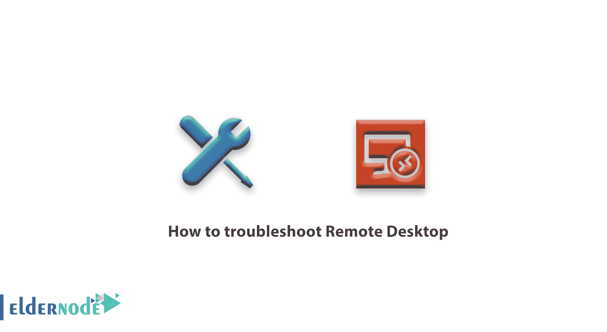

如何解决远程桌面问题？远程桌面协议是获得对一个 [Windows 服务器](https://eldernode.com/tag/windows-server/)的管理访问权的最常见的方法。RDP 可用于所有版本的 Windows server 和所有版本的 Windows 桌面操作系统附带的客户端(称为远程桌面连接)。

客户端也可以在 [iTunes 商店](https://itunes.apple.com/us/app/microsoft-remote-desktop-10/id1295203466?mt=12)买到微软的 Macintosh 操作系统，也可以在 Linux 桌面买到类似 [FreeRDP](http://www.freerdp.com/) 的应用。

通过 [RDP](https://eldernode.com/tag/rdp/) 连接到您的服务器，您可以完全控制服务器桌面环境，就像坐在服务器的显示器和键盘前一样。

根据您的权限和设置，您可以复制和删除文件，更改文件权限或设置，甚至从服务器打印文档。

[**购买 Windows 虚拟专用服务器**](https://eldernode.com/windows-vps/)

## 简介

使用 RDP 来管理 Windows 服务器通常需要一些关于服务器的基本设置和信息:

**1)** 远程桌面服务必须在您想要连接的服务器上运行(RDP 默认使用**端口 3389** )。

**2)** 需要知道服务器的 IP 地址。

**3)** 你必须有一个被允许远程连接到服务器的用户名和密码。

**注:** 通常，这是主管理员帐户，但也可以是专门为远程访问目的而设置的辅助帐户。

**4)**Windows 防火墙和任何其他硬件或软件防火墙需要配置以允许从您的位置进行远程连接。

一旦您启用了所有正确的设置， IP 地址和用户账户详情，您就可以将 RDP 连接到您的服务器了！

**–**启动 **RDP 客户端**。

**–**输入服务器的 IP 地址和用户凭证。

**–**使用看起来像标准的 Windows 桌面环境登录服务器。

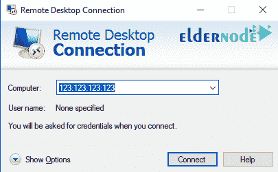

虽然远程桌面协议在管理您的 Windows 服务器时很有帮助，但也有连接失败的时候，这可能会非常令人沮丧，因为错误消息通常不是很有帮助(通常只是如下所示的窗口):

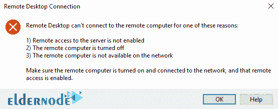

上面显示的 **错误** 表示由于某种原因，您的客户端无法通过**远程桌面协议**连接到 Windows 服务器。

当您遇到连接问题时，可以检查许多项目来尝试解决问题。

## RDP 连通性问题

**1。** 确保你可以通过 [ICMP](https://en.wikipedia.org/wiki/Internet_Control_Message_Protocol) (或者 Ping )到达服务器。

大多数桌面操作系统将允许你向计算机发送少量信息，以验证连接性和连接速度。

一般来说，你只需要打开一个**终端窗口**(在 Windows 桌面上，按下窗口键，然后键入 cmd ，按下 enter ，输入以下命令:

ping IP 或 ping domain.tld 。

通常，您会收到类似的输出:

**2。** 该**输出**显示 pings 成功到达目的地，并在 50 毫秒和 150 毫秒之间完成。

这些 pings 表明成功连接到了服务器(至少通过 ICMP)。

**注意:** 如果命令的输出显示没有响应，我们知道有一些网络干扰。

**3。** 如果 ping 测试失败，请检查您的互联网连接，以保证您可以访问互联网上的其他资源。

**4。** 到达其他互联网网站但没有到达您的服务器表明您的服务器拒绝来自您的 IP 地址的连接(由于安全软件或防火墙设置)。

**5。** 如果尽管**ping**你的服务器你仍然不能通过 RDP 连接，这很可能是 RDP 服务或你的防火墙的问题。

你需要联系你的托管公司来获得服务或防火墙的帮助。

### 防火墙问题

配置防火墙的最佳实践是允许对服务器的各种连接所需的最小访问量。

将连接限制到像 RDP 这样的特定服务被称为“限定服务的访问范围。如果您配置的 [Windows 防火墙](https://eldernode.com/open-a-port-on-a-windows-firewall/)监控 RDP 上的流量，用户可能会因为其 IP 地址不包括在规则中而无法连接。

一个用户通过 RDP 访问服务器，但另一个用户没有，检查防火墙；他们的 IP 地址可能不在允许远程桌面访问的 IP 列表中。

**1。登录**到服务器，点击 Windows 图标，在**搜索**栏输入 Windows 防火墙。

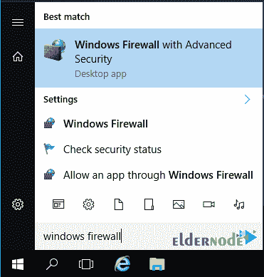

如何解决远程桌面问题

**2。T3 点击 **Windows 防火墙**带高级安全。**

**3。T3 点击入库规则。**

**4。** 向下滚动找到一个标注为 RDP 的规则(或者使用端口 3389 )。

**5。** **双击规则上的**，然后点击范围选项卡。

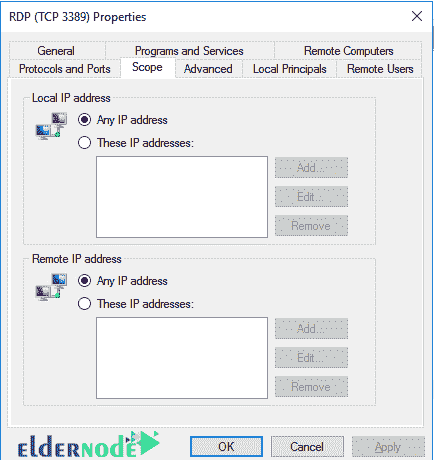

**6。** 确认用户的当前 IP 地址包含在**允许的** 远程 IP列表中。

**注意:** 如果你是无法从你的位置连接到服务器，请联系你的托管公司帮助检查 RDP 访问的防火墙规则。

### 用户连接问题

您可以使用管理员帐户连接到 RDP，但是一个或多个其他帐户不能吗？用户帐户权限可能有问题。

**1。** 确定该用户是远程桌面用户组的成员。

**–**用管理员账号登录到服务器。

**–**进入本地用户和组控制面板 ( **打开** 管理 工具，然后**打开** 电脑管理)。

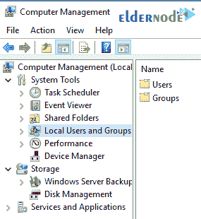

**2。** 导航到远程桌面用户组，并验证该用户是该组的成员。

如果他们不是该组的成员，请将他们添加为该组的成员。

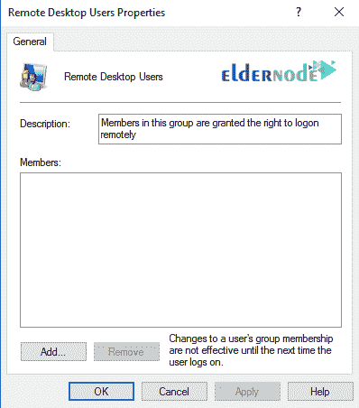

如何解决远程桌面问题

**3。** 转到用户选项卡下的用户名。

确保用户帐户未被锁定。

账户可能会因为太多次尝试使用不正确的密码登录而被锁定(无论是用户还是服务器上的[暴力攻击](https://eldernode.com/ftp-configuration-to-prevent-brute-force-attacks-on-windows-server-2012/))。

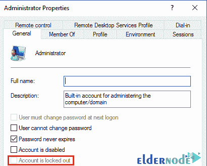

**4。针对用户的 IP 地址再次检查防火墙的**，并添加到 RDP 规则的范围。

### 没有可用的连接/会话

默认情况下， Windows 服务器只允许两个用户同时通过 RDP 连接。如果两个会话都在使用中，您将收到类似如下的错误:“此时没有其他用户可以连接。”

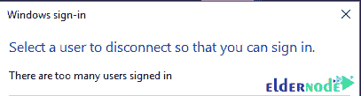

要解决此问题，您需要等待其他用户注销，或者您需要从您的主机提供商处购买额外的 RDP 用户许可证。

在暴力攻击期间失败的登录尝试有时会占用 RDP 许可证，即使会话没有连接。

如果您遇到不可用的会话，这可能是恶意登录的结果。

对于这种情况，最好的补救办法是限制T2 防火墙规则的范围，以阻止来自未授权 IP 地址的访问企图。

### 数据加密错误

如果您正在使用过期的远程桌面客户端或正在连接到旧的 Windows 服务器，您可能会收到一条错误消息，指出连接的 TLS 设置有问题。

通常，您可以通过更新工作站上的 RDP 客户端软件来解决此问题。

也许可以设置客户端忽略这些错误，但是这可能会使您的工作站和服务器容易受到恶意攻击。

### 突然断开

如果您正在使用 RDP 并突然失去连接，问题几乎总是与您的互联网连接有关。

检查以确保您可以与其他服务保持连接(比如在后台运行 ping 命令)。

如果你没有**失去** 互联网 连接，有可能是服务器内存不足或者 RDP 服务可能正在经历一次主动攻击暴力攻击。

如果您已经确认您的互联网连接是稳定的，请联系您的托管公司，以确保服务器不是连接丢失的原因。

### 连接缓慢问题

如果您的位置和服务器之间的连接 **很慢，您的远程桌面会话可能不会像您希望的那样顺利运行。您可以在连接前调整连接的**桌面设置**以简化；加快连接速度。**

**1。** 打开远程桌面客户端应用程序。

**注:** 这些方向是针对 Windows 内置客户端的，不过大部分 RDP 客户端都有类似的设置可用。

**2。** 点击体验标签可以看到各种选项，你可以选择**启用**或者**禁用**来提高你的连接速度。

改变**下拉菜单**选择一个特定的连接速度，或者选择 / 取消选择各种项目以优化性能。

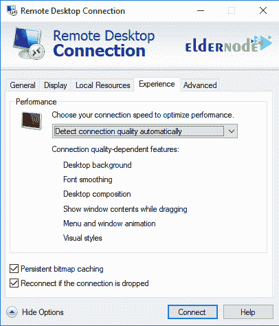

如何解决远程桌面问题

### Windows 10 更新问题

Microsoft 更新经常导致 RDP 连接出现问题！

**一般来说**,的最佳策略是同时更新服务器和工作站，因为当两个系统不在同一个更新周期时，连接性问题最常出现。

通过删除最近的 Windows update(服务器/台式机)，您也许能够解决新的连接问题。

许多用户还报告说，从本地资源设置中禁用**打印机选项**解决了最近的连接问题。

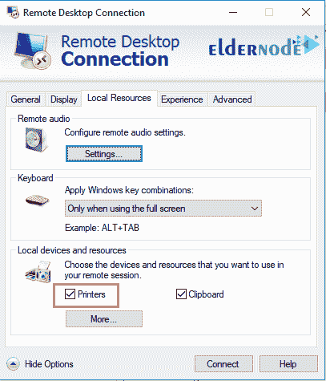

## 结论

虽然 RDP 是管理您的 Windows 服务器的一个很好的工具，但是连接问题可能会令人沮丧。

通过解决连接问题的可能原因，您通常可以立即将重新连接到并再次工作！

**尊敬的用户**，我们希望您能喜欢这个[教程](https://eldernode.com/category/tutorial/)，您可以在评论区提出关于本次培训的问题，或者解决[老年人节点培训](https://eldernode.com/blog/)领域的其他问题，请参考[提问页面](https://eldernode.com/ask)部分，并尽快提出您的问题。腾出时间给其他用户和专家来回答你的问题。

如何解决远程桌面问题？

祝你好运。