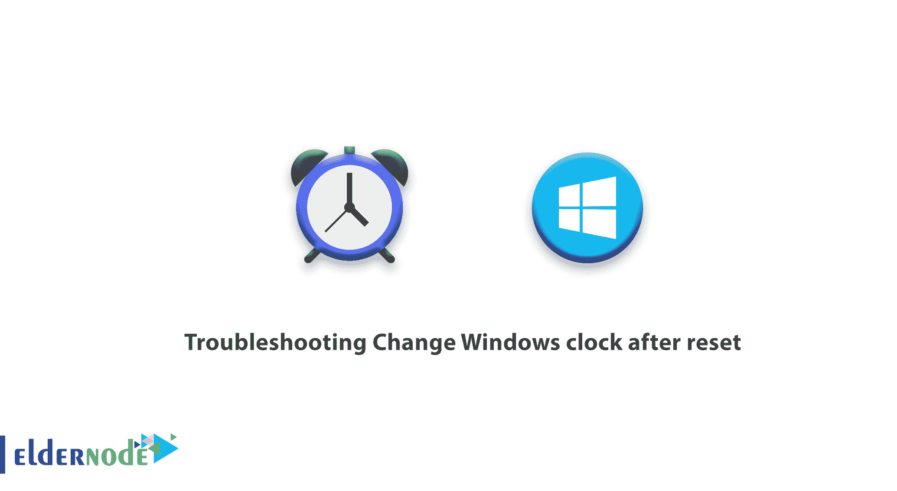
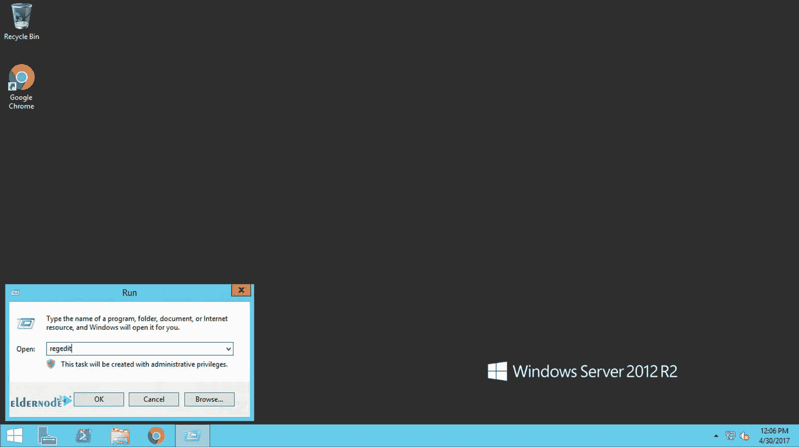
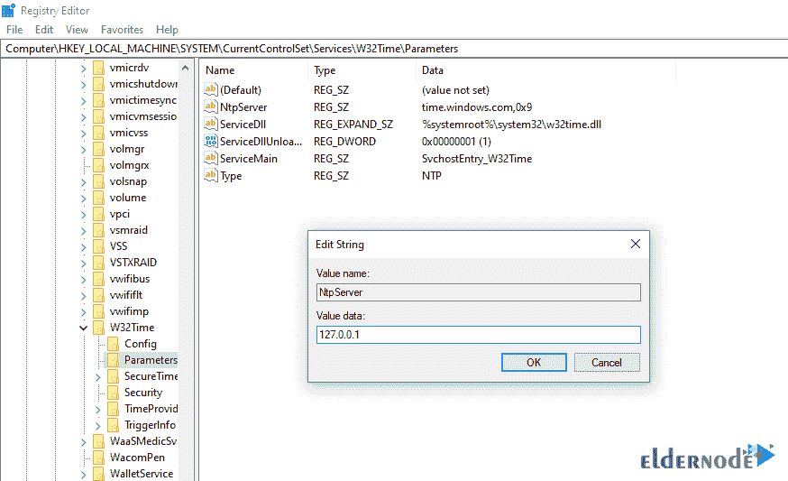

# 重置后更改 Windows 时钟故障排除- Eldernode

> 原文：<https://blog.eldernode.com/troubleshooting-change-windows-clock-after-reset/>



如今用户面临的一个问题是改变作为虚拟机提供的 Windows 的时钟。设置 Windows 的日期和时间是 Windows 中最重要的一点。各位用户请注意，Windows 的日期和时间是您必须注意其设置的工具之一。引起注意的原因是，在使用 Windows 时，不设置日期和时间会导致许多问题。
没有设置 Windows 的日期和时间，导致系统出现问题，给用户造成混乱和困惑。例如，如果您的 Windows 日期和时间没有设置，您的浏览器将无法工作。因此，在本文中，我们将教您如何排除重置后更改 Windows 时钟的故障。

Windows 的操作机制是这样的，即在重置时钟后，它会根据硬件时钟进行自我调整，因此在重置后会发生变化。这些时钟干扰有时会导致服务运行出现问题，并可能导致错误。在下面，我们已经教你如何解决重置后改变 Windows 时钟的问题。

## 重置后更改 Windows 时钟疑难解答

**1-** 首先，进入你的 [Windows 虚拟服务器](https://blog.eldernode.com/tag/windows/)环境。

**2-** 打开**运行**窗口。

要打开运行窗口，您可以使用**开始**按钮或 **Winkey + R** 组合键。

**3-** 然后输入 **[regedit](https://en.wikipedia.org/wiki/Windows_Registry)** 点击 **ok** 。



**4-** 进入后，你的 Windows 注册表就会打开。

**5-** 前往以下路径。

```
HKEY_LOCAL_MACHINE \ SYSTEM \ CurrentControlSet \ services \ W32Time \ Parameters
```

如图所示，打开 **NtpServer** 键。

**7-** 删除其中写入的短语，改为输入 **127.0.0.1** ，最后点击**确定**。



**8-** **最后**，关闭注册表窗口。

通过此操作，您引入了 Windows 作为读取时钟的参考。从现在开始，重置你的 Windows 后， **[Windows vps](https://eldernode.com/windows-vps/) 服务器**时钟不会改变。

## 结论

您可能以前使用过虚拟或专用服务器，并且遇到过这样的情况:服务器时钟是根据服务器位置设置的，并且您已经更改了服务器时间设置，以便根据您的时区设置服务器时钟。但是每次服务器复位后，服务器时间又回到原来的状态。在您阅读的文章中，您学习了如何解决重置后更改 Windows 时钟的问题。