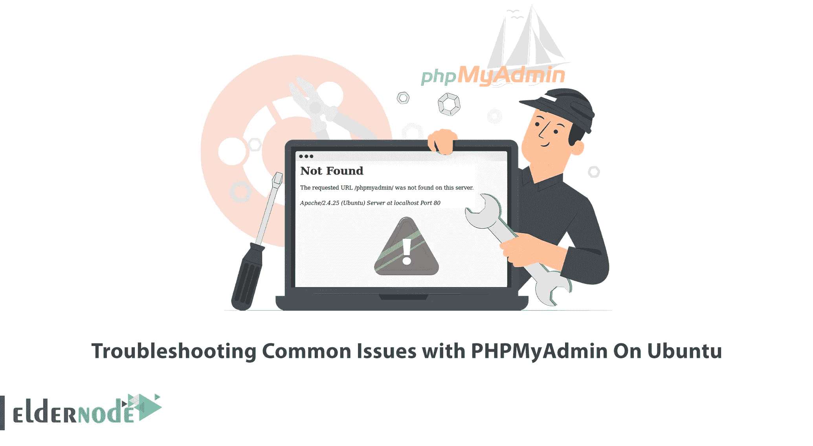

# Ubuntu 上 PHPMyAdmin 常见问题的疑难解答

> 原文：<https://blog.eldernode.com/troubleshooting-common-issues-with-phpmyadmin/>



在 Ubuntu 中安装 PHPMyAdmin 可能会有问题，或者安装后可能会出现问题。如果您是安装 PHPMyAdmin 后面临问题的人之一，那么这篇文章就是为您准备的。本文将解释 Ubuntu 上 PHPMyAdmin 常见问题的故障排除。如果你打算购买一台 Ubuntu VPS 服务器，你可以查看我们网站上提供的套装。

## **Ubuntu 上 PHPMyAdmin 有哪些常见问题？**

PHPMyAdmin 是一个用 PHP 编写的免费开源软件工具，用于管理 web 上的 MySQL。它负责以图形方式控制你的网站和应用程序的数据库。该工具支持多种操作，如在 MySQL 和 MariaDB 上管理数据库、关系、表、列、索引、权限、用户等。在 Ubuntu 上安装 PHPMyAdmin 后，您可能会遇到一些必须解决的问题。

### **PHPMyAdmin 不工作**

Ubuntu 上的 [PHPMyAdmin 的一个常见错误是 PHPMyAdmin 不工作错误。在 Ubuntu 上安装 PHPMyAdmin 后，链接**http://localhost/PHPMyAdmin/**可能会返回一个空白页。这个错误可能是因为您没有安装 libapache2-mod-php。](https://blog.eldernode.com/install-the-latest-phpmyadmin-on-ubuntu-20/)

要修复该错误，只需借助以下命令进行安装:

```
sudo apt install libapache2-mod-php8.1
```

并使用下面的命令重新加载 Apache:

```
sudo systemctl restart apache2
```

然后尝试访问 PHPMyAdmin。

此外，此错误可能是由于 Apache 服务器没有运行。因此，在以下命令的帮助下，检查您的 apache 是否运行良好:

```
sudo systemctl status apache2.service
```

### **拒绝根用户** 的 PHPMyAdmin 访问

当用户安装和配置一个新的 MySQL 时，可能会面临“拒绝用户“@'localhost '访问数据库 phpmyadmin””的问题。

对于新安装的 MySQL，当以 root 用户身份登录 PHPMyAdmin 时，通常会出现这个错误。您可以通过以下步骤解决这个问题。

要解决这个问题，首先用 root 用户访问 PHPMyAdmin。为此，请输入以下命令:

```
mysql -u root -p
```

修改 root 用户，使其能够以 root 身份登录 MySQL。这将允许访问根目录:

```
sudo mysql
```

出现提示时，输入您的密码。

现在更改身份验证方法，以 root 用户身份登录 MySQL，如下所示:

```
ALTER USER 'password'@'localhost' IDENTIFIED WITH mysql_native_password BY 'insert_password';
```

这将更改 root 用户的密码，并将身份验证方法设置为 mysql_native_password。

使用以下命令退出 MySQL:

```
mysql> FLUSH PRIVILEGES;
```

现在，通过输入以下命令重新启动 Apache:

```
sudo service apache2 restart
```

然后测试 root MySQL 用户访问 PHPMyAdmin。为此，请打开浏览器并输入以下 URL:

```
http://Server-IP/phpmyadmin
```

## 结论

在本文中，我们解释了 Ubuntu 上 PHPMyAdmin 常见问题的故障排除。我希望这篇教程对你有用，并且能帮助你解决 Ubuntu 上 PHPMyAdmin 的常见问题。如果你有任何问题或建议，可以在评论区联系我们。