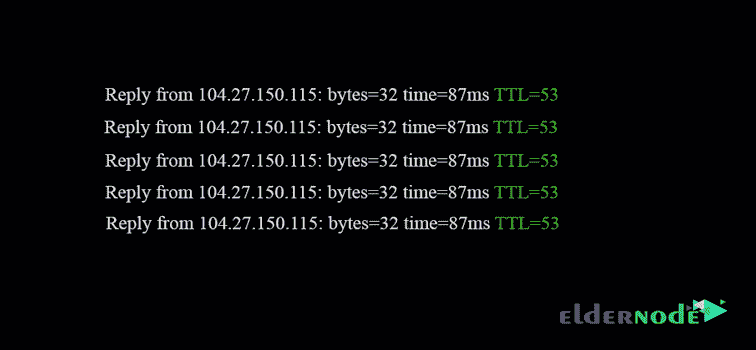

# TTL 在 DNS 和网络中是什么意思？|老年人博客

> 原文：<https://blog.eldernode.com/ttl-mean-in-dns-and-networking/>

TTL 在 DNS 和网络中的意思。在这篇文章中，我们将为您服务的主题 TTL 在 DNS 和网络。

TTL 在 DNS 和联网方面略有不同，但总体来说是一样的。

### TTL 在 DNS 和网络中是什么意思？

TTL 代表生存时间。我们先在网络中定义 TTL，再在 DNS 中定义 TTL。

**网络上的 TTL**

网络中的 TTL 是在两个或更多系统之间切换时包的寿命。

当数据包被发送到网络时，会为该数据包考虑一个时间节点(TTL ),超过该时间后，该数据包将被完全销毁。

例如，要查看数据包的 TTL，您可以使用 Ping 命令并找出 ICMP 数据包的 TTL 值。

注意下图:

正如你所看到的，这个包的 TTL 值是 64，这意味着这个包在拒绝一个 64 节点后消失了。

默认情况下，[基于 Linux](https://eldernode.com/) 的系统以 64 发送数据包，基于 Windows 的系统以 128 发送数据包。

注意:路径上每经过一个路由器，TTL 值默认会减少，除非路由器中有不扣除 TTL 的设置。

到目前为止，您已经熟悉了网络中 TTL 的概念。这是 DNS 中的 TTL 概念。

**DNS 中的 TTL**

DNS 中的 TTL 表示生命时间，而不是封闭的生命发送；当您在浏览器的地址栏中输入域名时，由 DNS 域名到 IP 返回，并且此 IP 地址和域将存储在您的系统缓存中，以便您下次不需要请求 DNS，并且您的速度将会提高。

DNS 中的 TTL 是为您缓存 IP 地址和域的时间量。

在网络 TTL 中，TTL 的值只有一个。但是 DNS 中的 TTL 是以秒为单位设置的，每秒都在工作。

如有疑问或问题，可向[提问系统](https://eldernode.com/ask/)咨询，提供指导。