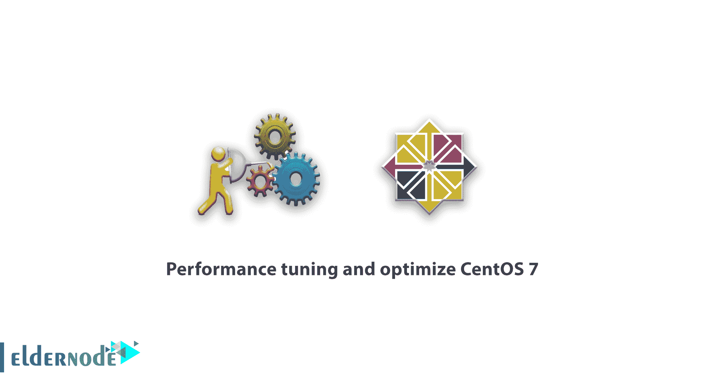

# 性能调优和优化 CentOS 7[最佳方式] - Eldernode

> 原文：<https://blog.eldernode.com/tuning-and-optimize-centos-7/>



**Linux CentOS** 发行版 CentOS 是当今最流行的 Linux 发行版之一，代表社区企业操作系统。CentOS Linux 的核心源自 Red Hat Enterprise Linux 或 RHEL，因此完全兼容 RHEL。与商业 RHEL 不同，CentOS 是一个免费的 Linux 发行版。CentOS 是由社区支持的，你只需要从这些公共社区获得帮助和支持，你不必支付任何费用。在本文中，我们试图教你**性能调优和优化 CentOS 7** 。您可以从 [Eldernode](https://eldernode.com/) 中提供的套装中选择并购买您的 [CentOS VPS](http://eldernode.com/centos-vps/) 服务器。

## 性能调优和优化 CentOS 7

为了提高服务器上的服务、应用程序和数据库的性能，使用各种工具执行一系列自定义性能设置。本教程将解释如何调整和优化 [CentOS](https://blog.eldernode.com/tag/centos/) 7。

### 什么是调谐的，它有什么作用？

Tuned 不会动态调整系统设置。您可以修改调优后的守护进程的运行方式，并允许它根据系统使用情况动态改变设置。还可以使用 tuned-adm 命令行工具来管理正在运行的守护程序。

一般来说，tuning 是一个强大的守护进程，可以根据它从监视系统组件的使用中收集的信息来动态地自动调整 Linux 服务器的性能，从而最大限度地提高服务器的性能。Tuned 通过使用调优配置文件，根据系统活动动态地调优系统设置来实现这一点。

通过设置调优配置文件，tuned tuning service 可以调整操作系统，使其在某些工作负载下性能更好。tuned-adm 命令行工具允许用户在不同的调优配置文件之间切换。调优配置文件包括 sysctl 配置、磁盘升降机配置、透明大页面、电源管理选项和定制脚本。

#### 调谐配置文件概述

几个**预定义的**概要文件包含在常见用例中，但是 tuned 也使您能够定义自定义概要文件，它可以基于预定义的概要文件之一，也可以从头开始定义。随 tuned 提供的配置文件分为两类:**节能配置文件**和**性能提升配置文件**。

性能提升配置文件包括侧重于以下方面的配置文件:

–存储和网络延迟低

–存储和网络的高吞吐量

–虚拟机性能

–虚拟化主机性能

## 性能调优和优化 CentOS 7

在本文的后续部分，我们将教您如何在 CentOS 7 上安装 tuned，以及如何创建定制的调优配置文件。请和我们在一起。

### CentOS 7 上调谐的教程安装

***注意:*** 在 CentOS 7 上，默认预装并激活 tuned，但在旧版 CentOS 中，需要使用以下命令进行安装:

```
yum install tuned
```

安装后，您可以看到以下配置文件:

/etc/tuned–优化的配置目录。

/etc/tuned/tuned-main . conf–优化的邮件配置文件。

/usr/lib/tuned/–存储所有优化配置文件的子目录。

现在可以使用以下命令来管理 CentOS 7 上的优化服务了:

```
systemctl start tuned
```

```
systemctl enable tuned
```

```
systemctl status tuned
```

```
systemctl stop tuned
```

现在，您应该能够使用 Tunde-adm 工具控制设置了。您可以使用以下命令检查当前活动的概要文件。

***注意:*** 对于一些常见的用例，已经包含了许多预定义的调优配置文件。

```
tuned-adm active
```

您可以使用以下命令行获得可用优化配置文件的列表:

```
tuned-adm list
```

使用以下命令移动到公共服务器负载上的任何配置文件:

```
tuned-adm profile throughput-performance  tuned-adm active
```

您也可以使用以下命令将**推荐的配置文件**用于您的系统:

```
tuned-adm recommend
```

最后，您可以使用以下命令**禁用**设置:

```
tuned-adm off
```

### 了解如何在 CentOS 7 上创建定制调谐配置文件

在本教程的后续部分，通过给出一个如何创建名为 test-performance 的新概要文件的例子，我们将展示您也可以创建新概要文件。此配置文件将使用延迟性能设置。请遵循以下步骤:

**1。**转到存储所有调谐配置文件子目录的路径。

**2。**为您的定制调优配置文件创建一个名为 test-performance 的新子目录。

```
cd /usr/lib/tuned/  mkdir test-performance
```

**3。**要在类别中创建一个 **tuned.conf** 配置文件，使用以下命令:

```
vim test-performance/tuned.conf
```

**4。**将以下指令放入文件中，然后**保存**它:

```
[main]  include=latency-performance  summary=Test profile that uses settings for latency-performance tuning profile
```

**5。**现在，您可以在以下命令的帮助下激活新调整的配置文件:

```
tuned-adm profile test-performance
```

### CentOS 7 的延迟-性能

**–**用于低延迟性能调整的配置文件。

**–**禁用省电机制。

**–**CPU 调控器被设置为性能并锁定到低 C 状态(通过 PM QoS)。

**–**CPU 能耗性能偏向性能。

**–**该配置文件是“网络延迟”的父配置文件。

您可以使用以下命令**激活 CentOS 7 的**优化延迟性能:

```
tuned-adm profile latency-performance
```

对于 CentOS 7，延迟-性能特征包括以下调整:

```
cat /usr/lib/tuned/latency-performance/tuned.conf
```

**【CPU】**

force_latency=1
调控器=性能
energy _ perf _ bias =性能
min_perf_pct=100

**【sysctl】**

kernel . sched _ min _ granularity _ ns = 10000000
VM . dirty _ ratio = 10
VM . dirty _ background _ ratio = 3
VM . swappiness = 10
kernel . sched _ migration _ cost _ ns = 5000000

## 结论

在本文的开始，我们解释了 tuned 及其应用的介绍。然后，我们回顾了调优配置文件，并尝试教您如何在 CentOS 7 上安装 tuned 以及如何创建自定义调优配置文件。