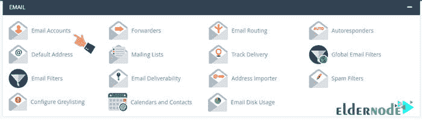

# 教程逐步将 Cpanel 电子邮件帐户连接到 Gmail

> 原文：<https://blog.eldernode.com/tutorial-connect-cpanel-email-account-to-gmail/>

在这篇文章中，我们将教你**教程连接 Cpanel 电子邮件帐户到 Gmail** 。吸引任何领域的用户都被认为是非常重要的。在在线企业，购买主机和域名后的第一步是通过电子邮件和其他方式与你的联系人联系。 **举个** 的例子，想象一下你得到了一个稳定的主机像 **[VPS 托管](https://eldernode.com/vps-hosting/)** 。现在启动网站后，你应该采取行动与用户互动。

## 教程将 Cpanel 电子邮件帐户连接到 Gmail

CPanel 提供了几个功能来简化电子邮件的管理。在这篇文章中，我们将教你如何将你的 CPanel 电子邮件托管账户连接到 **Gmail** 。学习完本教程后，您将能够将网络主机中的电子邮件帐户添加到 **Gmail 用户面板**。此外，使用 Gmail 管理所有网站的电子邮件账户。

***留在我们身边继续训练。***

## 主机邮箱连接 Gmail 有什么用？

假设你是一个大型网站的经理，你在你的网站主机中创建了几个电子邮件账户。你决定每天定期查看你收到的所有邮件。**有两种方法可以做到这一点:**

**–第一种方式** 就是每天登录自己网站的 host ( Cpanel )中每个邮箱账号的 webmail 。

**–第二种方式** 是将该邮箱账号连接到邮件客户端，如 windows live mail 、 outlook、或 Windows 10 邮件软件。

现在有了 **另一种更好的方式** 来管理你网站的电子邮件账户，那就是将你网站主机中的所有电子邮件连接到 Gmail 控制面板。这样，你就可以在 Gmail 中集中管理网站上的所有电子邮件账户。事实上，通过将虚拟主机邮件连接到 Gmail，从现在开始，您只需登录您的 Gmail 帐户并在 Gmail 中集中管理您所有的主机邮件。

***跟随我们在这篇有用的文章中继续设置 Gmail 中的主机邮件。***

### 如何将 CPanel 电子邮件帐户连接到 Gmail

**首先**，登录 CPanel 。

然后从**邮箱**部分，点击邮箱账号图标进入如下页面:

在**电子邮件帐户**部分，您已经创建的电子邮件帐户可用。我们想将其中一封电子邮件连接到 Gmail 。为此，点击该邮箱账户前面的设置邮件客户端选项，进入**设置邮件客户端页面**为 *[【邮箱保护】](/cdn-cgi/l/email-protection)* 。

这里是将电子邮件地址 *[【电子邮件保护】](/cdn-cgi/l/email-protection)* 连接到其他电子邮件管理客户端的设置。

在**邮件客户端手动设置**部分有两个框。在下文中，我们将向您解释这两者:

**1。安全 SSL / TLS 设置(推荐)** 标有蓝色方框。如果您使用该字段中的值将这些电子邮件主机连接到 Gmail 软件，您的电子邮件数据将通过 [SSL](https://eldernode.com/how-to-install-and-activate-the-ssl-certificate/) 加密在 Gmail 服务器和主机电子邮件服务器之间进行交换。

**注:** CPanel 也推荐使用这种方法。

**2。非 SSL 设置(不推荐)** 不被 CPanel 推荐，如果您使用此框中的信息将此电子邮件帐户连接到 Gmail，您的电子邮件数据将在Gmail 服务器和主机电子邮件服务器之间不加密地交换。

根据 CPanel 的建议，我们也使用左侧框中的值。

### 如何配置 Gmail 连接 CPanel

进入 Gmail 后，点击右上方的 ⚙ ( 设置)图标。然后，从打开的**子菜单**中，点击**设置**选项。

点击账户 ，导入标签，进入如下页面:

在**查看其他账户的邮件**部分前面，点击添加邮件账户选项打开如下窗口:

在**电子邮件地址**字段中，您必须输入您想要连接到主机的电子邮件帐户的地址。

既然我们想把我们网站的邮件连接到 Gmail，那么我们输入 *[【邮件保护】](/cdn-cgi/l/email-protection)* ，然后点击下面的下一步按钮进入下一步。

在下一步中，选择**从我的其他帐户 pop3** 导入电子邮件选项后，点击下一步按钮进入下一步。

将 Cpanel 电子邮件帐户连接到 Gmail ，我们将在 Cpanel 中进行电子邮件设置

### Cpanel 中邮件设置实用教程

第三步**，进入邮箱设置为 *[【邮箱保护】](/cdn-cgi/l/email-protection)* ，是本次培训最重要的步骤之一。您必须设置以下所有字段，我们将逐一向您解释:**

****— 用户名:** 在用户名栏中，您必须输入该邮箱账户的用户名。进入 CPanel 邮箱账户信息页面，将该值复制到用户名字段前面，粘贴到该字段中。**

****——密码:** 在该字段中，您必须输入您想要连接到 Gmail 的电子邮件帐户的密码。**

****注:** 该邮箱的密码与我们在 Cpanel 主机中创建 *[【邮箱受保护】](/cdn-cgi/l/email-protection)* 邮箱时设置的密码完全相同。**

****— Pop 服务器:** 在该字段中，您必须输入网站 Pop 主机的邮件服务器地址。**在 Cpanel 中重新进入**电子邮件设置页面，在**接收服务器**部分的前面，将该值完全复制并粘贴到 pop 服务器字段中。**

****— 端口:** 在此部分，您必须选择网站 pop3 主机的端口号。**

**要了解这个金额，请进入 CPanel 中的电子邮件帐户信息页面。然后从 **pop3 port** 段前面的传入服务器段，记住这个值，就是 995 ，从**下拉菜单**中选择端口号 995。**

****— 在服务器上保留检索到的邮件的副本:** 如果您选中此选项，此邮件帐户发送和接收的邮件的副本将一直保存在主邮件服务器上，即网站主机上。如果未选中此选项，从该帐户发送和接收的电子邮件将仅通过 Gmail 进行交换，不会在服务器和主机上存储任何副本。**

****— 检索邮件时始终使用安全连接 SSL**:如果您选中此选项，此电子邮件帐户发送和接收的电子邮件将始终在安全的 SSL 平台上的 Gmail 和主机邮件服务器之间交换。**

****— 标记收到的邮件:** Gmail 允许您在 Gmail 面板的左侧启用除收件箱和垃圾邮件之外的单独目录。这样，该电子邮件帐户收到的所有电子邮件都将列在该目录中，不会与我们的主 Gmail 帐户收到的电子邮件混在一起。**

****— 归档收到的邮件跳过收件箱:** 如果您启用此选项，从我们的主机邮箱帐户收到的邮件，除了存储在专用目录外，还会将它们的副本转移到 Gmail 收件箱。**

**点击**添加**T2 账户按钮进入下一步。**

****

**此时，Gmail 告诉我们该电子邮件帐户已成功添加。如果您愿意，您甚至可以用这个添加的电子邮件发送电子邮件，即使是通过 Gmail 帐户，除了从这个帐户接收电子邮件之外。在该步骤中，选择是并点击下一步按钮。**

****

**在下一步中，将成功添加电子邮件帐户。**

**除了通过 Gmail 帐户接收电子邮件外，您还可以通过添加的电子邮件发送电子邮件。**

**在该步骤中，选择是并点击下一步按钮。**

****

**现在我们通过你的 **SMTP** 服务器进入发送邮件。因为外发邮件通常通过 **SMTP 协议** 发送，所以您必须在这些字段中输入网站主机的 SMTP 值。在下文中，我们将解释这些字段中的每一个:**

****——SMTP 服务器:** 在该字段中，您必须输入网站邮件服务器的发送邮件地址。重新进入您的 CPanel 电子邮件帐户的手动设置页面。然后在外发服务器前面复制这个值，粘贴到这个窗口。**

****— 端口:** 从这个**下拉**菜单中，选择 SMTP 服务器端口号。因为我们不知道这个值，我们将返回到 Cpanel 中的**电子邮件帐户配置文件**页面，我们将在 SMTP 端口部分前面的发送服务器部分看到这个值。如你所见，是 **465** 。然后返回 Gmail，在下拉菜单中选择端口前面的 465 。**

****— 用户名:** 在该字段中，您必须重新输入该电子邮件帐户的用户名。返回到 Cpanel ，在用户名字段前面，复制这个值，它与电子邮件地址相同，并粘贴到这个字段中。**

****— 密码:** 在该字段中，您必须重新输入您在创建电子邮件帐户时设置的该电子邮件托管网站的密码。**

****——**最后，发送邮件有两个选项:**

*****使用 SSL 安全连接*****

*****安全连接使用 TLS*****

**因为我们希望我们的电子邮件在安全的 SSL 平台上发送，所以我们选择了第一个选项。然后点击下方的添加账号按钮进入下一步步骤。**

****

**接下来，我们进入向 Gmail 添加电子邮件帐户的验证步骤。**

**Gmail 现在想知道我们是否真的拥有我们正在添加的电子邮件帐户！因此，Gmail 向我们正在添加的同一个电子邮件地址发送了一个 **验证码** ，现在它要求我们在该字段中输入该验证码，这样我们就可以完成将一个**电子邮件帐户**添加到 Gmail 的步骤。**

#### **在您的 Cpanel 邮件帐户上查看来自 Gmail 的电子邮件确认。**

**您必须登录到您的网络邮件主机才能查看此电子邮件帐户收到的电子邮件。然后再次登录 Cpanel ，点击**邮件**部分的查收邮件。**

****

**在下一页，点击 RoundCube webmail 进入用户界面。**

**打开 Gmail 发送的第一封邮件。**

****

**单击下图中指定的链接。**

****

**点击**确认**按钮，可以看到步骤成功的信息。**

****

**正如你所看到的，Gmail 的左侧增加了一个目录，里面有该网站主机邮箱账户的邮件。**

#### **如何使用第二个帐户发送电子邮件**

**如果您想从现在开始使用这个 Gmail 帐户发送电子邮件，您必须执行以下操作:**

****1。T3 点击作曲按钮。****

****2。** 从部分的**中，点击图标，这样您就可以选择您添加的第二个账户。****

****亲爱的用户**，我们希望您喜欢**教程将 Cpanel 电子邮件帐户连接到 Gmail** ，您可以在评论区询问有关本次培训的问题，或者解决 [Eldernode 博客](https://eldernode.com/blog/)领域的其他问题，请参考提问页面部分，并尽快在其中提出您的问题。腾出时间给其他用户和专家来回答你的问题。**

****好运。****