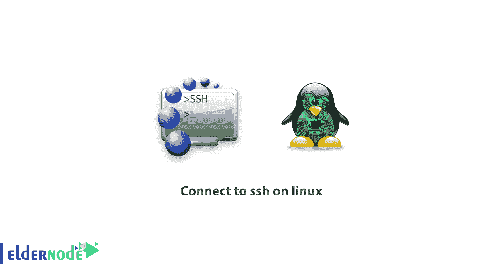
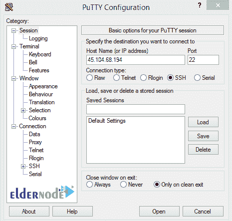

# 教程连接到 linux 服务器上的 ssh 教程 Linux - Eldernode 博客

> 原文：<https://blog.eldernode.com/tutorial-connect-to-ssh-on-linux/>



【更新于:2021-01-05】**S**ecure**Sh**ell 是一个基于 UNIX 的命令接口和协议，帮助我们在网络上建立一个安全的路径来连接到服务器。虽然 SSH 命令是安全和加密的，但是它们充当外壳来提供安全连接。使用数字证书，客户端和服务器连接的两端被认证。因此，密码被加密和保护。在本文中，您将了解更多关于教程**在 Linux 上连接 SSH**的内容。因为它的高安全性，并且依赖于操作系统，管理员管理他们的专用服务器使用 SSH 协议。或者他们用 SSH 保护他们的远程桌面协议。然而，如果你还没有准备好你的 Linux VPS，我们完美的软件包会很有帮助。

## **如何在 Linux 上连接 ssh**

## **用 Putty 通过 SSH 连接到 Linux 服务器**

当您运行 Linux 时，出于安全原因，您可以使用 SSH，生成一个 SSH 密钥，并向服务器添加一个公钥。它允许你访问你的云服务器并运行 shell 命令。通过这种方式，您可以轻松识别受信任的计算机。**的**安全**的**套接字 **L** 层加密 SSH。所以通讯很难被截获和读取。让我们看看如何连接到 SSH 并使用它的特性。

首先，在 Windows 上下载 **[Putty](https://www.putty.org/)** 软件，开始使用 SSH 连接。该软件无需安装，下载后即可立即运行。下载完成后，打开 putty。在主机名或 IP 地址框中输入 IP 地址，SSH 连接端口默认为**端口 22** ，在端口框中点击打开进入软件终端。



如果向您显示“ **PuTTY 安全警报**”安全消息，请单击“是”继续。窗口打开时输入你的用户名，通常是 [root](https://blog.eldernode.com/install-ssh-server-on-linux-and-allow-root-user-login/) 。然后，输入您的密码并按 enter 键连接到您的服务器。此外，您可以使用 [Linux 命令](https://blog.eldernode.com/linux-commands-with-examples/)来调整您的偏好。

**注意**:输入密码时，软件终端页面看不到字符。所以安全地输入字符，然后按回车键。如果你想粘贴你复制到其他地方的密码，只需使用鼠标右键。右键在本软件中起到粘贴的作用。

如果登录成功，命令行将被更改为 username @ hostname [~] #，ssh 将等待您的命令。

### **如何生成新的 SSH 密钥**

正如我们提到的，您可以通过生成 SSH 密钥对来保护对云服务器的 SSH 访问，并防止暴力密码攻击。这样，您将在服务器上有一个公钥，在本地计算机上有一个匹配的私钥。如果您希望不让任何人仅使用密码登录，那么您应该[在您的 Linux 服务器](https://blog.eldernode.com/configure-ssh-authentication-linux/)上配置基于 SSH 密钥的认证。

要生成 SSH 密钥对，请遵循以下路径:

用您的电子邮件地址替换以下命令。当您收到第二个命令时，它会生成您的公钥-私钥对。

```
[[email protected]](/cdn-cgi/l/email-protection)
```

```
ssh-keygen -t rsa -C "[[email protected]](/cdn-cgi/l/email-protection)"
```

如果按 Enter 键，将考虑默认位置。或者输入可以保存密钥的文件，然后按 enter 键。

**注意**:如果您不喜欢使用密钥对的密码，您应该在不设置密码的情况下按 Enter 键。但是，如果您希望密钥对的密码更加安全，请输入一个密码短语，然后按 enter 键。

您可以找到您的密钥，而无需在每次连接时指定其位置。您只需要将新的 ley 添加到本地的 *ssh-agent* 文件中来启用 ssh。

```
ssh-add ~/.ssh/id_rsa
```

**注意**:可以不使用 *ssh-agent* ，而是使用 ssh 配置。

## 结论

在本文中，您了解了教程 Linux 上的 ssh 连接。如果您在 SSH 登录时遇到问题，请尝试在登录紧急控制台时通过 SSH 登录。它允许您查看日志来查看失败的原因。如果您有兴趣阅读更多内容，请关注我们的[安全教程](https://blog.eldernode.com/tag/security/)。