# 教程在 RDP admin 2016 - Eldernode 上安装 IIS web 服务器

> 原文：<https://blog.eldernode.com/tutorial-install-iis-web-server-on-the-rdp-admin-2016/>

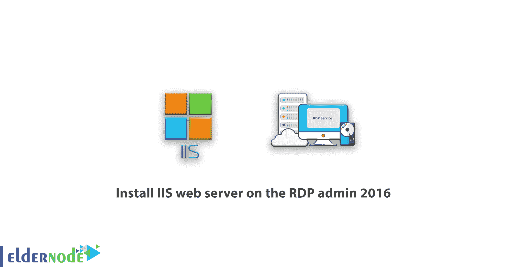

教程如何在 RDP 管理 2016 windows 服务器上安装 IIS web 服务器。为了能够向其他人展示你的网站，你肯定需要一个网络服务器，如果你正在使用 RDP 管理， [IIS](https://www.iis.net/) 是最好的解决方案。IIS 在 RDP 管理是非常不同的，从其以前的版本和许多功能，包括安全功能已被添加到它。互联网信息服务(IIS)是微软提供的一项服务，通过启动这项服务，你可以在一台 [Windows](https://blog.eldernode.com/tag/windows/) 服务器上托管你的文件或网站。在本文中，我们打算教你如何在 RDP 管理 2016 上安装 IIS web 服务器。您可以通过访问 [Eldernode](https://eldernode.com/) 中的[购买 RDP](https://eldernode.com/buy-rdp/) 管理页面查看和购买各种套餐。

在速度和性能方面，微软已经能够与强大的 Linux web 服务器 Apache 竞争。随着 IIS 的几个新特性和功能的引入，微软向其 web 服务器的发展迈出了一大步，我们将提到其中的三种特性:

***1。模块化结构:*** 在以前版本的 IIS 中，要么所有东西都必须一起安装，要么什么都不安装。但是在新版本中，您只能选择和安装您需要的模块，这可能会大大增加系统负载和性能。

***2。管理界面:*** IIS 拥有与之前版本完全不同的管理界面，使得单独管理各个网站变得容易得多。您可以轻松配置任何网站，而无需更改其他网站。此外，在这个版本中，您可以用一个配置文本文件一次编辑所有网站。

***3。与网站所有者共享的任务:*** 如果您的服务器托管多个网站，您可以轻松使用服务器委托功能为程序员或网站管理员划分任务。

## 教程在 RDP 管理 2016 上安装 IIS web 服务器

首先，借助您的访问信息并通过**远程桌面**连接到您的服务器。通过远程桌面登录后，按照以下步骤在 20 RDP 管理 2016 上安装 IIS:

**1。**从**开始菜单**，选择**管理工具**，然后点击**服务器管理器**。

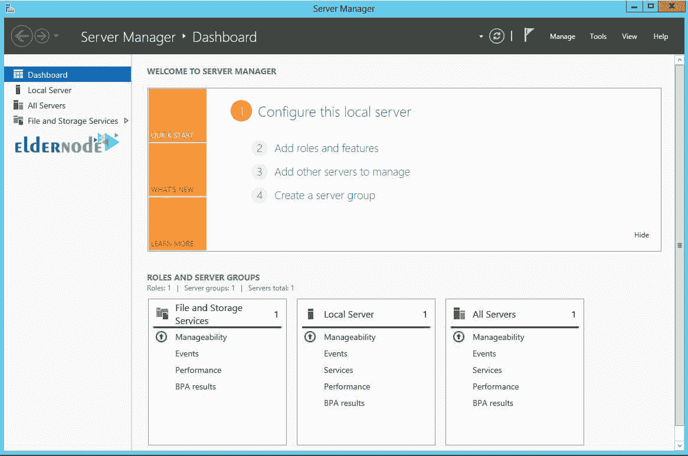

**2。**在服务器管理器和**仪表板**部分，点击**添加角色和功能**。

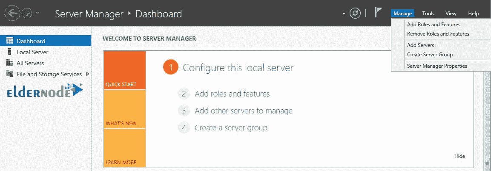

**3。**点击上述选项后，将为您打开以下页面。选择**下一个**选项。

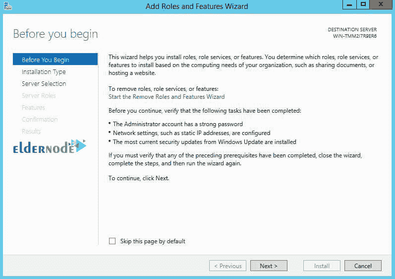

**4。**下一步，再次点击**下一步**，不做任何更改。

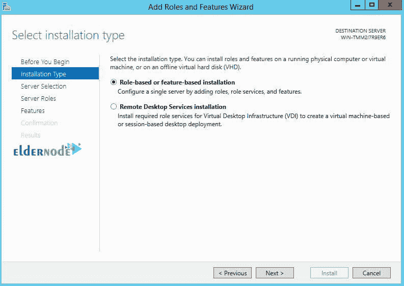

*

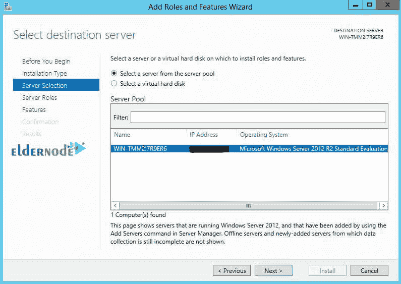

**5。**检查 Web 服务器(IIS ),然后单击下一步。

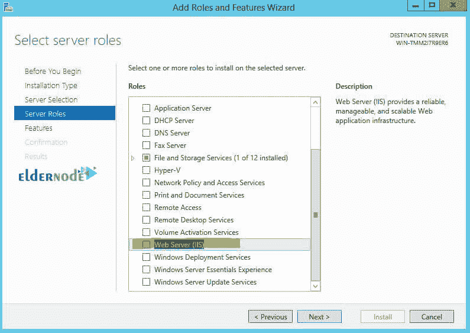

**6。**以下窗口将为您打开，点击**添加功能**选项。

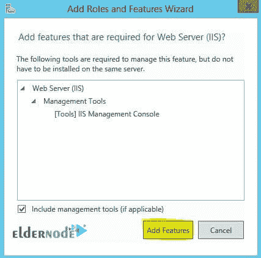

**7。**显示该窗口后，这是在 RDP 管理中安装 IIS web 服务器的最后一步，点击**安装**选项。

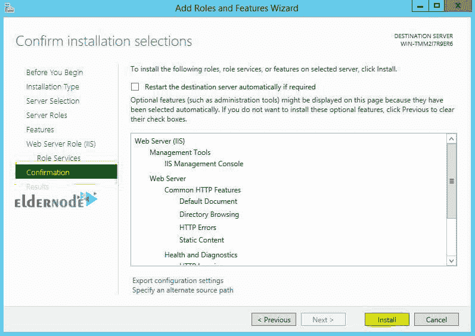

**8。**等待安装过程完成，然后点击**关闭**。

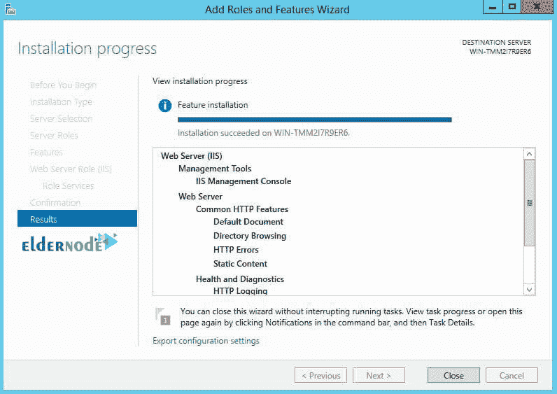

恭喜您，您已经在 RDP 管理 2016 中成功安装了 iis web 服务器。

要使用这项服务并托管您的文件，您可以通过**我的电脑**或**这台电脑**参考驱动器 **C** ，然后是 **inetpub** 文件夹，最后是 **wwwroot** 文件夹，并将您想要的文件放在这个路径中。

从现在开始，通过输入服务器的 IP 和/以及文件名，您可以从服务器下载所需的文件。

***例如:***http://my serve rip/filename . MP3

### 如何访问 IIS 部分并安装网站

在**服务器管理器**窗口中，进入**工具**菜单。然后点击**互联网信息服务**。您将看到类似下图的屏幕:

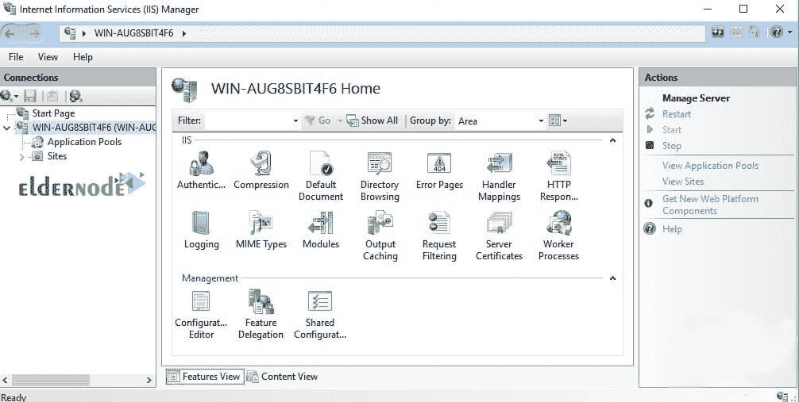

***好了，我们去网站安装:***

**1。**从开始菜单，进入**管理工具**部分和**互联网信息服务(IIS)管理器**部分并点击。

**2。**当 IIS 管理控制台打开时，打开 **web 服务器**部分。然后打开“站点”文件夹。右键点击**网站文件夹**，点击**添加网站**。

**3。**在**添加网站**部分，我们有一系列使用静态网站的基本设置，我们一起来看看:

**–网站名称:**您的网站名称或域名，例如 https://eldernode.com

**–物理路径:**指定网站相关文件的物理路径。
如果这个路径还没有创建，你可以从同一个控制台创建它，并把与网站相关的文件放在里面。

**–类型:**如果您的站点使用 SSL 安全系统，此部分应确定它是否有 SSL。

**–IP 地址:**从下拉列表中，指定网站所需的 IP 地址。如果您不确定，请单击所有未分配来设置默认设置。

**–域名:**如果你希望你的网站响应其他名称，可以指定。

好了，现在你的 web 服务器已经准备好了，你所要做的就是把与你的网站相关的文件放在物理路径中指定的部分，并把原始文件作为 index.html 放进去。您可以使用分配的 IP 地址或域名轻松访问它。

## 结论

IIS 是一个 web 服务提供程序，作为卷安装在 Windows Server 上。为此，我们试图在本文中教你如何在 RDP 管理员 2016 上安装 IIS web 服务器。