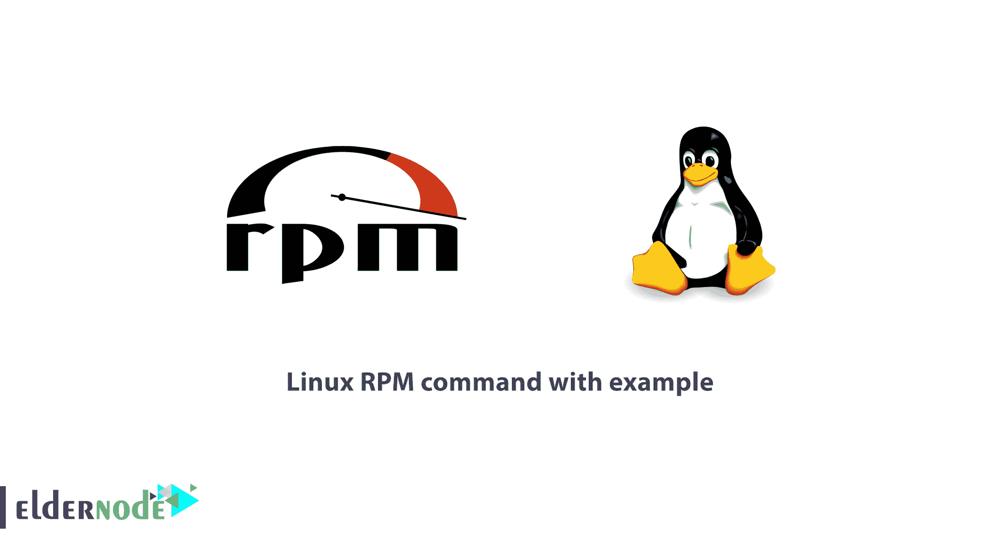

# 教程 Linux RPM 命令及示例- Eldernode

> 原文：<https://blog.eldernode.com/tutorial-linux-rpm-command/>



RPM 是 [RedHat](https://www.redhat.com/en) 包管理器**的缩写。**这是一个默认的开源和最流行的软件包管理工具，用于基于 RedHat 的系统。作为系统管理员或用户，您将需要 RPM 来执行一些活动，如在 Unix/Linux 操作系统中安装、更新、卸载、查询、验证和管理系统软件包。请注意，RPM 适用于构建在。RPM 格式。由于您需要拥有自己的 [Linux 虚拟专用服务器](https://eldernode.com/linux-vps/)，请相信我们会为您提供最好的服务。

## 

**请注意**:要启动本指南并进入解决方案，需要一个根用户。您应该是根用户，才能使用其管理 rpm 命令及其相应选项的权限。

## 带示例的 Linux RPM 命令教程

请阅读本文，了解大约 20 个有用且实用的 Linux RPM 命令示例。在那之后，你也许能够设法在你的 [Linux 系统](https://blog.eldernode.com/find-kill-running-processes-linux/)中安装、更新、删除软件包。

### RPM 包的五种基本模式

要开始本指南，请查看以下 RPM 包操作的五种基本模式列表:

*   安装
*   去除
*   提升
*   核实
*   询问

要使用和**安装** RPM 包，您将使用安装模式。正如您所猜测的，您可能需要删除或卸载任何 RPM 包。所以你会使用**清除**模式。此外，为了更新现有的 RPM 包，**升级**模式可用。如果您需要**验证**任何 RPM 包，第四种模式开启。最后到**查询**一个 RPM 包，找到最新的模式，查询。

关于 RedHat 软件包管理器的更多信息

你会发现 RPM 是免费的，它是在 **GPL** (通用公共许可证)下发布的。

### **1-** 使用 RPM 可以帮助您将所有包的信息保存在 **/var/lib/rpm** 数据库下。

**2-** 你需要 RPM 才能在 Linux 系统下安装包。请记住，如果您已经使用源代码安装了软件包，那么 rpm 将不会管理它。

**3-** RPM 处理**。rpm** 文件，它包含关于包的实际信息，比如:它是什么，它来自哪里，依赖信息，版本信息，等等。

找到 RPM 包的方法

在这里，有一些网站可以找到并下载所有的 **RPM** 包。

### 1-Rpmfind.net

2-Redhat.com

3-freshrpms.net

4-rpm.pbone.net

1-如何检查 RPM 签名包

在 Linux 系统上安装 RPM 包之前，您需要检查包的 PGP 签名。此外，确保它的完整性和来源是好的。为此，运行以下命令。

### **注意** : checksig(检查签名)是一个选项，用于检查一个名为 pidgin 的包的签名。

在 Linux 系统上安装 RPM 包之前，您需要检查包的 PGP 签名。此外，确保它的完整性和来源是好的。为此，运行以下命令。

```
[[[email protected]](/cdn-cgi/l/email-protection)]# rpm --checksig pidgin-2.7.9-5.el6.2.i686.rpm
```

```
pidgin-2.7.9-5.el6.2.i686.rpm: rsa sha1 (md5) pgp md5 OK 
```

**注意** : checksig(检查签名)是一个选项，用于检查一个名为 pidgin 的包的签名。

### 2-如何安装 RPM 包

### 运行以下命令安装 rpm 软件包。

### **注意**:你使用了 **-i** 选项。比如安装一个名为**pidgin-2 . 7 . 9-5 . El 6 . 2 . i686 . rpm**的 rpm 包。

以下是一些例子:

```
[[[email protected]](/cdn-cgi/l/email-protection)]# rpm -ivh pidgin-2.7.9-5.el6.2.i686.rpm
```

```
Preparing...                ########################################### [100%]     1:pidgin                 ########################################### [100%] 
```

RPM 命令和选项

**-i** :安装一个包

### **-v** :详细以获得更好的显示效果

**-h** :解包时打印哈希标记。

3-如何在安装前检查 RPM 包的依赖性

在此步骤中，您应该在安装或升级软件包之前进行依赖性检查。看看下面的例子，了解如何做到这一点。要检查**BitTorrent-5 . 2 . 2-1-python 2.4 . no arch . rpm**包的依赖项，请运行以下命令以显示该包的依赖项列表。

### 看一看:

RPM 命令和选项

```
[[[email protected]](/cdn-cgi/l/email-protection)]# rpm -qpR BitTorrent-5.2.2-1-Python2.4.noarch.rpm    /usr/bin/python2.4  python >= 2.3  python(abi) = 2.4  python-crypto >= 2.0  python-psyco  python-twisted >= 2.0  python-zopeinterface  rpmlib(CompressedFileNames) = 2.6 
```

**-q** :查询一个包

### **-p** :列出这个包提供的功能。

**-R** :列出这个包所依赖的能力。

4-如何安装没有依赖关系的 RPM 包

如果您认为最近已经安装了所有必需的软件包，并且不需要 RPM，那么在安装软件包之前，可以通过使用选项**–nodeps**(无依赖性检查)随意忽略这些依赖性。

要通过强制忽略依赖项错误来安装 rpm 包，可以使用上面的命令。请记住，如果那些依赖文件丢失了，您就不能运行程序，直到您安装了它们。

```
[[[email protected]](/cdn-cgi/l/email-protection)]# rpm -ivh --nodeps BitTorrent-5.2.2-1-Python2.4.noarch.rpm    Preparing...                ########################################### [100%]     1:BitTorrent             ########################################### [100%]
```

5-如何检查已安装的 RPM 包

同样为了显示是否安装了 rpm，使用带有包名的 **-q** 选项。

```
[[[email protected]](/cdn-cgi/l/email-protection)]# rpm -q BitTorrent BitTorrent-5.2.2-1.noarch
```

6-如何获取已安装 RPM 包的所有文件列表

使用带 rpm 命令的 **-ql** (查询列表)，查看已安装 rpm 包的所有文件

### 7-如何获得最近安装的 RPM 包列表

要列出所有最近安装的 rpm 包，可以使用下面的 rpm 命令和 **-qa** (query all)选项。

```
[[[email protected]](/cdn-cgi/l/email-protection)]# rpm -ql BitTorrent    /usr/bin/bittorrent  /usr/bin/bittorrent-console  /usr/bin/bittorrent-curses  /usr/bin/bittorrent-tracker  /usr/bin/changetracker-console  /usr/bin/launchmany-console  /usr/bin/launchmany-curses  /usr/bin/maketorrent  /usr/bin/maketorrent-console  /usr/bin/torrentinfo-console 
```

```
[[[email protected]](/cdn-cgi/l/email-protection)]# rpm -qa --last    BitTorrent-5.2.2-1.noarch                     Tue 04 Dec 2012 05:14:06 PM BDT  pidgin-2.7.9-5.el6.2.i686                     Tue 04 Dec 2012 05:13:51 PM BDT  cyrus-sasl-devel-2.1.23-13.el6_3.1.i686       Tue 04 Dec 2012 04:43:06 PM BDT  cyrus-sasl-2.1.23-13.el6_3.1.i686             Tue 04 Dec 2012 04:43:05 PM BDT  cyrus-sasl-md5-2.1.23-13.el6_3.1.i686         Tue 04 Dec 2012 04:43:04 PM BDT  cyrus-sasl-plain-2.1.23-13.el6_3.1.i686       Tue 04 Dec 2012 04:43:03 PM BDT
```

8-如何检查所有已安装的 RPM 包

通过运行以下命令，打印 Linux 系统上已安装软件包的所有名称:

```
[[[email protected]](/cdn-cgi/l/email-protection)]# rpm -qa initscripts-9.03.31-2.el6.centos.i686 polkit-desktop-policy-0.96-2.el6_0.1.noarch thunderbird-17.0-1.el6.remi.i686
```

9-如何升级 RPM 包

“**–U**”(升级)选项适用于升级任何 RPM 包。通过使用此选项，您可以升级任何软件包的最新版本，也可以保留旧软件包的备份。如果新升级的软件包无法运行，则可以再次使用以前安装的软件包。

### 9-如何升级 RPM 包

“**–U**”(升级)选项适用于升级任何 RPM 包。通过使用此选项，您可以升级任何软件包的最新版本，也可以保留旧软件包的备份。如果新升级的软件包无法运行，则可以再次使用以前安装的软件包。

```
[[[email protected]](/cdn-cgi/l/email-protection)]# rpm -Uvh nx-3.5.0-2.el6.centos.i686.rpm  Preparing...                ########################################### [100%]     1:nx                     ########################################### [100%]
```

### 10-如何移除 RPM 包

### 现在轮到学习如何卸载 RPM 包了。可以用包名 **nx** ，不要用原来的包名**NX-3 . 5 . 0-2 . el6 . centos . i686 . rpm**。 **-e** (擦除)选项用于移除封装。

### 10-如何移除 RPM 包

现在轮到学习如何卸载 RPM 包了。可以用包名 **nx** ，不要用原来的包名**NX-3 . 5 . 0-2 . el6 . centos . i686 . rpm**。 **-e** (擦除)选项用于移除封装。

```
[[[email protected]](/cdn-cgi/l/email-protection)]# rpm -evv nx
```

### 11-如何移除没有依赖关系的 RPM 包

### 要从系统中强制删除 rpm 包，请使用**–nodeps**(不要检查依赖关系)。考虑到一个特定的包可能会破坏其他正在工作的应用程序。

```
[[[email protected]](/cdn-cgi/l/email-protection)]# rpm -ev --nodeps vsftpd
```

12-查询属于哪个 RPM 包的文件

一旦你有了一个文件列表，你就可以找出哪个包属于这些文件。要做到这一点，在下面的命令中使用下面的 exam，带有 **-qf** (查询文件)选项，向您显示一个文件 **/usr/bin/htpasswd** 属于包**httpd-tools-2 . 2 . 15-15 . el6 . centos . 1 . i686**。

```
[[[email protected]](/cdn-cgi/l/email-protection)]# rpm -qf /usr/bin/htpasswd  httpd-tools-2.2.15-15.el6.centos.1.i686
```

13-查询已安装 RPM 包的信息

安装 rpm 包后，您可以看到关于该包的信息。下面的 **-qi** (查询信息)选项将打印已安装包的可用信息。

```
[[[email protected]](/cdn-cgi/l/email-protection)]# rpm -qi vsftpd    Name        : vsftpd				   Relocations: (not relocatable)  Version     : 2.2.2				   Vendor: CentOS  Release     : 11.el6				   Build Date: Fri 22 Jun 2012 01:54:24 PM BDT  Install Date: Mon 17 Sep 2012 07:55:28 PM BDT      Build Host: c6b8.bsys.dev.centos.org  Group       : System Environment/Daemons           Source RPM: vsftpd-2.2.2-11.el6.src.rpm  Size        : 351932                               License: GPLv2 with exceptions  Signature   : RSA/SHA1, Mon 25 Jun 2012 04:07:34 AM BDT, Key ID 0946fca2c105b9de  Packager    : CentOS BuildSystem <http://bugs.centos.org>  URL         : http://vsftpd.beasts.org/  Summary     : Very Secure Ftp Daemon  Description :  vsftpd is a Very Secure FTP daemon. It was written completely from  scratch.
```

14-如何在安装前获取 RPM 包的信息

要继续这一步，您必须从互联网上下载一个软件包，并想在安装它之前了解软件包的信息。要打印一个包的信息 **sqlbuddy，**使用以下选项 **-qip** (查询信息包)

### 15-已安装 RPM 包的查询文档

**教程 Linux RPM 命令**中的另一项是，要获得已安装包的可用文档列表，显示与 **vmstat** 包相关的手册页，请使用以下命令和选项 **-qdf** (查询文档文件)。

```
[[[email protected]](/cdn-cgi/l/email-protection)]# rpm -qip sqlbuddy-1.3.3-1.noarch.rpm    Name        : sqlbuddy                     Relocations: (not relocatable)  Version     : 1.3.3                        Vendor: (none)  Release     : 1                            Build Date: Wed 02 Nov 2011 11:01:21 PM BDT  Install Date: (not installed)              Build Host: rpm.bar.baz  Group       : Applications/Internet        Source RPM: sqlbuddy-1.3.3-1.src.rpm  Size        : 1155804                      License: MIT  Signature   : (none)  Packager    : Erik M Jacobs  URL         : http://www.sqlbuddy.com/  Summary     : SQL Buddy â Web based MySQL administration  Description :  SQLBuddy is a PHP script that allows for web-based MySQL administration. 
```

### 16-如何验证 RPM 包

要将软件包的已安装文件信息与 rpm 数据库进行比较，您需要验证一个软件包。为此，您可以使用 **-Vp** (验证包)。

```
[[[email protected]](/cdn-cgi/l/email-protection)]# rpm -qdf /usr/bin/vmstat    /usr/share/doc/procps-3.2.8/BUGS  /usr/share/doc/procps-3.2.8/COPYING  /usr/share/doc/procps-3.2.8/COPYING.LIB  /usr/share/doc/procps-3.2.8/FAQ  /usr/share/doc/procps-3.2.8/NEWS  /usr/share/doc/procps-3.2.8/TODO 
```

```
[[[email protected]](/cdn-cgi/l/email-protection) downloads]# rpm -Vp sqlbuddy-1.3.3-1.noarch.rpm  S.5....T. c /etc/httpd/conf.d/sqlbuddy.conf
```

17-如何验证所有 RPM 包

运行下面的命令来验证所有安装的 rpm 包。

### 18-如何导入 RPM GPG 键

你需要导入 **GPG** 键来验证 **RHEL/CentOS/Fedora** 包。它将进口 **CentOS 7** GPG 钥匙。因此，运行以下命令来实现这一点。

```
[[[email protected]](/cdn-cgi/l/email-protection)]# rpm -Va    S.5....T.  c /etc/rc.d/rc.local  .......T.  c /etc/dnsmasq.conf  .......T.    /etc/ld.so.conf.d/kernel-2.6.32-279.5.2.el6.i686.conf  S.5....T.  c /etc/yum.conf  S.5....T.  c /etc/yum.repos.d/epel.repo 
```

### 19-如何检查所有导入的 RPM GPG 键列表

以下命令让您打印系统中所有导入的 **GPG** 键。

```
[[[email protected]](/cdn-cgi/l/email-protection)]# rpm --import /etc/pki/rpm-gpg/RPM-GPG-KEY-CentOS-7 
```

### 20-如何重建损坏的 RPM 数据库

使用 RPM 包时要考虑的最重要的事情之一是如何重建损坏的 RPM 数据库，这在教程 Linux RPM 命令中讨论过。要准备好应对 rpm 数据库损坏并停止 rpm 和系统上其他应用程序的所有功能的情况，请学习重建 rpm 数据库，并在以下命令的帮助下恢复它。

```
[[[email protected]](/cdn-cgi/l/email-protection)]# rpm -qa gpg-pubkey*    gpg-pubkey-0608b895-4bd22942  gpg-pubkey-7fac5991-4615767f  gpg-pubkey-0f2672c8-4cd950ee  gpg-pubkey-c105b9de-4e0fd3a3  gpg-pubkey-00f97f56-467e318a  gpg-pubkey-6b8d79e6-3f49313d  gpg-pubkey-849c449f-4cb9df30 
```

```
[[[email protected]](/cdn-cgi/l/email-protection)]# cd /var/lib  [[[email protected]](/cdn-cgi/l/email-protection)]# rm __db*  [[[email protected]](/cdn-cgi/l/email-protection)]# rpm --rebuilddb  [[[email protected]](/cdn-cgi/l/email-protection)]# rpmdb_verify Packages 
```

结论

在本文中，您已经学习了 20 个 Linux RPM 命令的实际例子。如果你需要学习更多的命令，可以找到我们的相关文章 [从 A 到 Z 的 Linux 命令概述和例子](https://eldernode.com/linux-commands-with-examples/) 。

## 结论

在本文中，您已经学习了 20 个 Linux RPM 命令的实际例子。如果你需要学习更多的命令，可以找到我们的相关文章 [从 A 到 Z 的 Linux 命令概述和例子](https://eldernode.com/linux-commands-with-examples/) 。