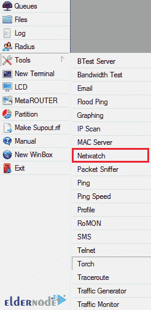
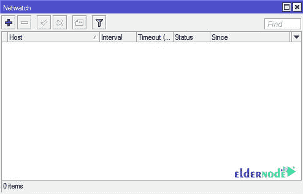
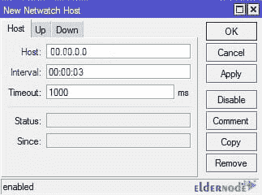
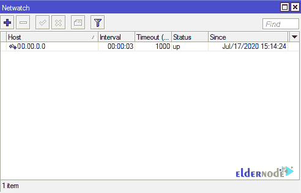

# MikroTik - Eldernode 博客中的 Netwatch 介绍和教程

> 原文：<https://blog.eldernode.com/tutorial-netwatch-in-mikrotik/>

Netwatch 是一种高级监控工具，可以在 ICMP Ping 数据包的帮助下，根据 Ping 数据包目的地返回的响应，自动将各种事件应用到路由器。Netwatch 的任务是监控互联网或内部网络中主机的状态(可达或不可达)。该工具通过向管理员指定的 IP 发送 ping 数据包来检查主机的状态。Netwatch 表中指定的所有 IP 都会发生这种情况。Ping 数据包有一个基于事件的返回消息。该定义可以是 Mikrotik 路由器上的脚本或命令的形式。在本文中，我们尝试用 MikroTik 介绍和指导 Netwatch。如果您需要购买 [Mikrotik VPS](https://eldernode.com/mikrotik-vps-server/) 服务器，您可以访问 [Eldernode](https://eldernode.com/) 中提供的软件包。

## **mikro tik**中的教程 Netwatch

### 什么是 NETWATCH 工具？

Netwatch 是一个用于检查和测试网络或系统状态的工具。该工具用于测量用户 Mikrotik 与连接到网络的设备之间的连接稳定性。它还向用户提供有关连接或断开网络的信息。

该工具是 Mikrotik 应用程序之一，使用它可以观察不同网络中两个 mikro tik 之间的连接状态，以及测试与服务器的连接。换句话说，用户可以通过在 Netwatch 中查看连接状态来确定连接状态和未连接状态，而不是排除故障和执行各种测试。

### **如何在 Mikrotik** 中使用 Netwatch

在本文的其余部分，我们将尝试向您解释如何在 Mikrotik 中使用 Netwatch 工具。请加入我们。使用 Netwatch 的第一步是点击**工具**菜单中的 **Netwatch** 选项来打开它的窗口。

下一步，打开 Netwatch 窗口后，点击**添加**选项。然后，您需要输入所需信息，以确保 Mikrotik 与您的设备之间的连接状态。

您必须输入的上述必需信息如下:

***A)** **主机:*** 在本栏位输入所需目的地的 IP 地址。

***B)** **间隔:*** 从该段设置您希望微控制器检查的时间。

***C)** **超时:***mikro tik 等待断开连接的时间长度在本节中指定。

输入信息后，点击**应用**，然后点击**确定**，显示网络状态。

*

一旦您能够添加所需的 Netwatch，您就可以在同一页面上看到您添加的服务器的状态。应该注意的是，关闭 ICMP 和 Ping 协议不会影响该工具的使用。Mikrotik 还可以测试和检查网络连接状态，而不必打开它。

## 结论

Netwatch 通过向指定的 IP 地址列表发送 ICMP pings 来监视网络上主机的状态。您可以为 netwatch 表中的每个条目指定 IP 地址、ping 距离和控制台脚本。netwatch 的主要优点是能够在主机模式改变时发出任意的控制台命令。在本文中，我们试图向您介绍 MikroTik 中的 Netwatch，并解释如何使用它。如果你愿意，可以访问 Mikrotik 中的 [DNS 配置教程和 MikroTik](https://blog.eldernode.com/dns-configuration-tutorial-in-mikrotik/) 文章中的[静态路由。](https://blog.eldernode.com/static-route-in-mikrotik/)