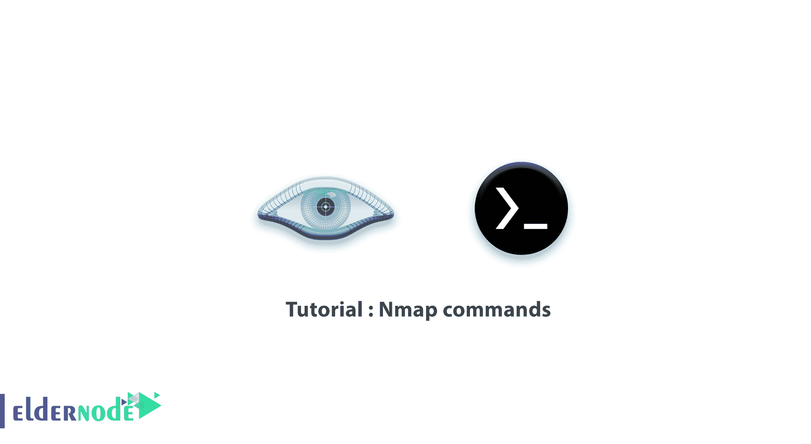

# 教程 Nmap 命令[完整] - ElderNode 博客

> 原文：<https://blog.eldernode.com/tutorial-nmap-commands/>



Nmap 是一个免费的开源网络映射器。这种最流行的网络扫描器用于网络发现和安全审计。作为管理员，您可以使用这个网络发现工具来映射您的网络。Nmap 对于在家托管网站的用户也很有价值，因为他们可以模拟黑客攻击他们网站的过程。安装 Nmap 时，您需要知道一些命令来执行一些基本的网络扫描。这篇文章介绍了教程 Nmap 命令。要购买您自己的 [Linux VPS](https://eldernode.com/linux-vps/) ，请访问 [Eldernode](https://eldernode.com/) 的可用包并订购您需要的东西。

## **Nmap 命令**

### **什么是 Nmap**

Nmap 是一个开源的免费工具，它使网络发现和安全。网络管理系统发现**网络映射器(Nmap)** 对于管理服务升级计划、监控主机或服务正常运行时间以及网络清单等任务非常有用。Nmap 也是灵活的、强大的、可移植的、简单的、免费的、有良好文档记录的、受支持的、受欢迎的。为了确定网络上可用的主机，map 以一种新颖的方式使用 row IP 数据包。它旨在快速扫描大型网络，并适用于单个主机。

### **Nmap 特性**

Nmap 提供了一些探测计算机网络的功能。以下是 Nmap 软件最广泛使用的功能。您可以通过 **-h** 开关获得其他功能和信息。让我们在下面的列表中回顾其中的一些:

1-快速扫描所有端口

2-目标操作系统识别

3-发送匿名数据包以过滤防火墙

4-扫描特定范围端口的能力

5-欺骗功能

6-能够以不同格式保存扫描结果

7-能够设置 TTL 来过滤智能防火墙

8-为云安全扫描发送数据包的能力

9-通过开放端口识别服务的能力

10-调整各种扫描技术的能力

## **顶级 Nmap 命令示例**

安装 Nmap 后，您需要使用 Nmap 命令开始扫描主机或网络，找出主机中任何可能的漏洞。例如，在命令中输入的 IP 地址，您可以输入您的 IP 地址。注意大小写字母。此外，所有命令都可以在 Windows 和 [Linux](https://blog.eldernode.com/tag/linux/) 操作系统上运行。

和我们一起回顾 Linux 网络中最好的 Nmap 命令和例子。

### **Nmap Ping 扫描命令**

Nmap 最基本的功能是识别网络中的活动主机。Ping 扫描允许 Nmap 执行此操作，并识别所有在线的 IP 地址，而不向这些主机发送任何数据包。您可以使用下面的命令**运行 ping 扫描**并查看哪些服务器是活动的:

```
nmap -sp 192.100.1.1/24
```

此外，它还会返回网络中主机的列表以及分配的 IP 地址总数。因此，您可以运行以下命令来查看网络上每个活动 IP 的返回信息:

```
#
```

### **Nmap 主机扫描命令**

主机扫描是一种更强大的扫描网络的方式，因为它向连接到您网络的所有主机发送 **ARP 请求数据包**。然后，每台主机用另一个包含其状态和 MAC 地址的 ARP 数据包来响应此数据包。

使用以下命令**运行主机扫描**:

```
nmap -sp <target IP range>
```

您可以使用此命令作为发现连接到您网络的可疑主机的有效方法。使用此命令，您可以返回关于每台主机的信息、它们的延迟、它们的 MAC 地址以及与此地址相关的任何描述。

***注意* :** 在这个列表中你可能会面临一个不寻常的问题。因此，使用以下命令在特定主机上运行 DNS 查询:

```
namp -sL <IP address>
```

您将会看到有关 IP 实际用途的信息，因为上面的命令会返回与扫描的 IP 相关的名称列表。

### **Nmap 端口扫描命令**

可以使用 Nmap 进行 [**端口扫描**](https://blog.eldernode.com/scan-ports-with-sctp-on-nmap/) 。以下是最常用的命令:

```
sS TCP SYN scan
```

```
sT TCP connect scan
```

```
sU UDP scans
```

```
sY SCTP INIT scan
```

```
sN TCP NULL
```

这些类型的扫描之间的区别在于它们是否覆盖 [TCP 或 UDP](https://blog.eldernode.com/watch-tcp-udp-ports/) 端口，以及它们是否执行 TCP 连接。

### **Nmap OS 扫描命令**

Nmap 的另一个强大功能是操作系统扫描。Nmap 可以在使用这种类型的扫描时将 TCP 和 UDP 数据包发送到特定端口，然后分析其响应。最后，通过将响应与包含 2600 个操作系统的数据库进行比较，返回有关主机操作系统(和版本)的信息。

您可以通过运行以下命令**运行操作系统扫描**:

```
nmap -O <target IP>
```

正如我们提到的，在家庭服务器上运行 Nmap 的用户发现它非常有价值。如果您在家庭服务器上运行 Nmap，使用下面的命令**自动扫描主机的一些最“流行”的端口**。你只需要**用要扫描的端口数替换****20**:

```
nmap --top-ports 20 YourIPAddress
```

它返回一个简明的输出，详细说明最常见端口的状态。这样，您将看到是否有任何不必要的开放端口。

### **Nmap 输出结果命令**

要输出到一个文件，请为您的命令添加一个扩展名，如下所示。它会将 Nmap 扫描的结果输出到一个文件中:

```
-oN output.txt
```

向您的命令**输出结果到文本文件**，或者:

```
-oX output.xml
```

输出到 XML。

此外，您可以通过运行以下命令将输出保存到文本文件中:

```
nmap 192.168.1.1 > output.txt
```

```
nmap -oN /path/to/filename 192.168.1.1
```

```
nmap -oN output.txt 192.168.1.1
```

### **如何加速 Nmap 扫描**

特别是在大型网络扫描中，如果您禁用反向 DNS 解析，您可以通过使用 **-n** 参数来**加速您的 Nmap 扫描**。例如，为了**关闭上述基本 ping 扫描的 DNS 解析**，添加 **-n** :

```
nmap -sp -n 192.100.1.1/24
```

要**执行快速扫描**，请使用下面的 Nmap 命令:

```
nmap -F 192.168.1.1
```

```
nmap -6 -F IPv6_Address_Here
```

在本文的下文中，让我们看看使用 Nmap 的其他一些命令。

_ **系统的快速扫描**:

```
nmap -F 192.168.1.1
```

_ **快速扫描**端口的详细信息和版本:

```
nmap -v 192.168.1.1
```

_ **通过详细扫描识别操作系统**:

```
nmap -v -A 192.168.1.1
```

_ **使用所需范围的端口号进行全面扫描**:

```
nmap -v -p 1-100 192.168.1.1
```

在上面的命令中，只扫描和报告端口 1 到 100。

_ Scan 通过**发送随机数据包**来拦截目标系统防火墙:

```
nmap -v -f
```

_ **从特定端口发送数据包**进行匿名扫描:

```
nmap -v 192.168.1.1 -g 80
```

在上面的命令中，Nmap 通过您的**端口 80** 发送所有数据包，目标系统将其视为 web 请求。

要**显示发送和接收的所有数据包**,运行:

```
nmap --packet-trace 192.168.1.1
```

```
nmap --packet-trace server1.YourDomainAddress
```

_ **扫描系统**当系统阻止 ping 时:

```
nmap -v -Pn
```

Nmap 软件使用 ICMP 协议来检查系统的状态，如果用户阻止了该协议，您必须使用 **-pn** 开关。

_ 使用 Nmap 的完整命令示例:

```
nmap -v -A -Pn -f  -p 1-65535 192.168.1.1 -g 80
```

您的系统将使用端口 80 发送数据包，同时检查并显示操作系统规格。此外，Nmap 软件并不关心关闭目标系统的 ICMP 协议，而是随机发送数据包。

### **如何扫描大量主机/网络**

要扫描大量主机/网络，您可以使用 ***-iL*** 选项。使用此选项，您可以通过文本文件读取目标系统列表:

```
cat > /tmp/test.txt
```

然后，按如下方式附加名称:

```
server1.YourDomainAddress
```

```
192.168.1.0/24
```

```
192.168.1.1/24
```

```
10.1.2.3
```

```
localhost
```

语法如下:

```
nmap -iL /tmp/test.txt
```

### **如何排除主机/网络(IPv4)**

要在扫描大量主机/网络(IPv4)时将其从 Nmap 扫描示例中排除，请使用以下命令:

```
nmap 192.168.1.0/24 --exclude 192.168.1.5
```

```
nmap 192.168.1.0/24 --exclude 192.168.1.5,192.168.1.254
```

或者从名为 **/tmp/exclude.txt** 的文件中排除列表:

```
nmap -iL /tmp/scanlist.txt --e    xcludefile /tmp/exclude.txt
```

### 如何使用 Nmap 命令检测防火墙设置

您可以在渗透测试和漏洞扫描期间使用防火墙检测。有几个函数可以用来检测给定主机上的防火墙设置，但最常用的是 **-sA** 标志:

```
nmap command examples for your host
```

```
nmap -sA 192.168.1.254
```

```
nmap -sA server1.YourDomainAddress
```

然后，您可以使用下面的命令对受防火墙保护的主机进行扫描。例如，要扫描 IP 地址为 192.168.1.1 的路由器/wifi 设备:

```
nmap -PN 192.168.1.1
```

```
nmap -PN server1.YourDomainAddress
```

### 如何使用 Nmap 命令查看打开的端口

要显示公开或可能公开的帖子，您可以在 Linux 中使用以下 Nmap 命令:

```
nmap --open 192.168.1.1
```

```
nmap --open server1.YourDomainAddress
```

```
nmap --open 192.168.2.18
```

要扫描所有设备/电脑的开放端口，请键入:

```
nmap -T5 192.168.1.0/24
```

```
nmap -T5 {sub/net}
```

## **如何对 Nikto**T3 使用 Nmap 命令

最近， [Nikto](https://blog.eldernode.com/introducing-and-install-nikto-on-kali-linux/) 介绍给你。要将 web 服务器和管道扫描到 Nikto 进行扫描，请运行以下命令:

```
nmap -p80 192.168.1.2/24 -oG - | /path/to/nikto.pl -h -
```

```
nmap -p80,443 192.168.1.2/24 -oG - | /path/to/nikto.pl -h -
```

## 结论

在本文中，您回顾了最重要的 Nmap 命令。Nmap 命令带有许多选项，现在您已经知道如何使用 Nmap 进行攻击和防御。然而，如果你不习惯使用 CLI，你可以使用名为 [Zenmap](https://blog.eldernode.com/setup-zenmap-on-ubuntu/) 的 GUI 应用程序。这是官方的 Nmap 安全扫描器图形用户界面。如果您有兴趣了解更多信息，请参考 Nmap 上的[如何使用连接扫描](https://blog.eldernode.com/scan-ports-using-connect-scan-on-nmap/)和[鳍扫描](https://blog.eldernode.com/scan-ports-with-fin-scan-on-nmap/)来扫描端口。