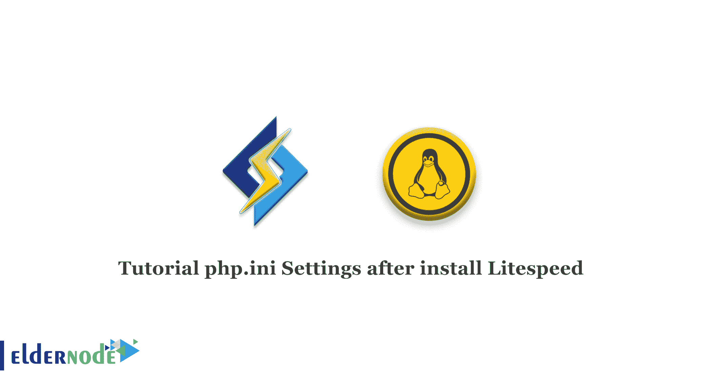

# 安装 Litespeed - Eldernode 博客后的教程 php.ini 设置

> 原文：<https://blog.eldernode.com/tutorial-php-ini-settings-after-install-litespeed/>



加快网站速度和优化网站速度是用户寻求的最重要的问题。这样做的原因是，首先，用户能够更快地访问网站，其次，搜索引擎认为这是该网站的一个特殊优势。各种解决方案总是被引入来提高现场速度。其中一个方法是使用 litespeed 网络服务器和更好的网站缓存管理。这就是为什么我们在这篇文章中，我们将教你如何在安装 Litespeed 后添加 php.ini 设置。另外，如果你想购买一个 [**Linux VPS**](https://eldernode.com/linux-vps/) 主机，你可以访问 [Eldernode](https://eldernode.com/) 中的软件包。

## **安装 Litespeed 后如何添加 php.ini 设置**

安装 litespeed 后，将之前的 php.ini 文件链接到 php.ini Lightspeed，这样之前的设置不会改变。

使用 PHP–ini 命令，找到当前的 php.ini 路径，并对其进行符号链接，如下所示。

```
ln -s /usr/local/php56/lib/php.ini /usr/local/lsws/lsphp5/lib/php.ini
```

php7 的 php.ini 光速路径如下:

```
/usr/local/lsws/lsphp7/lib/
```

最后，通过以下命令重置 Lightspeed 服务:

```
Service lsws restart
```