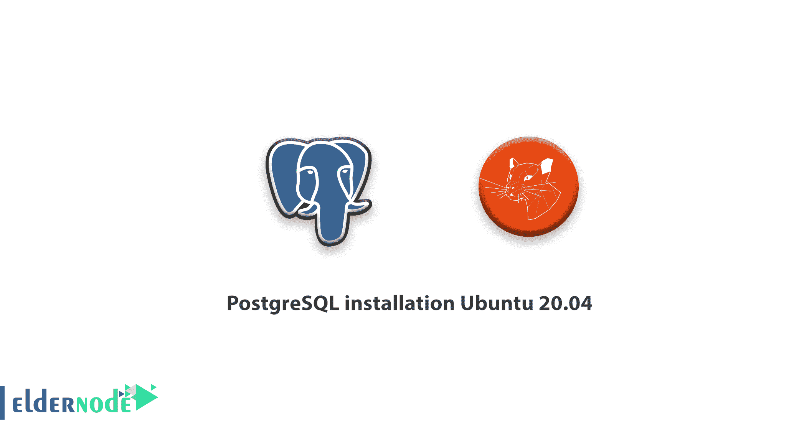

# 教程 PostgreSQL 安装 Ubuntu 20.04-Ubuntu 上的 postgres

> 原文：<https://blog.eldernode.com/tutorial-postgresql-installation-ubuntu-20/>



在本教程中，我们想学习“教程 PostgreSQL 安装 Ubuntu 20.04”及其工作原理。因此，让我们从什么是 postgres 开始，当你知道了这些，安装并使用 postgres。

#### 什么是 PostgreSQL？

PostgreSQL 也称为 Postgres，它是一个开源的、功能强大的关系数据库管理系统。 [PostgreSQL](https://en.wikipedia.org/wiki/PostgreSQL) 使用具有高级特性的 SQL 语言，如无读锁的并发和可靠事务。加入我们来学习在 Ubuntu 20.04 上安装 PostgreSQL

## **安装前的先决条件**

要安装 PostgreSQL，首先你应该有一个配置好的 Ubuntu 20.04 服务器，一个基本的防火墙，还有一个拥有 Sudo 权限的 **non_root** 用户。

## 教程 PostgreSQL 安装 Ubuntu 20.04

### **一步步在 Ubuntu 上安装 Postgres**

**第一步。**

您需要刷新服务器的本地包索引:

```
$ sudo apt update
```

要添加实用程序和功能，请安装带有 -contrib 的 Postgres 包:

```
$ sudo apt install postgresql postgresql-contrib
```

**第二步。**

使用 PostgreSQL 角色和数据库

安装后，Postgres 将设置使用 ident 身份验证来匹配 Unix/Linux 帐户的角色。创建角色时， [Unix/Linux](https://blog.eldernode.com/tag/linux/) 用户名将能够使用相同的名称作为该角色登录。现在，我们将验证您可以使用该帐户访问 Postgres 的方式。

首先:通过键入以下命令，您将切换到您服务器上的 Postgres 帐户，一种方法是切换到您服务器上的 Postgres 帐户:

```
$ sudo -i -u postgres
```

然后，您将通过键入以下内容来访问 Postgres:

$ psql

登录 PostgreSQL 与数据库管理系统进行交互会有所帮助。

如果需要退出，可以使用下面的命令:

```
postgres=#  \q
```

您也可以运行 exit 命令返回到系统普通用户:

```
[[email protected]](/cdn-cgi/l/email-protection):~$  exit
```

或者直接使用 sudo 以 postgres 帐户的身份运行 psql 命令，以连接 Postgres 提示符，而不需要中间的 bash shell:

```
$ sudo -u postgres psql
```

同样，您可以通过键入以下命令退出交互式 Postgres 会话:

```
postgres=#  \q
```

**第三步。**

创建一个新角色。

您可以通过键入以下内容来创建新角色:

```
[[email protected]](/cdn-cgi/l/email-protection):~$  createuser --interactive
```

如果您不想从普通服务器帐户切换，请对每个命令使用 sudo:

```
$ sudo -u postgres createuser --interactive
```

根据您的回答，运行正确的 Postgres your specifications 命令，根据您的规范创建用户。

```
*Output*  Enter name of role to add: *sammy*  Shall the new role be a superuser? (y/n) *y*
```

**第四步。**

创建新的数据库。

默认情况下，身份验证系统使所有角色用于登录，因此这些角色将拥有一个同名的数据库以供访问。

当您创建一个名为“ sammy 的用户时，其角色将尝试连接到一个与您可以用 createdb 命令创建的数据库同名的数据库。

然后，如果您使用 postgres 帐户登录，您可以键入:

```
[[email protected]](/cdn-cgi/l/email-protection):~$ creatdb sammy
```

如果您不想从普通服务器帐户切换，请对每个命令使用 sudo:

```
$ sudo -u postgres created sammy
```

**第五步。**

用新角色打开 Postgres。

当您想要使用身份登录时，您需要一个与您的 Postgres 数据库和角色同名的 Linux 用户，如果没有匹配的 Linux 用户，您可以使用 adduser 命令创建一个新用户。使用拥有 sudo 权限的非 **root** 帐户:

```
$ sudo adduser sammy
```

只要新帐户可用，您就可以通过键入以下命令切换并连接数据库:

```
$ sudo -i -u sammy  $ psql
```

此外，您也可以内联完成此操作:

```
$ sudo -u sammy psql
```

通过运行此命令，如果所有组件都已正确配置，您将自动登录。通过指定数据库，您可以将您的用户连接到不同的数据库，如下所示:

```
$ psql -d postgres
```

您可以通过键入以下命令来检查连接信息:

```
Sammy=#  \conninfo
```

*输出*

```
You are connected to database "sammy" as user "sammy" via socket in "/var/run/postgresql" at port "5432"
```

您可以在评论区提出关于本次培训的问题，并得到您的回答，或者要解决[Eldernode.com](https://eldernode.com/)培训领域的其他问题，请参考[提问页面](https://eldernode.com/ask)部分，并尽快提出您的问题。腾出时间给其他用户和专家来回答你的问题。

**同样，参见**

[教程在 Ubuntu 18.04 上安装和使用 PostgreSQL](https://eldernode.com/install-postgresq-ubuntu-18-04/)

[Windows Server 2016 上的 PostgreSQL 安装教程](https://eldernode.com/postgresql-installation-tutorial/)

[PostgreSQL installation tutorial on Windows Server 2016](https://eldernode.com/postgresql-installation-tutorial/)