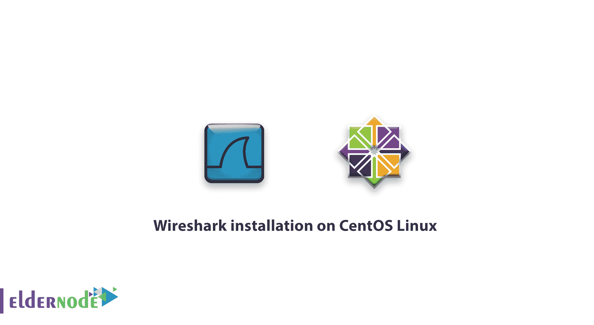

# 教程在 CentOS Linux 上安装 Wireshark-安装 Wireshark

> 原文：<https://blog.eldernode.com/tutorial-wireshark-installation-centos/>



最近我们介绍了 [Wireshark](https://eldernode.com/introducing-wireshark-software/) 的特性。在本文中，我们将展示在 [CentOS Linux](https://eldernode.com/tag/centos/) 上安装 Wireshark 的教程。Wireshark 软件因其良好的免费操作吸引了大多数操作系统的用户。因此，该公司发布了基于 [Linux](https://eldernode.com/linux-vps/) 和 Windows 的各种版本的操作系统。Wireshark 为 Linux 发布了两个版本，其中包括一个带有图形环境的版本和另一个名为 [Tshark](https://www.wireshark.org/docs/man-pages/tshark.html) 的版本，以便 Linux 用户可以在终端环境中使用它。
**注:**要在 CentOS Linux 中安装 Wireshark，需要安装一系列的软件包和先决条件，我们将在下面讨论。

## 在 CentOS Linux 上安装 Wireshark 的教程

**1**–首先，用下面的命令安装 **GTK 包**。

```
yum install gtk
```

这个包用来创建一个无线图形环境。
所以如果你在终端使用 Wireshark，你**就不能**安装这个包。

**2**–用下面的命令安装 **libpcap 包**。

```
yum install libpcap
```

您应该安装这个包来**将 Wireshark 连接到链路层。**

**3**–安装 tcpdump 包。

```
yum install tcpdump
```

在本节中，在安装完必备软件包后，我们将在 CentOS Linux 中安装 **Wireshark。**

**4**–运行以下命令下载并安装所需的 Wireshark 软件文件。

```
yum install wireshark
```

您现在已经安装了 Wireshark 软件，您可以在终端环境中使用 **Tshark 命令使用。**

**5**——如果需要安装 Wireshark 的**图形环境**，输入以下命令。

```
yum install wireshark-gnome
```

CentOS 上的 **无线安装由 Linux 命令完成。在接下来的文章中，我们将学习它在图形环境和 Tshark 命令中是如何工作的。**

亲爱的用户，我们希望这篇教程能对你有所帮助，如果你有任何问题或想查看我们的用户关于这篇文章的对话，请访问[提问页面](https://eldernode.com/ask)。也为了提高你的知识，这里有很多关于[老年节点训练](https://eldernode.com/blog/)的有用教程。