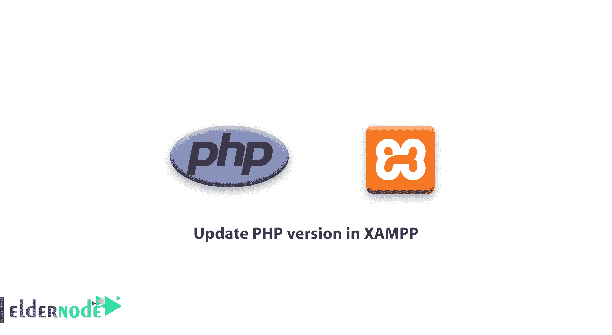
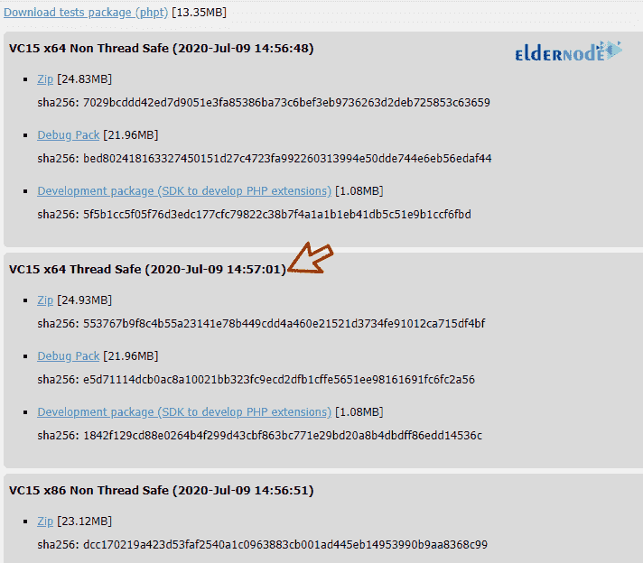
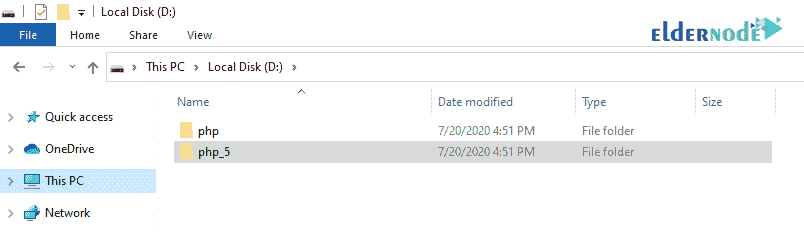
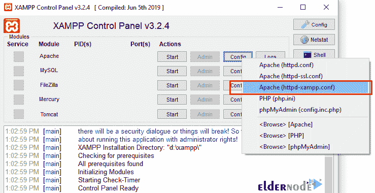
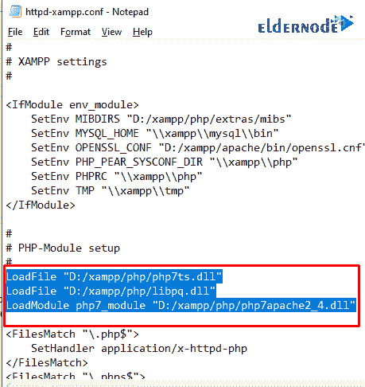

# 如何在 XAMPP - ElderNode 博客更新 PHP 版本

> 原文：<https://blog.eldernode.com/update-php-version-in-xampp/>



如何在 XAMPP 更新 PHP 版本？很多 web 开发者，尤其是初学者，都有一个共同的问题:“**我如何在 XAMPP 更新我的 PHP 版本？**“在收到很多关于更新 PHP 版本的问题后，我们决定写一个简短的教程，让你可以轻松地在[XAMPP](https://www.apachefriends.org/download.html)([Windows VPS](https://eldernode.com/windows-vps/))中更新 PHP 版本。

在本教程中，我们将向你展示如何通过 4 个步骤在 XAMPP 的 T2 轻松更新你的 PHP 版本。

XAMPP 对网页开发者来说起着重要的作用。它是开发者在自己的系统上免费构建网站最流行的栈之一。在 localhost 工作是加强你网络开发技能的一个很好的实践。这在 WordPress 开发者中也很常见。

在 XAMPP 更新 PHP 版本非常简单。你所要做的就是遵循这四个简单的步骤。

[购买 Windows 虚拟专用服务器](https://eldernode.com/windows-vps/)

## **第一步:** 下载最新 PHP 版本

首先，通过下面的链接下载 PHP 的最新版本:

[**下载 PHP 最新版本**](https://windows.php.net/download/)

确保根据您的 **Windows 版本下载线程安全 Zip 文件。32 位**的 x86 和 64 位的 **x64。如下图所示:**



在上图中你可以看到我已经下载了 VC15 x64 线程安全，因为我的 Windows 版本是 **64 位**。

## **第二步:** 解压 zip 文件，创建 PHP 文件夹

在这一步中，在你的 Windows 桌面上创建一个新文件夹，并将其命名为 PHP 。然后，将 zip 文件解压到新文件夹中(即 PHP)。

## **第三步:** 替换新版 PHP 代替旧版

接下来，进入你电脑上的 XAMPP 文件夹，选择 php 文件夹。然后将其重命名为类似 php_5 的名称，并将提取的新 php 文件夹放在 XAMPP 目录下。



## **第四步:** 配置 Apache 服务器

下一步是配置 Apache 服务器。为此，你必须打开你的 XAMPP 控制面板。然后点击 **Apache** 部分的( httpd-xampp.conf )。



一个 httpd-xampp.config 文件将在您的页面上打开。接下来，在 **PHP-Module** 设置中，删除下图中的旧代码行，替换新代码行。

**旧代号:**

```
LoadFile “D:/xampp/php/php5ts.dll”    LoadFile "D:/xampp/php/libpq.dll"    LoadModule php5_module “D:/xampp/php/php5apache2_4.dll”
```

**新代号:**

```
LoadFile "D:/xampp/php/php7ts.dll"    LoadFile "D:/xampp/php/libpq.dll"    LoadModule php7_module "D:/xampp/php/php7apache2_4.dll" 
```



保存文件，重启 XAMPP 服务器。 **搞定** ！

**亦作，见:**

[了解如何使用 XAMPP 在 Windows 10 中设置 VPS](https://blog.eldernode.com/learn-how-to-setup-vps-in-windows-10-using-xampp/)

[如何在 Windows 10 上安装 XAMPP](https://blog.eldernode.com/install-xampp-on-windows-10/)

[如何在 Windows 10 上配置 XAMPP](https://blog.eldernode.com/configure-xampp-on-windows-10/)

**尊敬的用户**，我们希望您能喜欢本教程，您可以在评论区提出关于本次培训的问题，或者要解决老年节点培训领域的其他问题，请参考[社区](https://community.eldernode.com/)版块，并尽快提出您的问题。腾出时间给其他用户和专家来回答你的问题。

好运。