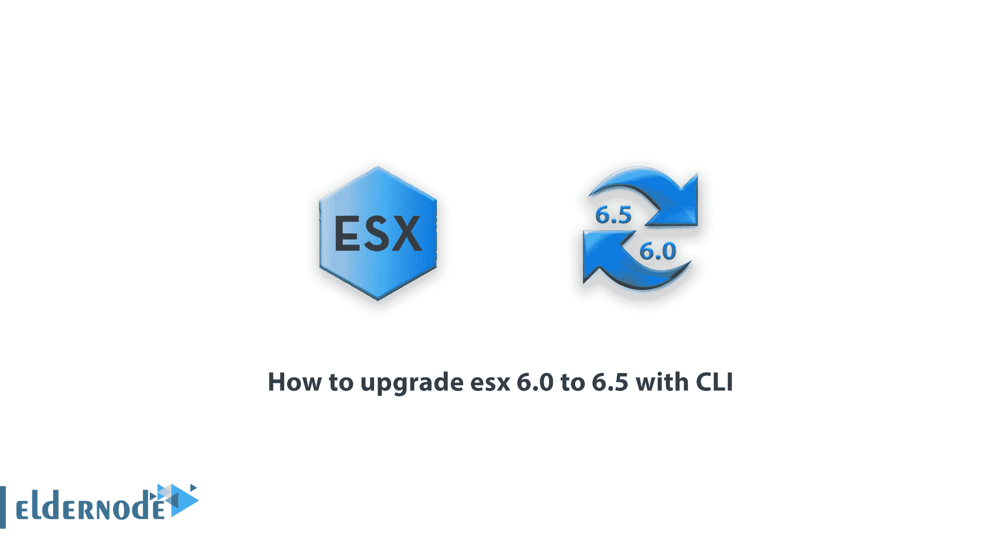
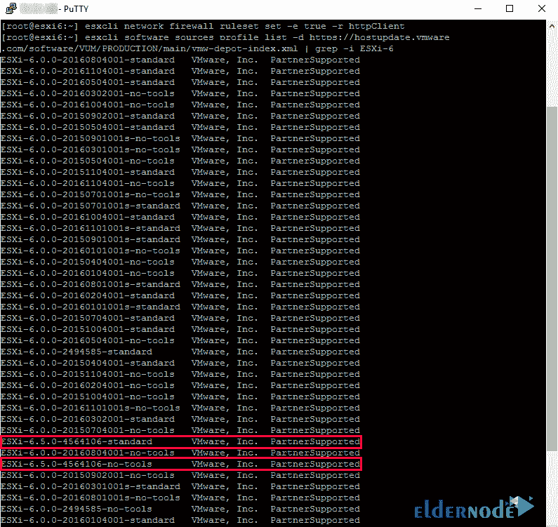

# 如何使用 CLI 将 esx 6.0 升级到 6.5-elder node 博客

> 原文：<https://blog.eldernode.com/upgrade-esx-6-0-to-6-5-with-cli/>



ESXi 是 VMware 虚拟机管理程序软件套件的最新版本，独立于操作系统，直接安装在硬件上。在该软件中，裸机技术正在使用并提供了管理硬件和系统资源的可能性。使用该软件，您可以构建一个虚拟机以及向虚拟机分配资源的过程。事实上，可以说 ESXi 控制和管理虚拟机之间的硬件资源。在本文中，我们尝试教您如何使用 CLI 将 esx 6.0 升级到 6.5。如果你认为你有一个[专用服务器](https://blog.eldernode.com/tag/dedicated-server/)，你不能忽视它，因为用一个新的 VPS 服务器重新安装和重启你的软件的成本很高，你不需要更换或重启。因为在 ESXI 中可以轻松地将您的物理机转换为虚拟机(convert ),并继续您的工作流程和添加其他机器。您还可以访问 [Eldernode](https://eldernode.com/) 中提供的位置和软件包，购买[专用服务器](https://eldernode.com/dedicated-server/)。

## **教程使用 CLI 将 esx 6.0 升级到 6.5**

ESXi 主要在组织中使用，管理人员可以通过配置文件上传必要的信息。应该注意的是，VMware 管理软件可用于管理 ESX 服务器和其他构建于其上的 [VPS](https://eldernode.com/vps/) 服务器。在本文的后续部分，请加入我们，了解如何使用 CLI 逐步将 esx 6.0 升级到 6.5。

## **使用 CLI 将 esx 6.0 升级到 6.5**

在本节中，我们将向您介绍如何升级 Esxi。开始之前，请确保您的 ESXi 6。x 主机连接到互联网。然后，您应该查看发行说明。请务必备份您的 ESXi 6。x 开始升级前的安装或配置。

要进行升级，您需要在第一步启用 SSH。然后，您需要通过 Putty 连接到 ESXi 主机。

成功登录 ESXi 主机后，您必须使用以下命令为 web 流量启用防火墙(权限)规则:

```
esxcli network firewall ruleset set -e true -r httpClient
```

现在，在这一步中，您必须运行以下命令，以查看 VMware 在线存储库和您可以从中更新的各种配置文件:

```
esxcli software sources profile list -d https://hostupdate.vmware.com/software/VUM/PRODUCTION/main/vmw-depot-index.xml | grep -i ESXi-6
```

正如您在下图中看到的，有两个轮廓引起了我们的兴趣。您必须选择“**无工具**”。



下一步是使用以下命令运行升级:

```
esxcli software profile update -p ESXi-6.5.0-20170702001-standard -d https://hostupdate.vmware.com/software/VUM/PRODUCTION/main/vmw-depot-index.xml
```

以下命令是 ESXi 6.5 的主要命令:

```
esxcli software profile update -p ESXi-6.5.0-4564106-no-tools -d https://hostupdate.vmware.com/software/VUM/PRODUCTION/main/vmw-depot-index.xml
```

升级成功后，在下一步中，您必须通过执行以下命令再次启用防火墙:

```
esxcli network firewall ruleset set -e false -r httpClient
```

最后，要完成安装，您必须重新启动主机以退出维护。

## 结论

在提供基于虚拟化的系统的公司中，vmware 是该领域的先驱之一。ESX 是一个使用强大的 VMKernel 内核的 VMware 虚拟机管理程序。在本文中，我们尝试教您如何使用 CLI 将 esx 6.0 升级到 6.5。