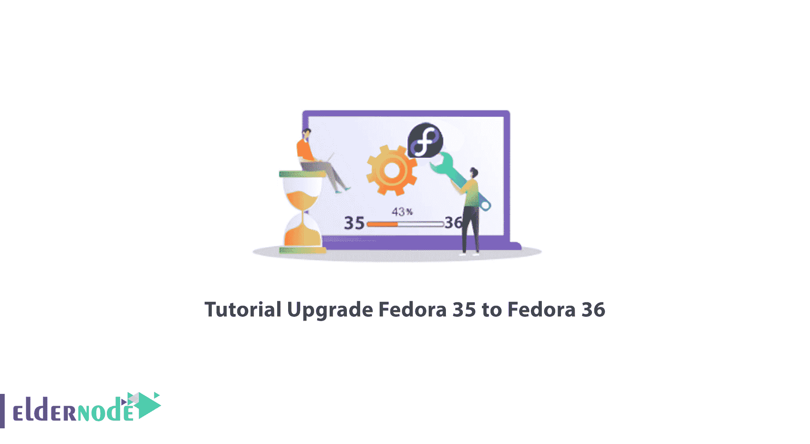
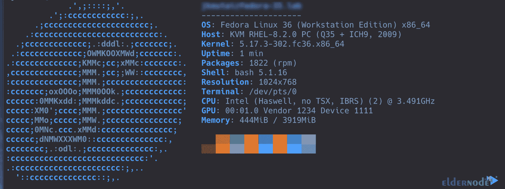

# 教程升级 Fedora 35 到 Fedora 36【顶途】- Eldernode 博客

> 原文：<https://blog.eldernode.com/upgrade-fedora-35-to-fedora-36/>



Fedora 通过为硬件、云和容器创建一个创新、免费和开源的平台，帮助您为用户提供正确的解决方案。如果你想随着 Fedora 新版本的发布**将 Fedora 35 升级到 Fedora 36** ，请加入我们这篇文章。如果你想买一个 [**Linux VPS**](https://eldernode.com/linux-vps/) 服务器，你可以在 [Eldernode](https://eldernode.com/) 看到可用的软件包。

## **如何将 Fedora 35 升级到 Fedora 36**

### **Fedora 36**的特点

1)它拥有 **GNOME 42 桌面环境**，该环境拥有新的特性和许多改进。

2)推出**新的桌面壁纸**，给 Fedora 桌面带来惊艳的外观。

3)提供 **Linux 内核 5.17** 所列功能:新的 AMD P-State 驱动程序、英特尔 AMX 对 KVM 虚拟化的支持、面向 Xen 来宾的 USB 设备的 Xen USB 虚拟主机驱动程序、新的 Android x86 平板驱动程序、BTRFS 和 EXT4 文件系统增强。

4)提供**深色/浅色 GNOME 42 壁纸**你可以很容易地从这些现有的壁纸中改变桌面的整体外观。

5) **更新关键应用程序和软件中的软件包**，如 Golang、openJDK、Wayland、GCC、e.t.c。

本文来自 [Fedora 教程](https://blog.eldernode.com/tag/fedora/)系列的续篇，我们将一步步教你如何将 Fedora 35 升级到 Fedora 36。

## **将 Fedora 35 升级到 Fedora 36**

首先用下面的命令**更新系统包**:

```
sudo dnf -y upgrade
```

然后**重启**你的系统:

```
sudo systemctl reboot
```

您的系统验证是 Fedora 35:

```
cat /etc/redhat-release
```

升级之前，请将您的文档和文件备份到外部驱动器或其他网络系统。

使用以下命令检查新的更新:

```
sudo dnf upgrade --refresh
```

然后运行以下命令**安装 DNF 插件**:

```
sudo dnf -y install dnf-plugin-system-upgrade
```

通过安装**dnf-plugin-system-upgrade**，Fedora 35 升级开始。以 root 或用户身份在终端中运行以下命令:

```
sudo dnf system-upgrade download --releasever=36
```

您可以更改**–release ver =**号来升级到 Fedora 的另一个版本。

按下 **y** 键接受系统升级:

```
Before you continue ensure that your system is fully upgraded by running "dnf --refresh upgrade". Do you want to continue [y/N]: y
```

如果您想要的依赖关系阻止系统升级，请使用以下命令:

```
sudo dnf system-upgrade download --releasever=36 --allowerasing
```

下载完软件包后，运行以下命令**开始升级过程**:

```
sudo dnf system-upgrade reboot
```

完成升级过程后，系统将**重启**，您将看到新版本的 Fedora OS:



你可以使用 **rpmconf** 命令来搜索**。rpmnew** ，**。rpmsave** 和**。rpmorig** 文件。您可以选择如何处理它们:

—使用新的软件包备份版本维护当前版本。

—恢复先前版本的原始文件。

—检查版本之间的差异。

输入以下命令来**安装 rpmconf** 包:

```
sudo dnf -y install rpmconf
```

使用以下命令**检查修改的配置**文件:

```
sudo rpmconf -a
```

最后，**安装下面的包**,删除退役的包:

```
sudo dnf install remove-retired-packages
```

**通过以下命令移除退役包**:

```
sudo remove-retired-packages
```

因此，Fedora 36 已经可以使用了。

## 结论

正如你所看到的，Fedora 36 增加了新的特性，使其使用起来更有吸引力。在本文中，您还了解了如何将 Fedora 35 升级到 Fedora 36。