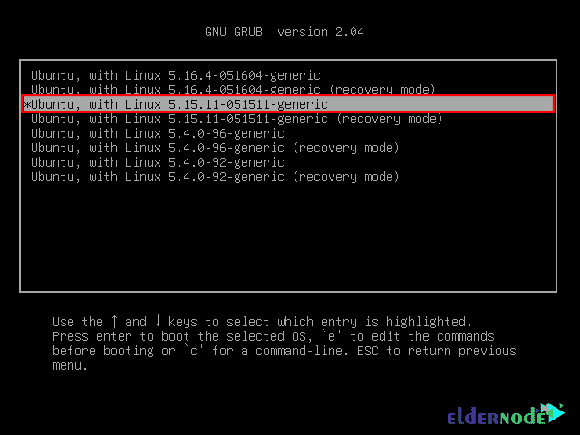

# Ubuntu 20.04 | 22.04 上的内核升级教程

> 原文：<https://blog.eldernode.com/upgrade-kernel-on-ubuntu/>


每当你试图使用像 Ubuntu 这样的 Linux 发行版时，一个内核会被自动安装，因为没有它整个系统就无法运行。你可以像其他软件包一样在 Ubuntu 上更新内核。在这篇文章中，你将学习如何在 Ubuntu 20.04 | 22.04 上升级内核。如果你想购买 [**Ubuntu VPS**](https://eldernode.com/ubuntu-vps/) 服务器，请查看 [Eldernode](https://eldernode.com/) 网站上提供的套装。

## **如何在 Ubuntu 20.04 | 22.04** 上升级内核

### **内核简介**

内核是 Linux 发行版的核心，是这个操作系统中硬件和软件之间的接口。Linux 内核更新不断发布，允许您更新您的 Linux 内核版本，以享受最新的功能、工具和安全措施。

在 [Ubuntu 培训](https://blog.eldernode.com/tag/ubuntu/)系列的这篇文章的续篇中，我们将一步一步教你如何在 Ubuntu 20.04 | 22.04 上升级内核。

## **在 Ubuntu 上升级内核 20.04 | 22.04**

首先**用下面的命令检查运行在 Ubuntu Linux 上的内核**的版本:

```
uname -r
```

启动前，首先运行以下命令**更新所有系统包**:

```
sudo apt update
```

```
sudo apt upgrade
```

然后使用下面的命令安装 **wget** 工具:

```
sudo apt install wget
```

您可以从 **Ubuntu Linux 仓库**下载内核 Deb 二进制文件，或者使用以下命令在 **GitHub** 上下载脚本:

```
wget https://raw.githubusercontent.com/pimlie/ubuntu-mainline-kernel.sh/master/ubuntu-mainline-kernel.sh
```

然后运行下面的命令使脚本可执行:

```
chmod +x ubuntu-mainline-kernel.sh
```

```
sudo mv ubuntu-mainline-kernel.sh /usr/local/bin/
```

现在您可以搜索并**找到内核**的最新版本，可以用下面的命令安装:

```
ubuntu-mainline-kernel.sh -c
```

您还可以使用下面的命令查看要安装的可用内核版本列表:

```
ubuntu-mainline-kernel.sh -r
```

运行以下命令**安装最新版本的内核**:

```
sudo ubuntu-mainline-kernel.sh -i
```

如果你想**安装内核的任何其他版本**，你可以使用下面的命令:

```
sudo ubuntu-mainline-kernel.sh -i version-number
```

要使用相同的脚本列出系统上可用的内核版本，请运行以下命令:

```
sudo ubuntu-mainline-kernel.sh -l
```

现在**重启您的系统**以使用已安装的版本:

```
sudo reboot
```

您可以使用下面的命令**检查您当前的内核版本**:

```
uname -r
```

你可以选择运行哪个版本的内核，否则默认情况下 Ubuntu 会自动选择最新安装的版本。

然后运行以下命令编辑 **Grub** 文件:

```
sudo nano /etc/default/grub
```

将下面几行添加到 **Grub** 文件中，然后用 **Ctrl+O** 保存，按 **Enter** ，最后用 **Ctrl+X** 退出文件:

```
GRUB_SAVEDEFAULT=true
```

```
GRUB_DEFAULT=saved
```

您可以使用以下命令**更新 Grub** :

```
sudo update-grub
```

最后**重启你的系统**:

```
sudo reboot
```

在系统重启阶段，按下 **Esc** 键进入 **Grub 菜单**，然后选择**Ubuntu 的高级选项**，最后为您的系统选择默认内核版本:


*



## 常见问题解答

[sp _ easy agreement]

## 结论

正如我们所提到的，内核是 Ubuntu 的核心，整个系统的运行离不开它。在本文中，您还学习了如何在 Ubuntu 20.04 | 22.04 上升级内核，因此您可以享受新的特性和工具。