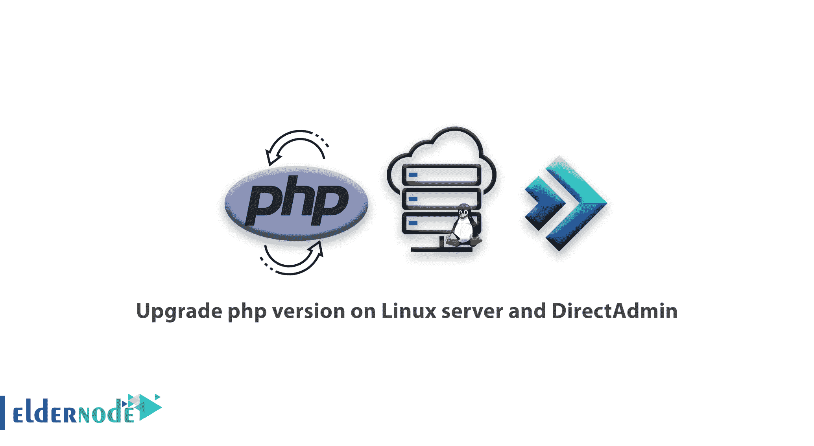

# 如何在 Linux 服务器和 DirectAdmin 上升级 php 版本-教程

> 原文：<https://blog.eldernode.com/upgrade-php-version-on-linux-server-and-directadmin/>



如何升级 php 版本的 Linux 服务器 DirectAdmin 控制面板是教，注意，如果你有一个定期和共享的主机 direct admin，你将无法使用本教程。本教程对于使用 [Linux VPS](https://eldernode.com/linux-vps/) 服务器( [VPS](https://eldernode.com/vps/) )或[专用服务器](https://eldernode.com/dedicated-server/)的人很有用，这些服务器有一个活动的 directadmin 并可以访问他们的 ssh 服务器。

### 在 Linux 服务器和 DirectAdmin 上升级 php 版本

Directadmin 中的 PHP 升级由 custombuild 完成。您可以更改自定义版本。如果您使用的是版本 1.2，请升级到版本 2，这是最佳的 custombuild directadmin。

首先，使用 [putty](https://eldernode.com/tag/putty/) 程序登录到您的根服务器，然后使用下面的命令，您可以看到您的服务器上安装的 php 版本:

```
php -v 
```

要升级 php，首先需要输入 custombuild 脚本路径。使用以下命令，我们将进入所需的文件夹:

```
cd /usr/local/directadmin/custombuild 
```

我们需要的所有设置都在 options.conf 文件中，通过编辑该文件，我们可以引入我们需要自定义构建的版本。为此，我们需要编辑该文件:

```
nano options.conf
```

如果您遇到 nano 安装错误，您可以安装 nano:

```
yum install nano
```

然后根据将 php1_release 或 php5_ver 更改为所需的版本。要同时安装两个 php 版本，可以使用 PHP 选择器教程在 DirectAdmin 中更改 PHP 版本:

然后用 ctrl + x 按钮保存文件，然后按 Enter 键。然后，我们用以下命令开始 php 更新操作:

```
./build clean  ./build update  ./build php n  ./build rewrite_confs
```

安装以下版本是为了确保:

```
php -v
```