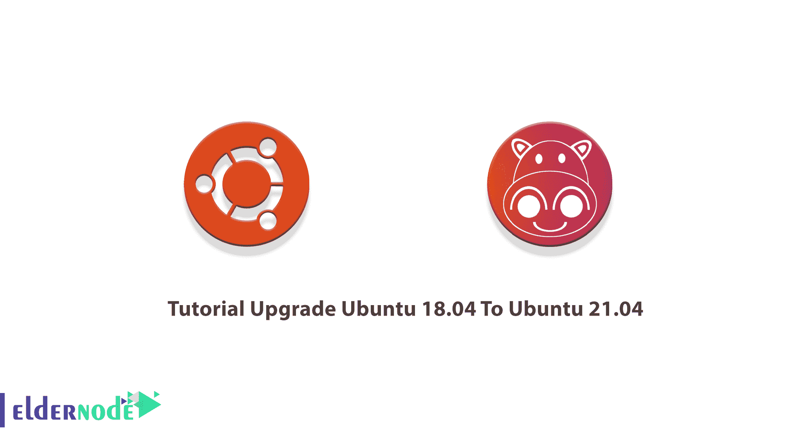
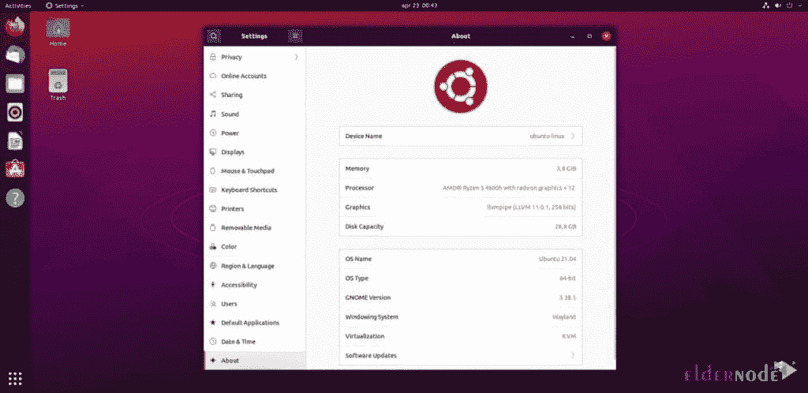

# 将 Ubuntu 18.04 升级到 21.04 的教程- Eldernode 博客

> 原文：<https://blog.eldernode.com/upgrade-ubuntu-18-04-to-21-04/>



总是最新的！这可能是一种性格特征。有些人等待任何更新，甚至是他们的洗碗机应用程序。如果你也一样，那你现在来对地方了。由于新的 Ubuntu 已经发布，你可能需要将你的当前版本升级到最新版本。所以，和我们一起通过这篇文章来回顾一下**教程升级 Ubuntu 18.04 到 21.04** 。在 [Eldernode](https://eldernode.com/) 上订购您喜欢的包，购买您自己的 [Ubuntu VPS](https://eldernode.com/ubuntu-vps/) 。

## **如何从 Ubuntu 18.04**T3 升级到 Ubuntu 21.04

Ubuntu 21.04 Hirsute Hippo 正式发布，你已经了解了关于 Ubuntu 21.04 的所有信息。现在，如果你需要将你的 [Ubuntu](https://blog.eldernode.com/tag/ubuntu/) Linux 版本 18.04 升级到 21.04 Ubuntu，请和我们一起完成这项工作。

### **升级 Ubuntu 18.04 到 Ubuntu 21.04 的先决条件**

为了让本教程更好地工作，请考虑以下先决条件:

_ 拥有 Sudo 权限的非 root 用户。要设置，请遵循我们在 Ubuntu 21.04 上的[初始服务器设置。](https://blog.eldernode.com/initial-server-setup-on-ubuntu-21-04/)

_ 无法直接从 Ubuntu 18.04 升级到 Ubuntu 21.04。所以，你必须[先把 Ubuntu 18.04 升级到 Ubuntu 20.04](https://blog.eldernode.com/how-to-upgrade-to-ubuntu-20-04-lts/) 。然后，您可以继续升级到 Ubuntu 21.04。

## **升级到 Ubuntu 21.04 多毛河马**

不需要再等了，让我们按照本指南的步骤运行 Ubuntu 21.04。

*第一步:*

首先你需要**更新你的 Ubuntu 20.04** Linux 系统。所以，运行:

```
sudo apt update
```

```
sudo apt upgrade
```

```
sudo apt dist-upgrade
```

*第二步:*

移除所有不再需要的软件包:

```
sudo apt autoremove
```

*第三步:*

现在，你需要**配置发布升级**。打开**/etc/update-manager/release-upgrades**文件，用自己喜欢的编辑器编辑。确保提示变量设置为**正常**。完成后，**保存**并关闭文件。

*第四步:*

***注:*** 显然也可以从 Ubuntu 20.10 升级到 Ubuntu 21.04。所以，对于那些从 Ubuntu 20.10 升级到 Ubuntu 21.04 的人来说，这一步是**而不是**必须的。

但是由于上面解释的先决条件，我们假设你已经从 Ubuntu 18.04 升级到了 Ubuntu 20.04。因此，使用下面的命令**开始 Ubuntu 20.10 升级过程**。然后，按下 **Y** 继续:

```
sudo do-release-upgrade
```

*第五步:*

现在，你需要通过升级的 Ubuntu 21.04 系统**移除过时的或者不再需要的包**。

*第六步:*

升级完成后，**重启系统。**为此，按下 **Y.** 然后，系统开始运行**Ubuntu 21.04 Hirsute Hippo Linux 系统**。



就是这样！一旦看到上面的屏幕，就意味着升级到 Ubuntu 21.04 已经彻底完成。

## 结论

在本文中，您了解了如何将 Ubuntu 18.04 升级到 Ubuntu 21.04。Ubuntu 21.04 是最新发布的版本。如果您仍在使用 Ubuntu 18.04，并且需要升级到 Ubuntu 21.04，首先，您需要升级到本指南中介绍的更高版本。