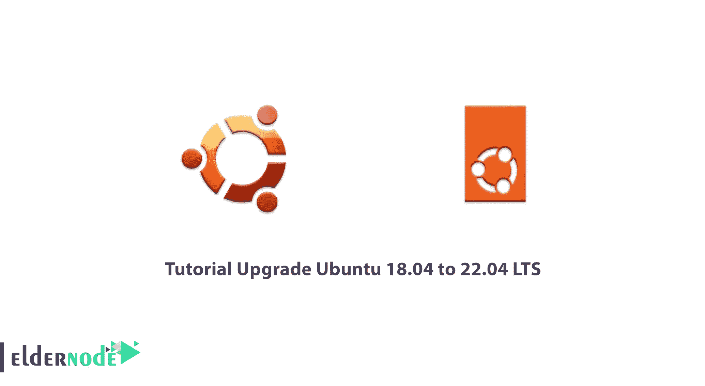
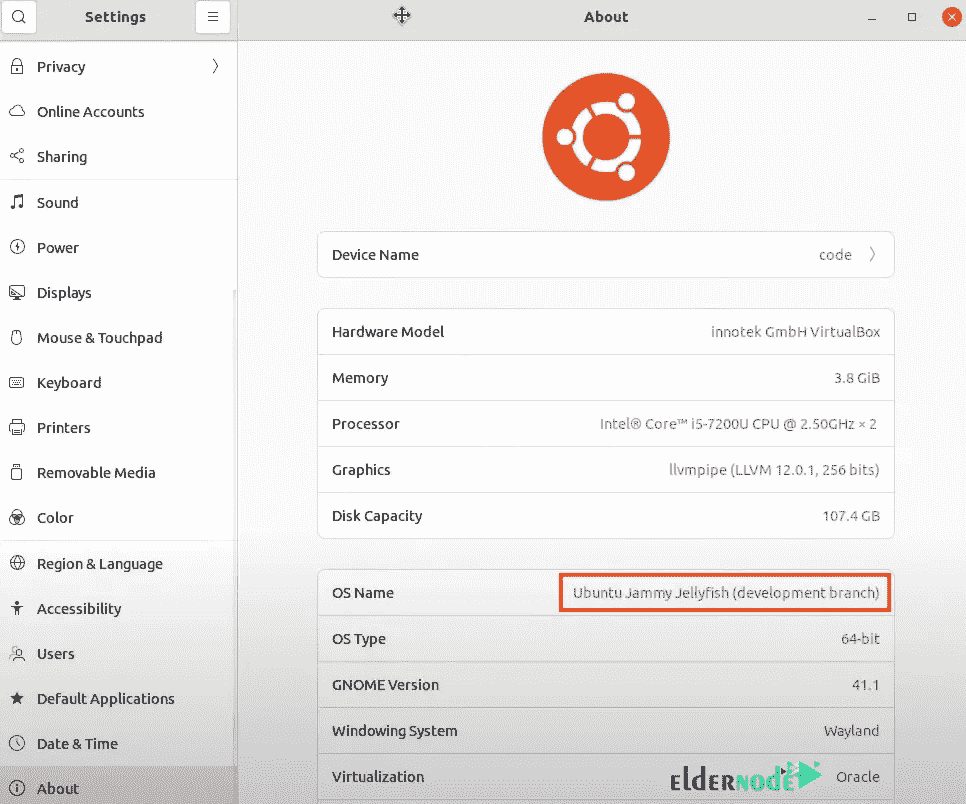
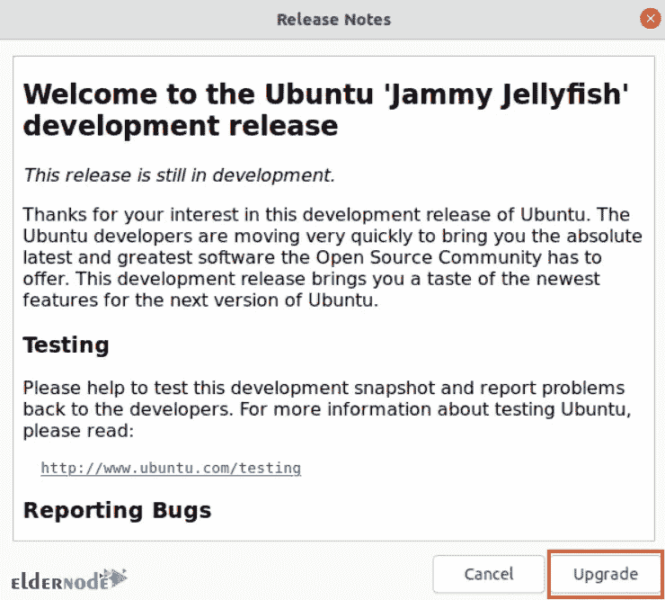
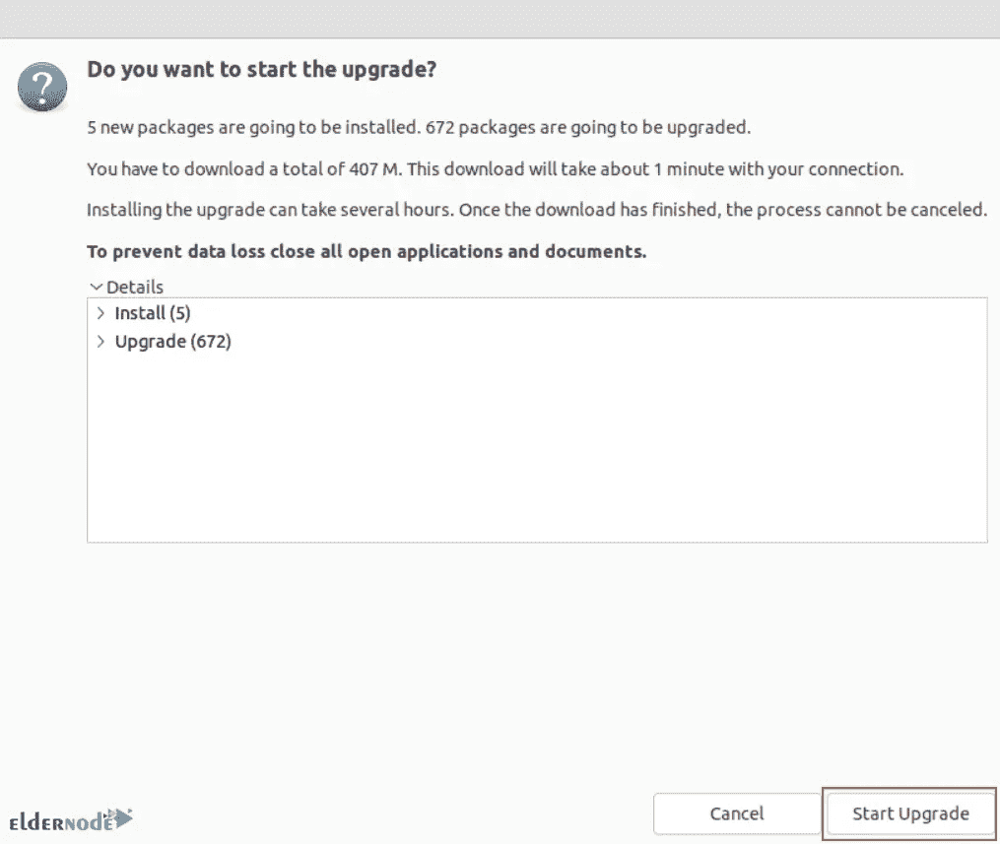
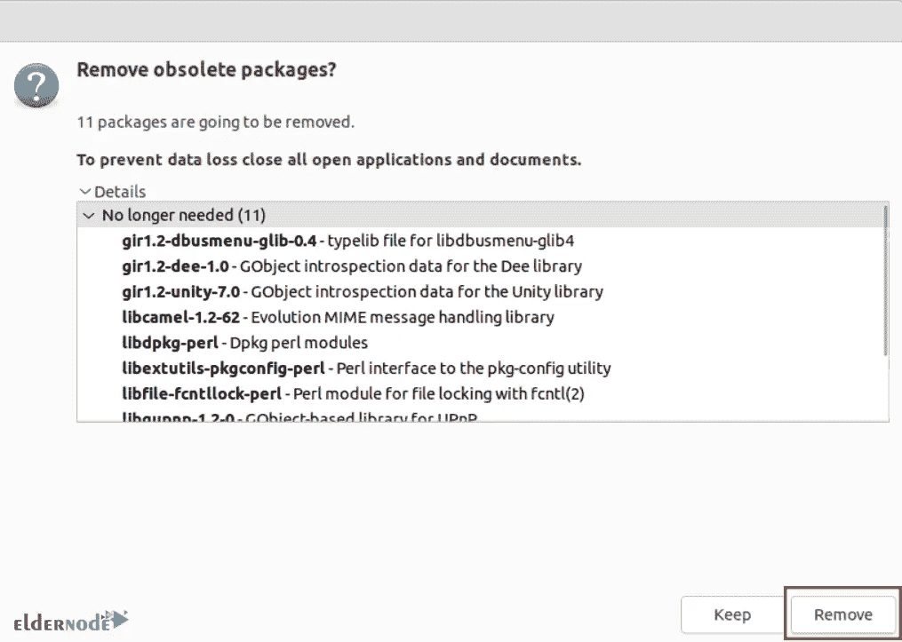
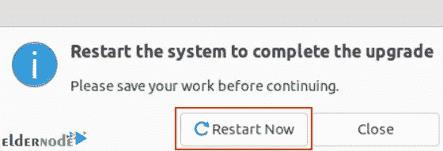

# 将 Ubuntu 18.04 升级到 22.04 的教程 LTS -埃尔德诺德博客

> 原文：<https://blog.eldernode.com/upgrade-ubuntu-18-04-to-22-04/>



当 Ubuntu Linux 新版本发布时，除了可以通过清空之前的 Ubuntu 系统重新安装之外，还可以使用升级的方式安装新版本，而不删除其他软件和个人信息。可以将 Ubuntu 的常规版本升级到较新的版本，但是在 LTS 版本的情况下，你只能升级到较新的 LTS 版本而不改变设置。在这篇文章中，我们将教你如何将 Ubuntu 从 18.04 升级到 22.04 LTS 版本。如果你想购买一台 **[Ubuntu VPS](https://eldernode.com/ubuntu-vps/)** 服务器，你可以查看 [Eldernode](https://eldernode.com/) 网站上提供的软件包。

## **如何将 Ubuntu 18.04 升级到 22.04 LTS**

如果你之前已经在你的电脑上安装并使用了一个版本的 Ubuntu，现在想要使用一个更新的版本，我们建议你升级而不是重新安装。在我们深入了解升级的步骤和条件之前，请记住最好对所有重要的个人和业务文件进行复制和备份，以便在出现意外错误时不会出现问题。

### **Ubuntu 22.04 简介**

Ubuntu 是企业使用的最佳选择之一，是 Linux Mint 和 Elementary OS 等项目的技术基础。需要注意的是，Ubuntu 总是一年发布两个主要版本，按照计划，Ubuntu 22.04 LTS 现已上市。

Ubuntu 22.04 是一个长期支持(LTS)版本，这意味着它将保持 50 年的安全修复和选定的更新。通过这种方式，如果你不想定期处理重大更新，你可以通过安装操作系统并更新到 10 月 22 日新版本可用之前，使用 LTS 版本多年。

Ubuntu 22.04 也是第一个在 Raspberry Pi 4 上作为完整桌面运行的版本。这个 Ubuntu 版本还包括 OpenSSL v3 编程语言、RDP、Linux 5.15 内核和 Mesa 22 图表。Ubuntu 22.04 适用于 AMD 64 位和 x86 PCs。WSL、Docker 和其他在 Ubuntu 上提供图像文件的服务已经发布了这个 Linux 发行版的 22.04 版本。

## **将 Ubuntu 18.04 升级到 22.04 LTS**

首先，您应该用下面的命令更新您的系统:

```
sudo apt update
```

```
sudo apt upgrade
```

```
sudo apt dist-upgrade
```

现在**通过输入以下命令从系统中删除所有必需的包**:

```
sudo apt autoremove
```

您可以通过运行以下命令来**安装更新管理器核心包**:

```
sudo apt install update-manager-core
```

接下来，你应该**运行 Ubuntu 升级工具**。为此，请输入以下命令:

```
sudo do-release-upgrade
```

当系统询问您是否确定要升级时，输入“ **y** ”，然后按“**回车**”。在这种情况下，升级到 Ubuntu 22.04 海哲明水母开始。

现在，您应该可以在您的终端中看到升级摘要，并键入“**y”**并再次按“**输入**以同意升级。

升级过程完成后，你需要**重启系统**并输入 **y** ，再次按**进入**:



请注意，您应该手动更改默认壁纸。为此，右键单击桌面并按下“**更改背景**按钮。

就是这样！

### **如何通过 GUI** 将 Ubuntu 18.04 升级到 22.04

您也可以从您的桌面环境中升级您的系统。在这种情况下，您不需要与命令行交互。

首先，你应该**打开你的终端**并启动 **GUI 升级程序**。为此，请输入以下命令:

```
sudo do-release-upgrade -f DistUpgradeViewGtk3
```

现在点击**升级**:



***等待升级过程完成。***

在此步骤中，将再次询问您是否准备好升级。再次点击**开始升级**即可。然后等待所有新的软件包被下载和安装。



现在你应该批准 **Snap 包管理器**了，因为 Ubuntu 22.04 用它来安装和保持 Firefox 最新。

要查看您是否需要确认更多的更改，您可以在安装过程中每隔一段时间看一下您的屏幕。

升级过程完成后，您需要**从系统中删除过时的软件包**:



最后，你应该**重启你的系统**。开机备份后，你将加载到 Ubuntu 22.04。



## 结论

Ubuntu 22.04 将在 2027 年 4 月前获得免费系统更新，这是最新的长期支持版本。在这篇文章中，我们教你如何将 Ubuntu 从 18.04 升级到 22.04。我希望这篇教程对你有用。如有疑问，可在评论中联系我们。