# 如何将 Windows 10 升级到 Windows 11【两大方法】

> 原文：<https://blog.eldernode.com/upgrade-windows-10-to-windows-11/>

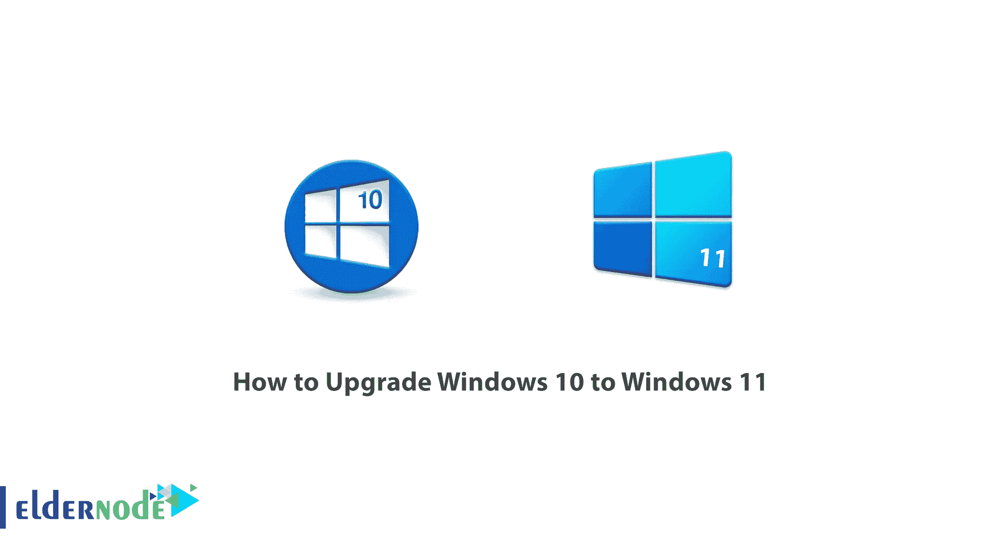

将 Windows 10 升级到 11 有多种方式。在本文中，我们将提到所有这些方法，以便您可以根据您的情况选择正确的方法将 Windows 10 升级到 Windows 11。关注我们这篇文章，一步一步**教你如何将 Windows 10 升级到 Windows 11** 。需要注意的是，如果你想购买一台 [Windows VPS](https://eldernode.com/windows-vps/) 服务器，可以在 [Eldernode](https://eldernode.com/) 网站上看到提供的套装。

### **Windows 11 简介**

[Windows](https://blog.eldernode.com/tag/windows/) 11 于 10 月 5 日推出，因此此次更新对 Windows 7 及更高版本的所有用户都是免费的。虽然 Windows 11 有新的功能和用户界面，但它不能视为一场革命，而是对以前版本的修改。对于喜欢简单和速度胜过其他任何东西的用户来说，Windows 11 是理想的操作系统，但对于有经验的用户来说，它可能太简单了。

### **Windows 11 的特点**

–>在 Windows 11 中，新的任务栏外观将吸引眼球。它被移动到桌面的中间，这增加了焦点和注意力。

–> Windows 11 中文件资源管理器的新设计变得更流畅、更简单，图标也变得更小、更有吸引力。在文件资源管理器标题部分，只有最常用的任务，包括剪切、复制和删除文件，而其他选项，如属性和选项，则隐藏在三点菜单下。

–>小工具是智能手机界面中熟悉的一部分，它们在 Windows 11 中的出现传达了同样的现代生活感和对便捷的更大渴望。

–>您可以选择天气小工具、存储在一个驱动器中的图像、日历、用于列出任务的待办事项、用于查看股票价值的观察列表、体育比赛结果和 Windows 11 提示。

–> Windows 11 中增加了对齐布局，以提高工作效率和多任务处理能力，并允许用户以各种格式和布局排列打开的窗口。

–>借助 Windows 11 的任务视图功能，您可以为不同的用户应用程序创建单独的桌面。

## **第一种方法:将 Windows 10 更新到 11**

如果你的设备支持 Windows 11，你可以放心地等待微软自己发布，通过 **Windows Update** 版块接收。

首先通过检查**搜索**栏中的 **Windows 更新**页面，检查 windows 11 是否与你的系统兼容。

***注:*** Windows 10 更新不一定要安装 windows 11，但最好做。

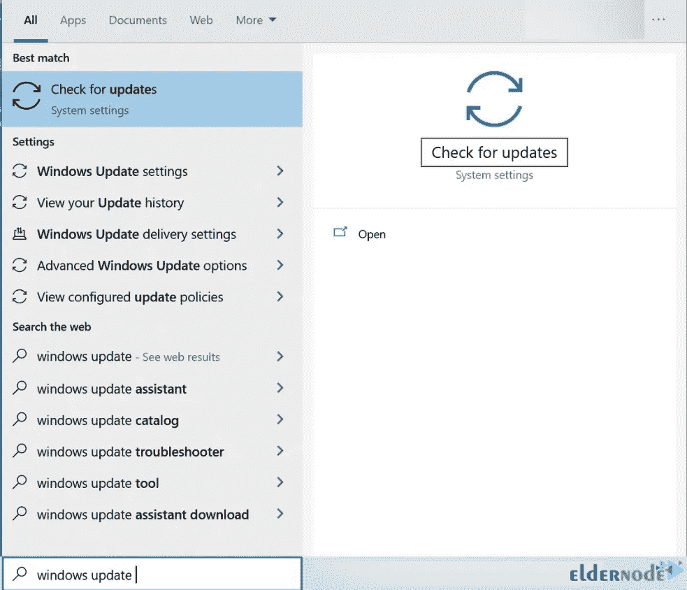

然后点击**检查硬件要求**链接:

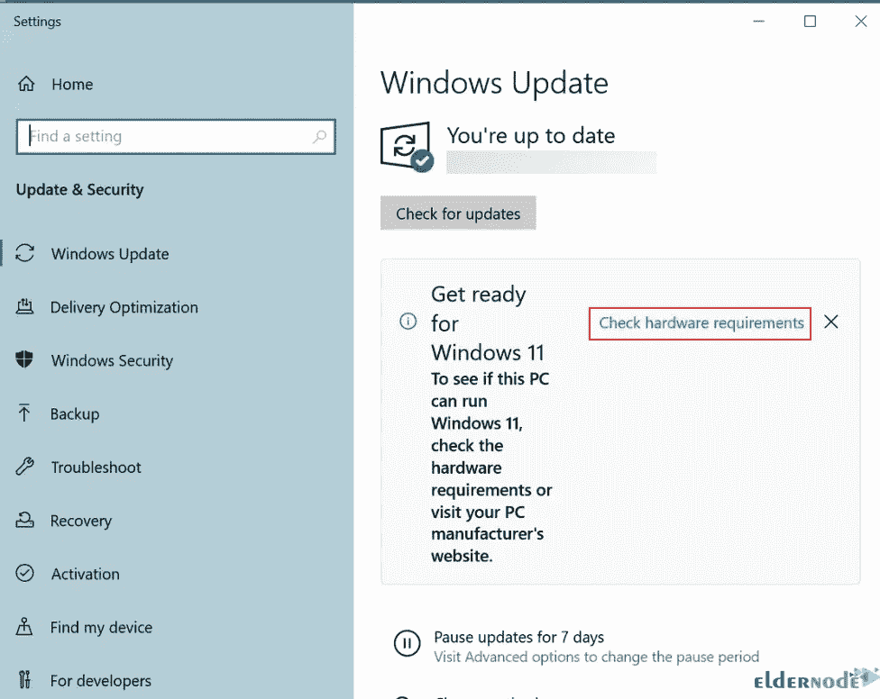

然后你会被带到一个页面，给你提供关于 windows 11 的信息。点击**了解更多信息**:

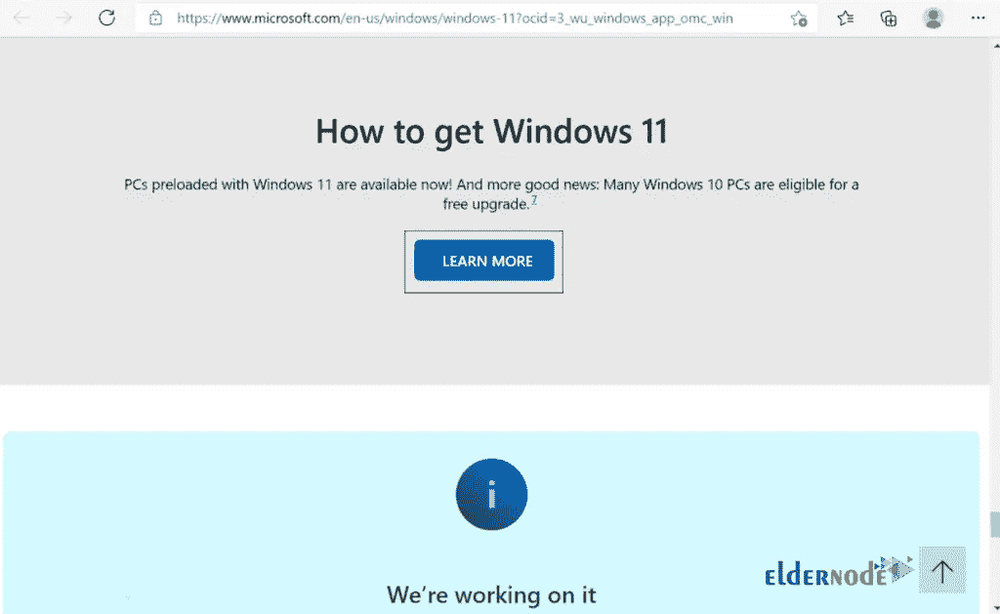

现在点击该页面上的“**检查兼容性”**:

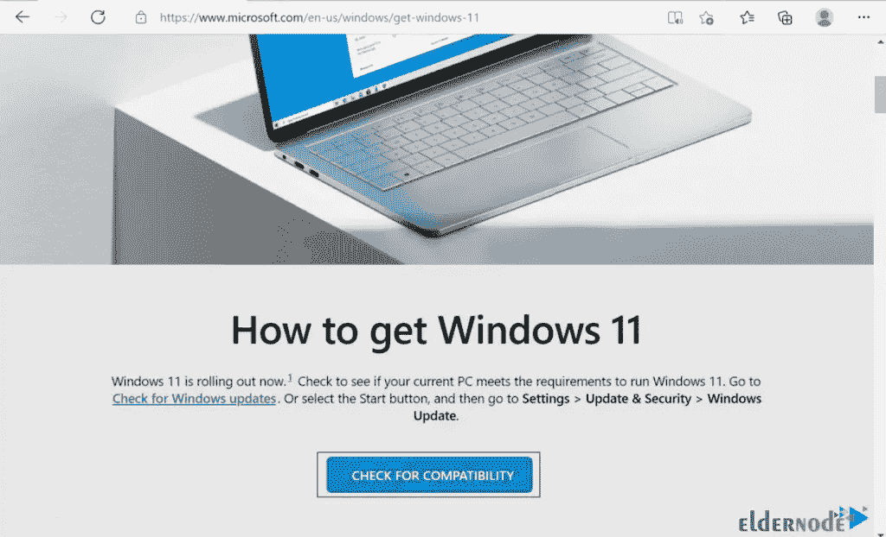

然后点击**下载 PC 健康检查 APP** :

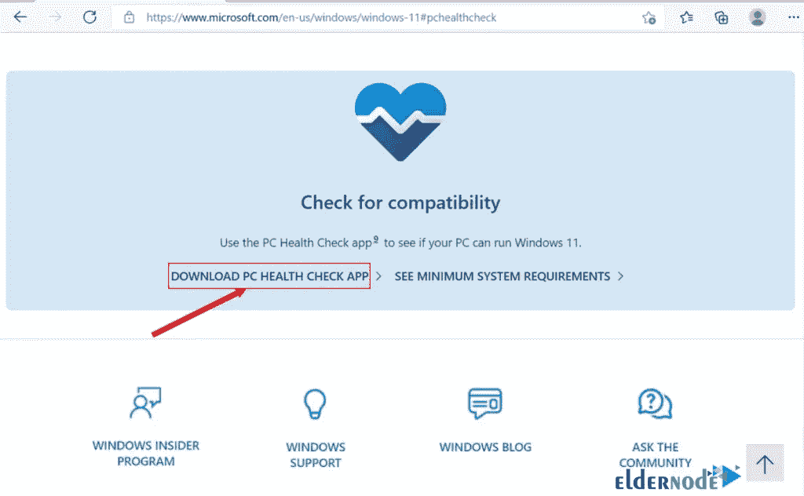

下载完成后，启动程序，点击**立即检查**:

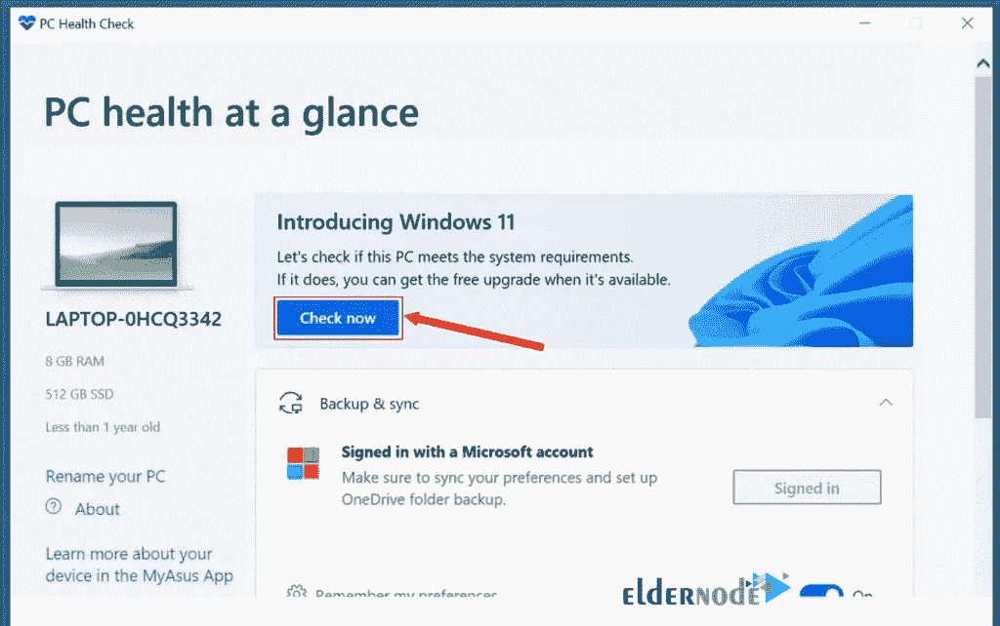

### **如何安装 Windows 11**

申请[从微软网站下载 Windows 11](https://www.microsoft.com/en-gb/software-download/windows11) 。下载 Windows 11 的最佳选择是使用 **Windows 11 安装助手**:

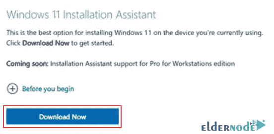

在开始之前，请检查 Microsoft 需要的先决条件:

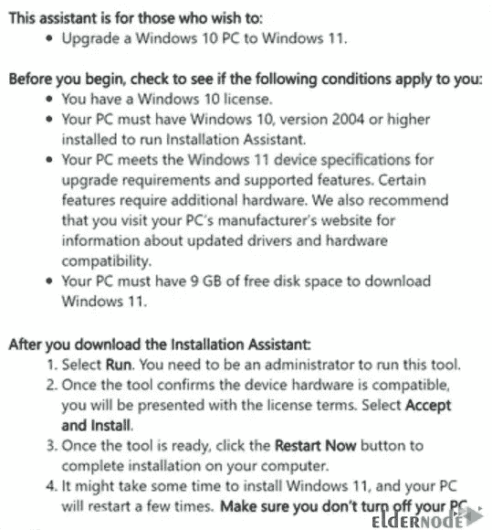

然后 **Windows 11 安装助手**页面就会为你打开；点击**接受并安装**:

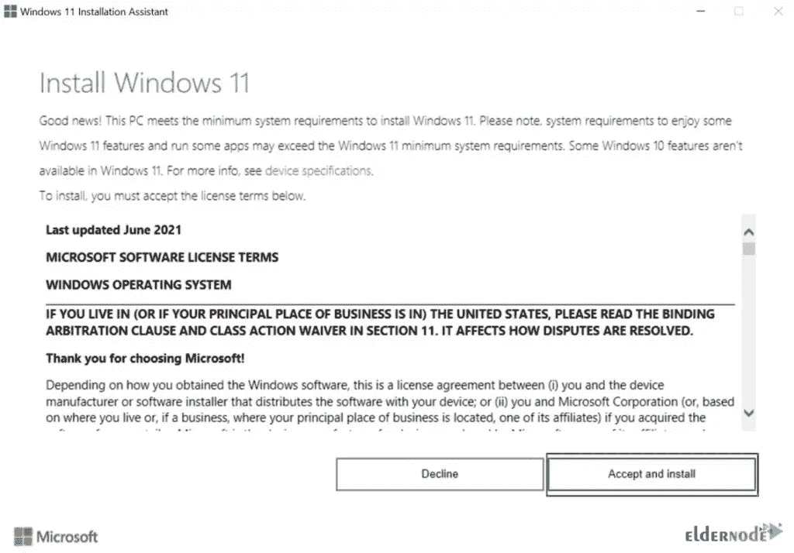

这样，您的下载将开始，最终 Windows 11 将安装在您的系统上:

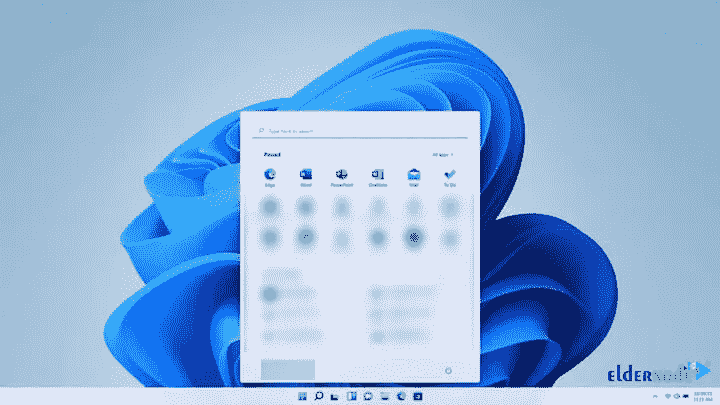

## **第二种方法:使用 ISO 文件**将 Windows 10 更新到 11

幸运的是，微软已经让用户可以通过他们的官方网站下载该文件。这个方法即使对于那些系统没有官方支持 Windows 11 的人也是有效的，至少有一段时间可以体验使用。但是我们建议您不要这样做，因为您不会收到任何更新。

每当你觉得需要更新，你可以通过微软网站下载并安装一个新的 ISO 文件。

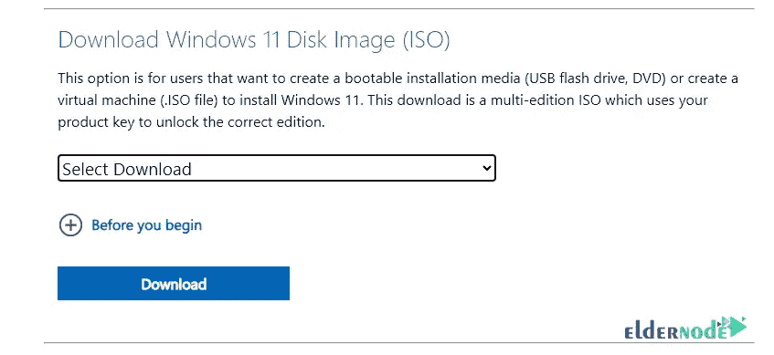

然后运行 **Windows 11 更新助手**应用。在这一部分，你可以将 **Windows 11 ISO 文件**刻录到闪存盘上，或者点击**更新**选项将系统更新到新的操作系统。

以这种方式安装 Windows 11 会让你在系统上遇到一系列你似乎已经接受的大大小小的 bug，因为我们知道，即使你以尽可能好的方式获得 Windows，你仍然可能遇到 bug 和问题。

## 结论

这样你就可以用上面的方法在你的系统上安装 Windows 11 了。如果 Windows 11 对你来说是个问题，你有 10 天的时间回到 Windows 10，所以在这十天里，一定要对你的系统做各种硬测试。确保没有特别的问题。在这篇文章中，我们试图教你如何将 Windows 10 升级到 Windows 11。