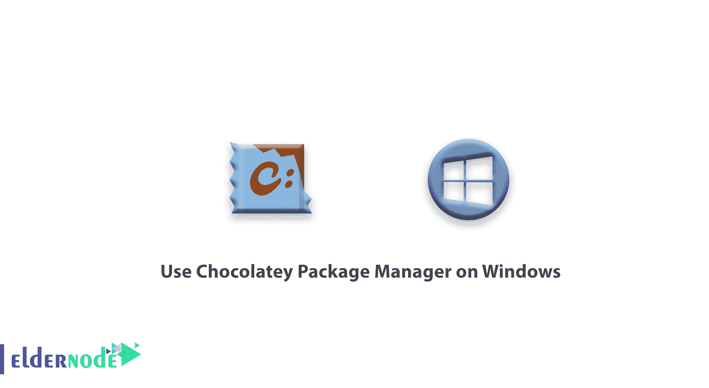

# 如何在 Windows - Eldernode 上使用 Chocolatey 软件包管理器

> 原文：<https://blog.eldernode.com/use-chocolatey-package-manager-on-windows/>



如何在 Windows 上使用 Chocolatey 包管理器？ Chocolatey 为 Windows 带来了软件包管理，使得在 Linux 上管理软件和依赖关系变得容易。只需几个步骤，您就可以快速轻松地将软件包和工具部署到新的 Windows 计算机上。Chocolatey 的简单和熟悉语法简单易学，在设置新环境时可以节省大量时间。在这篇文章中，我们将教你如何安装 chocolatey 和软件包，以及卸载软件包。

首先必须安装 Chocolatey。 下面，我们将通过 CMD 和 PowerShell 来教大家如何安装 Chocolatey。

**你可以从 eldernode 选择你最完美的 [Windows VPS 服务器](https://eldernode.com/windows-vps/) 包。**

### 使用 cmd 安装 Chocolatey

**1。T5 从开始菜单中搜索命令提示符。**

**2。** 然后**右键点击**然后点击以管理员身份运行然后 t 在命令提示符下输入以下命令:

```
@"%SystemRoot%\System32\WindowsPowerShell\v1.0\powershell.exe" -NoProfile -InputFormat None -ExecutionPolicy Bypass -Command "iex ((New-Object System.Net.WebClient).DownloadString('https://chocolatey.org/install.ps1'))" && SET "PATH=%PATH%;%ALLUSERSPROFILE%\chocolatey\bin"
```

### 使用 PowerShell 安装 Chocolatey

**1。T5 通过 PowerShell** 安装 Chocolatey，首先**在开始菜单上右键**，选择 Windows PowerShell 。

**2。** 把下面的命令放进去:

```
Set-ExecutionPolicy Bypass -Scope Process -Force; iex ((New-Object System.Net.WebClient).DownloadString('https://chocolatey.org/install.ps1'))
```

在 Chocolatey 网站上有数百种套餐可以浏览。

Chocolatey 提供的一些常见的服务器和开发包包括:

****SQL 管理工作室****

****hMail 服务器****

****FreeSSHd****

****Filezilla 服务器****

****Java 服务器运行时环境****

**要安装包，可以先打开 PowerShell 或命令提示符，在其中输入以下命令:**

```
`choco install <packagename> -y`
```

**任何依赖项也将自动安装。您可以在一个命令中包含多个包，以最大限度地减少等待时间:**

```
`choco install visualstudiocode fiddler googlechrome -y`
```

**您可以简单地运行下面的命令来 **卸载** 您选择的软件包:**

```
`choco uninstall <packagename>`
```

**用下面的命令移除你的巧克力:**

```
`choco uninstall chocolatey`
```

**对于其他命令行选项，请使用以下命令运行 Chocolatey:**

```
`choco /?`
```

****见，亦作:****

**[如何在 Windows 10 | Server 2019 上安装 Windows 终端](https://eldernode.com/install-windows-terminal-on-windows/)**

****尊敬的用户**，我们希望您能喜欢这个[教程](https://eldernode.com/category/tutorial/)，您可以在评论区提出关于本次培训的问题，或者解决[老年人节点培训](https://eldernode.com/blog/)领域的其他问题，请参考[提问页面](https://eldernode.com/ask)部分，并尽快提出您的问题。腾出时间给其他用户和专家来回答你的问题。**

**如何在 Windows 上使用 Chocolatey 包管理器？**

**好运。**