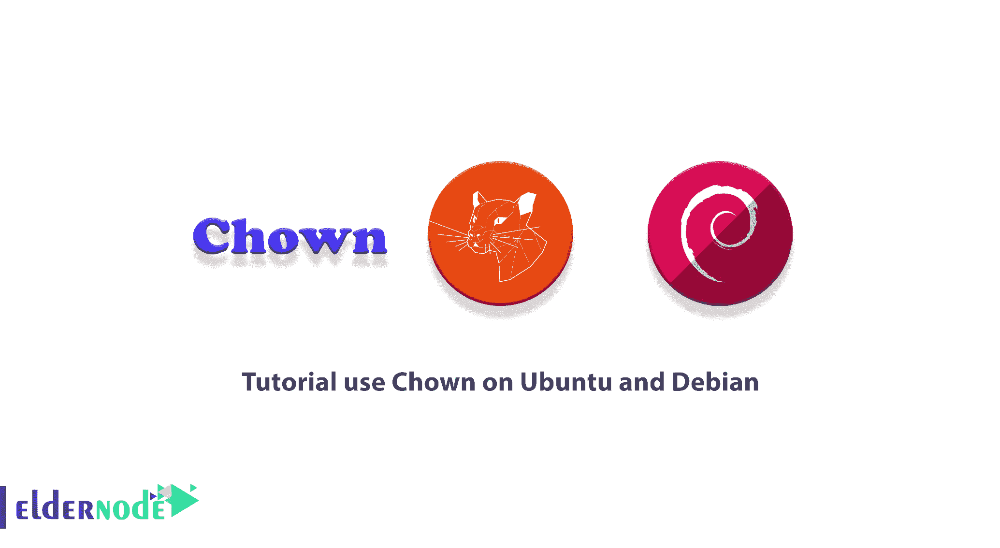

# 在 Ubuntu 和 Debian - Eldernode 博客上使用 Chown 的教程

> 原文：<https://blog.eldernode.com/use-chown-on-ubuntu-and-debian/>



在 Linux 中，每个文件都属于一个特定的用户。尽管文件支持组许可，但所有权的目的是确保只有那些实际访问文件的人才能读取、写入或执行文件。如果没有所有权，这些情况通常是不允许的。在这篇文章中，我们将教你如何在 Ubuntu 和 Debian 上使用 Chown。如果你想购买一台 [**Ubuntu VPS**](https://eldernode.com/ubuntu-vps/) 服务器，你可以访问 [Eldernode](https://eldernode.com/) 中提供的软件包。

## **如何在 Ubuntu 和 Debian 上使用 Chown【完整】**

### **Chown 命令简介**

Chown 命令代表变更所有者。此命令用于 Unix 和类似 Unix 的操作系统中，以更改文件系统文件和目录的所有者。希望更改自己拥有的文件的组成员资格的非特权用户可以使用 **chgrp** 。

系统上任何文件的所有权只能由一个超级用户更改。用户不能转移文件的所有权，即使用户拥有它。同样，一个组中只有一个成员可以更改该组的文件组 ID。

Chown 命令也已经移植到 IBM I，允许您更改用户和/或文件组、列表或符号链接的所有权。

在 Linux 中，所有文件都与一个所有者和一个组相关联，并且文件所有者、组成员和其他人都有访问权限。在本教程中，您将学习使用 Chown 命令来更改文件的所有者和组信息。请继续关注本文的其余部分。

## **在 Ubuntu 和 Debian 上使用 Chown**

在这一节，我们想教你如何在 Ubuntu 和 Debian 上使用 Chown。为此，只需遵循以下步骤。在本教程中，我们将学习如何使用 Chown 命令来更改文件和目录的所有者和组。

开始语法之前，请按如下方式使用此命令:

```
chown [OPTIONS] USER[:GROUP] FILE(s)
```

**用户**可以是用户名或者 **UID** 的形式，它将成为文件 FILE 的新所有者。

**组**可以是组名或者 **GID** 的形式，这将是新的组文件 FILE。

### **如何在 Ubuntu 和 Debian 上使用 Chown 改变文件所有者**

您可以使用以下命令来更改文件的所有者。请注意，您必须用新所有者的用户名替换该用户:

```
chown USER FILE
```

例如，在下面的命令中，所有者在 **abc** 用户上设置了 **eldernode.txt** 文件:

```
chown abc eldernode.txt
```

您也可以在文件名之间拆分几个文件来更改所有者:

```
chown abc file1 file2
```

***注意:*** 在上面的命令中，如果你把目录名代替了文件名，所有者目录将会改变。

### **如何更改所有者和群组文件**

使用以下命令，可以同时更改文件或目录的所有者和组:

```
chown USER:GROUP FILE
```

您只能按如下方式更改组:

```
chown :GROUP FILE
```

要更改目录中所有文件的所有者或组，可以在下面的命令中使用 **-R** 。请注意，您必须使用目录名而不是文件名:

```
chown -R USER:GROUP DIRECTORY
```

### **使用 Chown** 改变符号链接所有权

在这一节中，我们将讨论如何使用 Chown 来改变符号链接的所有权。请注意，当不使用 return 选项时，Chown 命令会更改符号链接引用的文件的组所有权，而不是符号链接本身。

例如，如果您试图更改指向 **/var/www/file1** 的符号链接 symlink1 的所有者和组，Chown 会更改文件或符号链接目录的所有权:

```
chown www-data: symlink1
```

请注意，“**无法取消引用‘symlink 1’:权限被拒绝**”错误的发生是因为在大多数 Linux 发行版中，默认情况下符号链接是受保护的。此外，您也无法处理所需的文件。该选项在**/proc/sys/fs/protected _ symlinks**中指定。

**1** 表示活动和

**0** 表示不活动。

***注意:*** 我们建议您不要禁用 syml 链接保护。

您可以使用以下命令来更改 syml 链接的组所有权:

```
chown -h www-data symlink1
```

### **如何递归改变文件所有权**

在学习了前面的步骤之后，我们现在打算教你如何递归地改变文件所有权。您可以使用以下命令对列出的所有文件和目录进行递归操作:

```
chown -R USER:GROUP DIRECTORY
```

正如您在下面的示例中看到的那样， **/var/www** 目录中所有文件和子目录的所有权都被更改为一个名为 www-data 的新所有者和组:

```
chown -R www-data: /var/www
```

如果列表包含符号链接，您可以使用以下命令:

```
chown -hR www-data: /var/www
```

### **如何在 Linux Ubuntu | Debian 上用 Chown 使用参考文件**

在最后一节，我们将教你如何使用 Chown 的参考文件。请注意，以下命令允许您更改用户和给定文件组的所有权，例如指定的引用文件(ref_file):

```
chown --reference=REF_FILE FILE
```

这里有一个例子。您可以使用以下命令将文件 1 的用户和组所有权分配给文件 2:

```
chown --reference=file1 file2
```

## 结论

正如您在本教程中了解到的，Chown 是一个用于更改用户所有权和/或文件组的 Linux/UNIX 命令行工具。在本文中，我们试图首先向您介绍 Chown。然后，我们通过不同的部分教您如何使用 Chown 命令。