# 如何使用 FoxyProxy 和 Burp Suite 来更改代理- Eldernode

> 原文：<https://blog.eldernode.com/use-foxyproxy-and-burp-suite-for-change-proxy/>

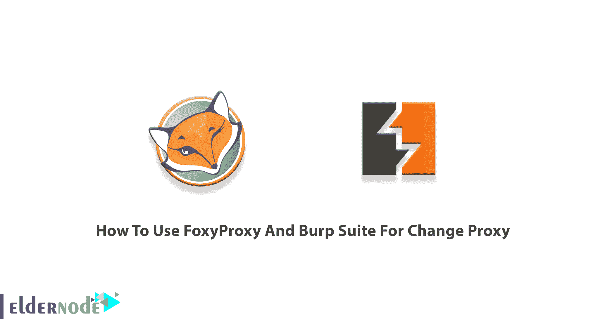

使用代理有助于您深入了解网站并寻找漏洞。FoxyProxy 是一个 Firefox 扩展，用于根据 URL 模式自动切换一个或多个代理服务器的互联网连接。它还简化了浏览器访问代理服务器的配置，提供了比其他代理插件更多的功能。Burp Suite 是一个流行的渗透测试和漏洞查找工具，用于检查 web 应用程序的安全性。要发现隐藏的缺陷，您可以通过代理路由流量，如 Burp Suite。然后，FoxyProxy 帮你手动开启和关闭。所以，你可以使用一个名为 FoxyProxy 的浏览器插件，通过单击一个按钮来自动完成这个过程。在本文中，您将学习**如何使用 FoxyProxy 和 Burp Suite 进行代理变更**。如果您准备购买一台完全托管的 **[VPS 服务器](https://eldernode.com/vps/)** ，您可以依靠我们的技术团队，并在 [Eldernode](https://eldernode.com/) 订购您考虑的套装。

## **教程使用 FoxyProxy 和 Burp Suite 换代理**

您可以在大多数浏览器的桌面版本上更改代理网络的设置。你可以在 Chrome、Firefox、Edge、Internet Explorer 和 Safari 上这样做。此外，iPhone 或 Android 的设置可能会被更改。代理信息页面上提供了连接到所选代理所需的信息。之前，您已经学习了[如何在 Burp 套件](https://blog.eldernode.com/setup-proxy-on-burp-suite/)上设置代理。接下来，你将学习如何安装 Burp Suite 和 FoxyProxy。

### **如何安装打嗝套件**

加入我们，学习本教程的第一部分。让我们通过下面的步骤，安装 Burp suite 和 FoxyProxy。

第一步:

去[打嗝套件](https://portswigger.net/burp/communitydownload)官网下载最新版本。

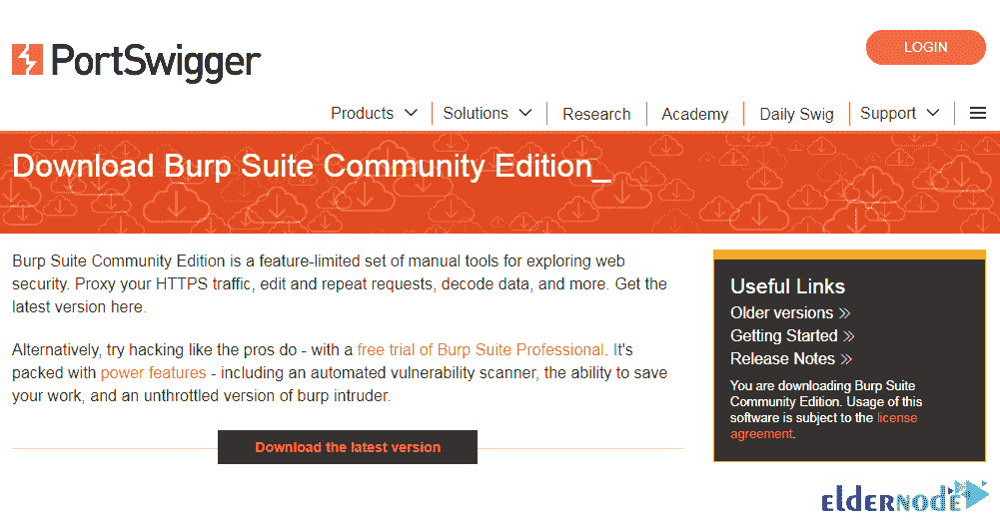

注意选择 **Burp Suite 社区版**，Windows 64 位，并按下**下载**按钮。

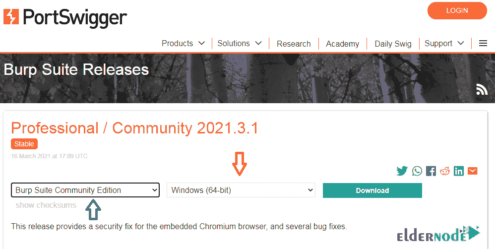

第二步:

下载 Burp 套件后，**运行**并继续安装路径。

你不必努力安装打嗝套件。只需点击下一个的**。**

然后点击**我接受**确认许可协议。

之后，再次点击**下一个**，最后点击**开始打嗝**。

如果您正确完成所有步骤，Burp 套件将成功安装在您的系统上。

***注:*** 如果有兴趣了解打嗝套件，可以参考[介绍，查看打嗝套件能力](https://blog.eldernode.com/check-of-burp-suite-capabilities/)。

**安装并使用 FoxyProxy 和 Burp Suite 进行代理变更**

## 当 Burp 套件安装完成后，需要安装 FoxyProxy。再次打开浏览器搜索 FoxyProxy 标准，按**添加到 chrome** ，然后按**添加扩展**。

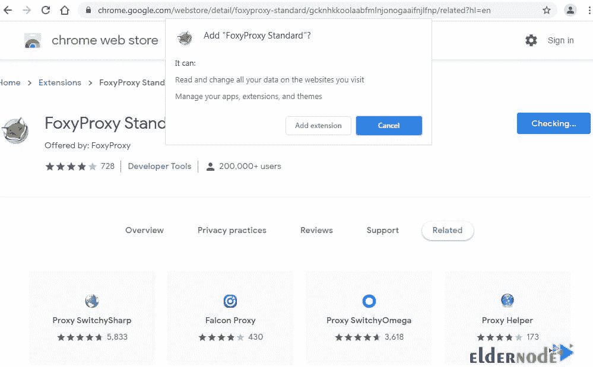

在页面的右上方，点击**狐狸**图标，然后点击**选项**。

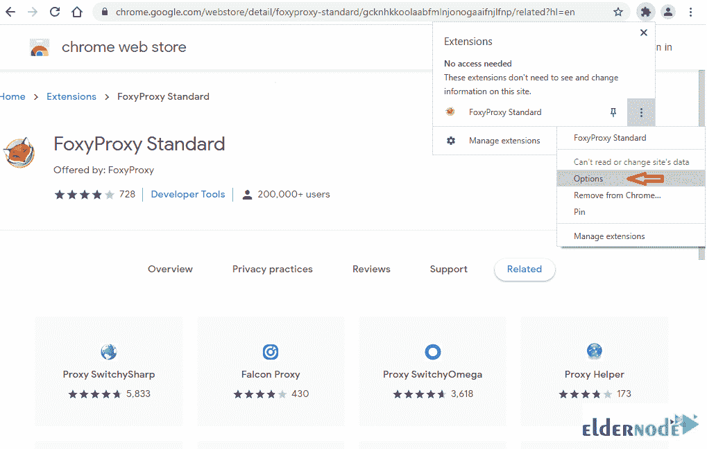

现在，点击“**添加新代理**”。

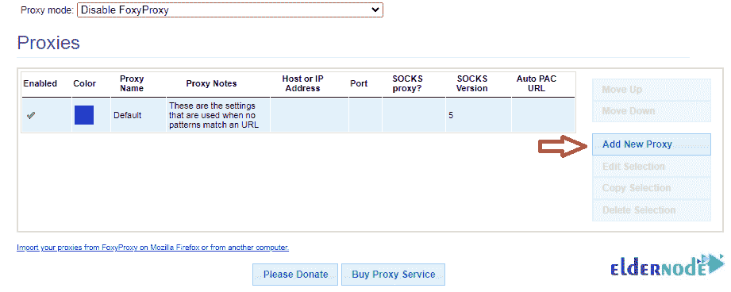

在“**主机或 IP 地址**字段中输入“127.0.0.1”和“8080”0n 端口。点击**保存**按钮并继续。

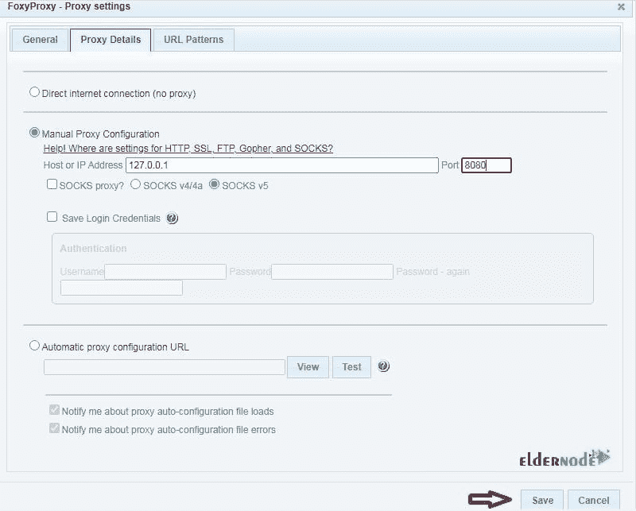

现在，您被重定向到代理页面，您可以看到添加的代理。此外，您可以看到添加的代理，并从 **FoxyProxy** 中进行选择。

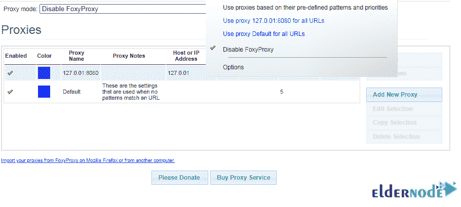

在这一步中，您可以访问 HTTP 网站。在**代理**选项卡中打开打嗝套件中的**拦截**。然后，转到**狐狸**图标，选择**打嗝代理**。因此，当您返回到 Burp Suite 时，您可以查看成功拦截的请求。

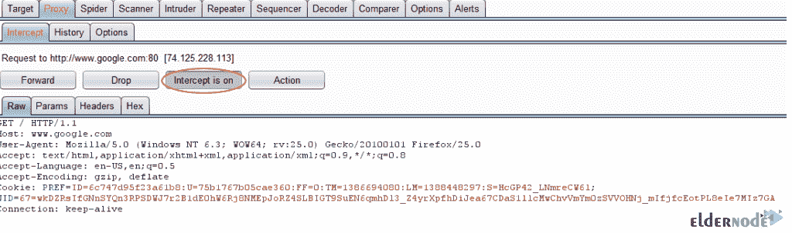

**如何排除不可信连接错误**

### 从现在开始，你可以看到我对 Google 的请求已经被 BurpSuite 捕获了。但如果不是，检查“**截击在**按钮上”的外观(用橙色圈出)。当拦截关闭时，您的流量可能会打嗝，您无法查看每个请求。所以，如果你在 HTTPS 使用谷歌，如果你回到浏览器，你可能会看到这条信息。

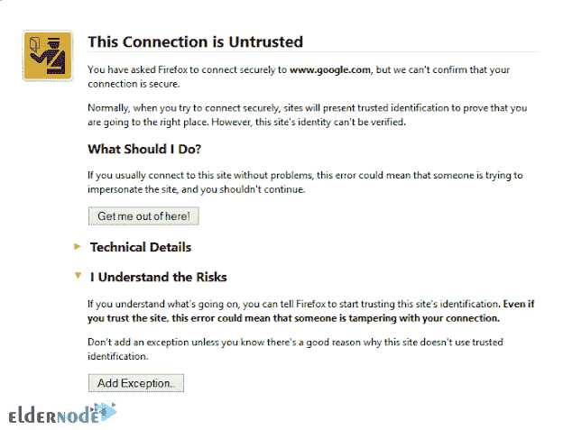

你可以设置 Firefox 信任 burp 证书，这样我们就不会收到这个错误。

***注意* :** 专业版的 burp 可以让我们相当容易的拿到证书，但是在免费版我们要做一点工作。

当您在使用 HTTPS 的页面上时，您可以点击“**添加例外…** ”。如果你离开了这个页面，只需访问任何支持 HTTPS 的网站，然后从那里开始。

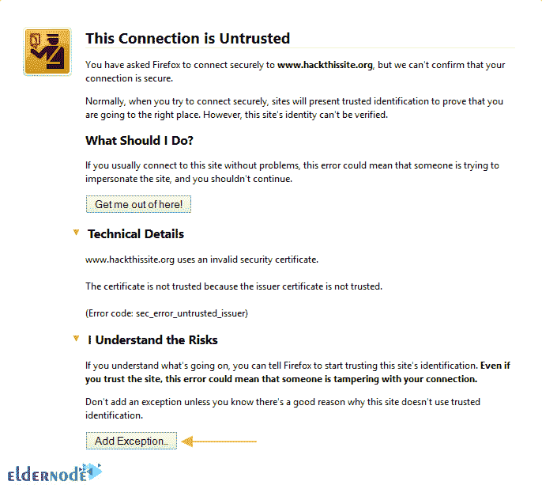

添加例外屏幕允许您查看证书。现在，点击**查看…** 按钮。

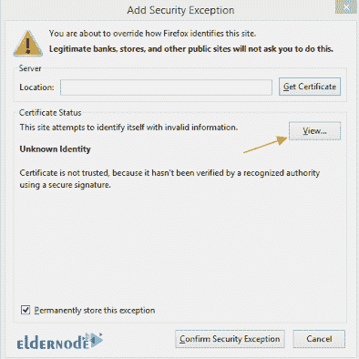

由于您的浏览器警告您证书的问题，您可以将 Portswigger CA 安装到 Firefox 中。此外，您需要导出证书并记下位置。

***注意* :** 在点击**导出**之前，记得选择证书查看器详情下的 **PortSwigger CA** 。

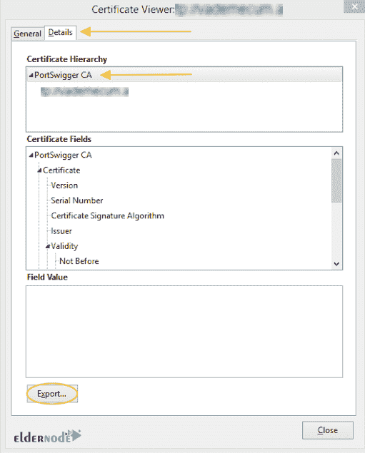

确保保存为 X.509。crt，。pem 文件类型。

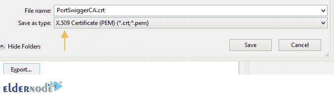

现在，您可以保存它并记下位置。请确定此证书已安装在 Firefox 中。为此，在 Firefox 选项窗格中选择“**高级**下的“**查看证书**”。

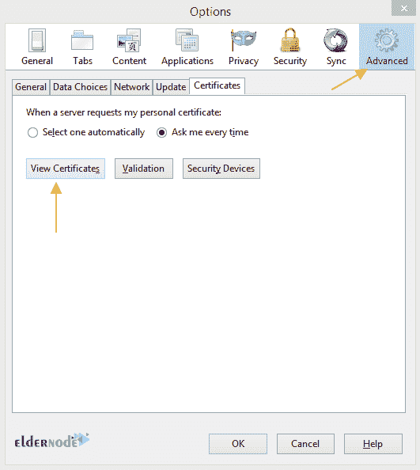

在这里，您可以选择**导入**。

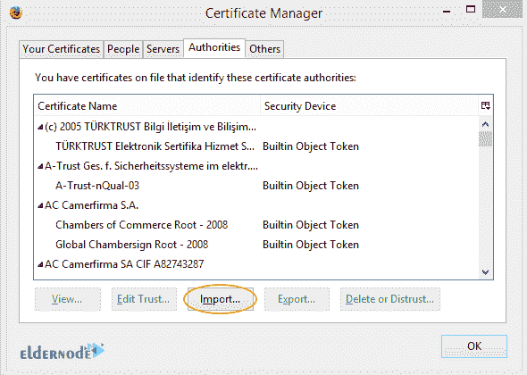

此时，您应该从标记的位置选择您之前导出的证书，并单击 **OK** 。然后选择“**信任此 CA 来识别网站**

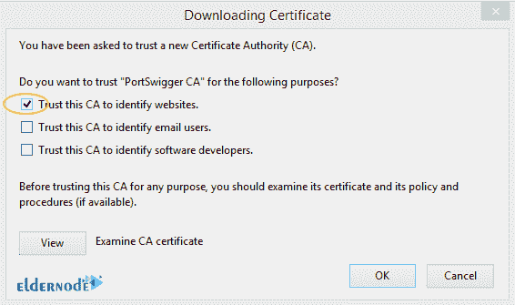

一旦您在“**机构**选项卡下看到“ **Portswigger CA** ”证书名称，则表示一切正常。

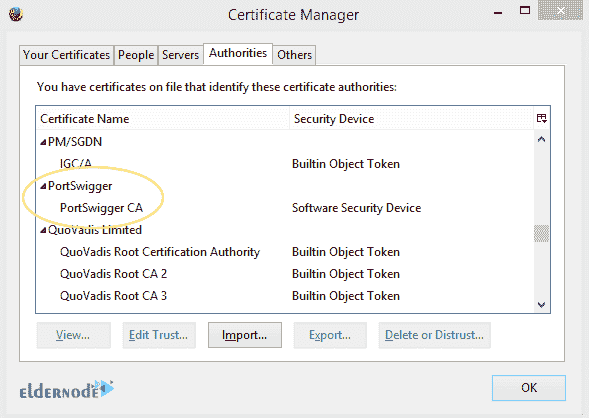

如果操作正确，您现在可以导航到 burp 中的任何 SSL 站点，而不会被提示信任该证书。

**如何禁用谷歌安全浏览**

### 由于安全浏览会在测试期间导致不必要的流量，您需要禁用它。遵循下面的路径来做这件事。

Firefox 按钮>>选项>>选项(或工具>>选项) >>安全并取消选中“阻止报告的攻击网站”和“阻止报告的网络伪造”

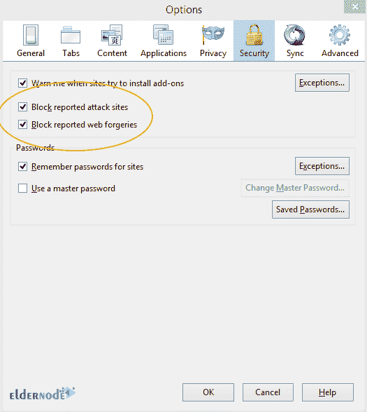

结论

## 在本文中，您学习了如何使用 FoxyProxy 和 Burp Suite 进行变更代理。您已经成功地使用了 FoxyProxy 附加组件来配置 Firefox 通过 Burp Suite 进行代理。Firefox 中的新配置文件有助于将您的正常浏览配置文件与我们的代理配置文件分开。

In this article, you learned How To Use FoxyProxy And Burp Suite For Change Proxy. You have successfully used the  FoxyProxy add-on to configure Firefox to proxy through Burp Suite. The new profile in Firefox helps you to keep your normal browsing profile separated from our proxy profile.