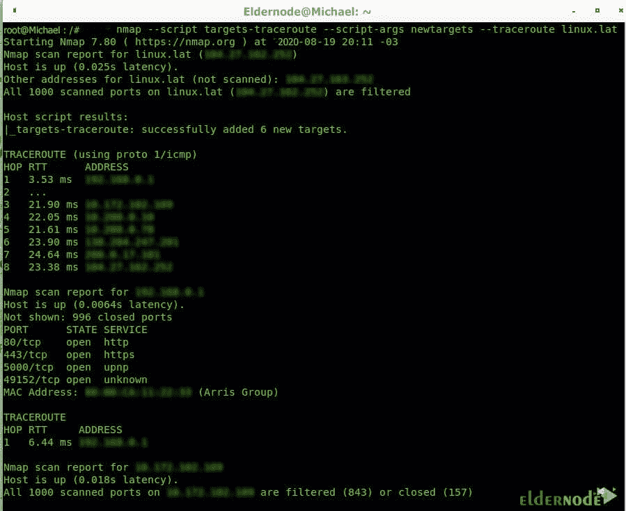

# 如何使用 Traceroute 跟踪 Nmap - Eldernode 博客上的数据包

> 原文：<https://blog.eldernode.com/use-traceroute-to-track-packets-on-nmap/>


Traceroute 工具显示将数据包传输到目的地的路由器(跳)列表。该工具在所有 Linux 和 Windows 操作系统上都可用。Mikrotik 路由器上也有此工具。Traceroute 通常用于排除网络故障。通过显示经过的路由器，该工具使用户能够看到到达网络特定目标所必须经过的路径。在本文中，我们将教您如何使用 Traceroute 来跟踪 Nmap 上的数据包。需要注意的是，如果你想买一个 [VPS 服务器](https://eldernode.com/vps/)，你可以在 [Eldernode](https://eldernode.com/) 看到可用的包。

## **教程使用 Traceroute 跟踪 Nmap 上的数据包**

网络管理员和技术人员经常用来排除网络故障的工具之一是 [Traceroute](https://blog.eldernode.com/install-and-run-traceroute-on-ubuntu-20-04/) 。只要网络中存在延迟和连通性问题等干扰，Traceroute 和 Ping 这两种基本但有效的工具就能帮助我们解决问题。如果两个系统的连接有问题，Traceroute 首先可以确定是否有连接问题，其次可以确定问题出在哪里！Traceroute 通常使用回应数据包(属于 ICMP 协议)以及不同数量的 TTL(生存时间)。

Traceroute 首先发送 TTL 为 1 的数据包。这些数据包在到达第一跳后会将 TTL 值减少一个单位。因此，这些数据包的 TTL 值为零。当 TTL 值达到零时，数据包首先被丢弃。第二，向发送方发送一条错误消息。

到目前为止，RTT 代表了发送方(发送数据包的人和执行 Traceroute 命令的人)与第一跳之间的时间间隔。因为我们将 TTL 设置为 1。

在下一步中，Traceroute 开始发送 TTL 为 2 的数据包。这样做的目的是将我们的数据包仅移动到第二跳。因此，在数据包开始移动后，它们首先通过第一跳，其 TTL 从 2 降至 1。然后，当数据包到达第二跳时，它们的 TTL 从 1 减少到 0，结果，一个错误消息被发送到发送方。这样，发送器了解到第二跳的 RTT 的状态。Traceroute 一直这样做，每次将 TTL 增加一个单位，以了解每一跳的连接状态和 RTT。

### **什么是 Traceroute，它是如何工作的？**

Traceroute 是计算机网络中的一个实用程序，您可以通过在 CMD 中键入 Tracert 来访问它。此工具允许您检查到达所需目的地的路线和可能的错误。

当您与网络上的其它设备通信时，信息或数据包会通过许多网络设备(如路由器)发送到目的地。现在，如果你用 UTP 电缆直接连接两台计算机，数据包就直接从一台计算机发送到另一台计算机。

如果您可以访问互联网上的网站，流量首先会通过路由器或本地设备。换句话说，这种流量可能通过 ISP 路由设备，可能是中性路由器或连接到本地和目的设备的设备。在路由设备之间传输数据包称为“跳”。因此，如果您 ping 一个网站，它将是您的第一个本地路由器，下一跳将是数据包到达 web 服务器所经过的每个路由器。

在本文的后续部分，请加入我们，通过示例向您展示如何使用 Traceroute 来跟踪 [Nmap](https://blog.eldernode.com/introduction-nmap-tool-and-check-its-applications/) 上的数据包。

## **使用 Traceroute 跟踪 Nmap 上的数据包**

Traceroute 涉及收集流量从一点传输到另一点所经过的中间路由器的信息。有趣的是，大多数操作系统已经使用“traceroute”命令获得了这个特性。Nmap NSE (Nmap 脚本引擎)套件中还附带了额外的工具。

### **Traceroute 如何与 Nmap 一起工作的示例**

在下面的例子中，我们正在追踪从我的设备到 Eldernode.com 的路线；应该注意，选项 **-sn** 指示 Nmap 忽略默认端口扫描，因为我们对扫描 Eldernode.com 端口不感兴趣，而只是路由、选项或标志 **-Pn** 指示 Nmap 避免主机发现，因为我们知道主机是活动的。

***注:*** 选项**–traceroute**用于追踪所有跳或中间路由器。

```
nmap -sn -Pn --traceroute eldernode.com
```


通过执行上面的命令，您将看到在我的计算机和 Eldernode.com 服务器之间有 16 个设备( **HOP** )，它们在 HOP 列中指定。

您还可以在 **RTT 列**(返回时间或延迟时间)中看到包含从该跳返回的每一跳的**速度**，单位为毫秒。应该注意，这对于诊断连接问题非常有用。

请注意，**地址**列显示了每个路由器或跳设备的地址。

上图可以看到，我的第一个 hopper 是 192.168.0.1。然后它到达 7 个路由器。这八台路由器位于阿根廷的布宜诺斯艾利斯，归克拉罗电信所有，该公司将流量传送到墨西哥的下一跳。然后它去迈阿密，到 gblx.net 路由器，最后到达托管服务。

总共有 16 跳，但是 RTT 随着路由器的通过而增加。

### **如何用 NSE 将 traceroute 跳插入 Nmap 扫描**

在本节中，我们将了解如何使用 NSE 将 traceroute 跳插入 Nmap 扫描。应该注意的是，Nmap 脚本引擎包括用于管理跟踪的脚本，并增加了一些很棒的特性。在这种情况下，您只能使用 Nmap NSE 来端口扫描所有跳接口以到达 linux.lat。

```
nmap --script targets-traceroute --script-args newtargets --traceroute linux.lat
```



1


2


3

关注我们，跟踪到达 Eldernode.com 的所有跳数:

```
nmap --script targets-traceroute --script-args newtargets --traceroute eldernode.com
```


4


5


6


7


8


9


10


11


12

稍微注意一下上面的图片，您就可以很容易地看到 Nmap 将有关发现的跳端口的信息放在端口上。

## 结论

Traceroute 是用来测试主机(服务器)可用性的最有用的网络工具之一。该工具的工作方式类似于带有 ICMP 协议的 ping 工具，但与 ping 有许多不同之处。在 Traceroute 中，与 ping 不同，它与网络上的路由器无关，网络上的每一台路由器，从 Internet 网关到路由器，再到目的服务器之前的路由器，都显示为单个测试，并向您显示结果。该实用程序通常用于查找路由器之间的通信问题。在本文中，我们试图通过一个例子来一步一步地教您如何使用 Traceroute 来跟踪 Nmap 上的数据包。