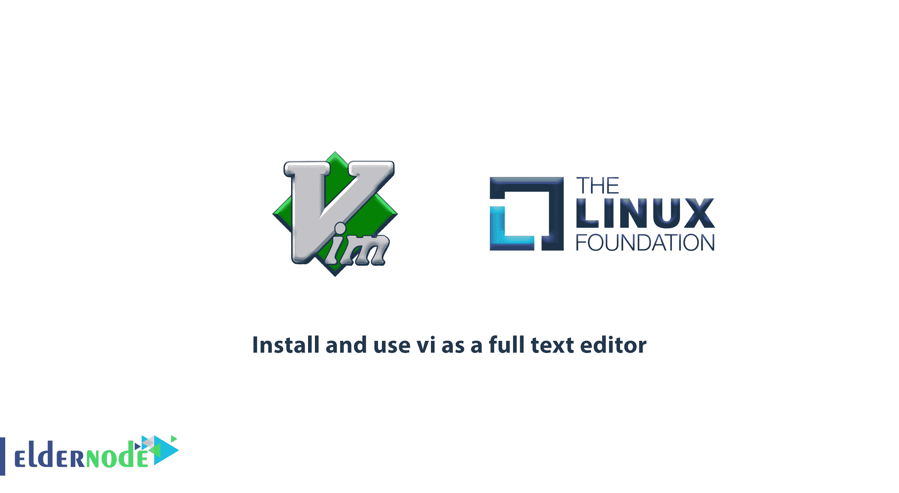
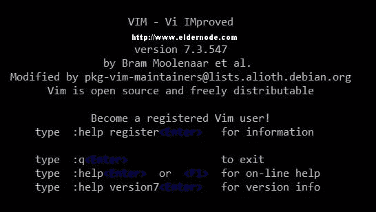
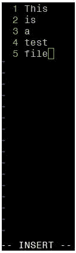

# 如何安装和使用 vi 作为全文编辑器——什么是 vi/vim

> 原文：<https://blog.eldernode.com/use-vi-full-text-editor/>



由于 [Linux](https://www.linux.org/) 基金会推出了 **LFCS** 认证，在这篇文章中，我们将学习**如何安装和使用 vi 作为全文编辑器**。LFCS(Linux Foundation Certified Sysadmin)帮助来自世界各地的个人验证他们能够在 Linux 系统上执行基本到中级的系统管理任务:系统支持、第一手故障排除和维护，以及智能决策，以知道何时向上层支持团队提出问题。

## 如何安装使用 vi 作为全文编辑器

让我们回顾一下本指南的步骤，以了解 **vi/m editor** 中的基本文件编辑操作和理解模式，这些是 **LFCS 认证** n 考试所需的。

### 使用 vi 执行基本文件编辑操作

Vi 是第一个为 Unix 编写的小而简单的全屏幕文本编辑器。对于专门使用 GUI 文本编辑器的人来说，这可能有点困难，举几个例子来说，比如 **NotePad++** ，或者 **gedit** 。

你将学习这个强大程序的 3 种方法，以便能够使用 **Vi** ，然后了解它强大的文本编辑程序。

**重要的** :大多数现代 Linux 发行版都附带了一个 **vi** 的变体，称为**vim**(“vi 改进”)，它支持比最初的 Vi 更多的特性。因此，在本指南中，我们将交替使用 vi 和 vim。

如果您的发行版没有安装 vim，您可以安装它。

**Ubuntu 及衍生品**:智能更新&智能安装 vim

**基于红帽的发行版**:百胜更新&百胜安装 vim

**openSUSE** : zypper 更新&zypper 安装 vim

**[购买 Linux 虚拟专用服务器](https://eldernode.com/linux-vps/)**

### 我为什么要学 vi？

在下文中，我们提到了学习 vi 的两个好理由。

**第一个**、**第六个**总是可用，因为 POSIX 需要它。

**第二个**，**第六个**不会消耗大量的系统资源，并且允许您执行任何可以想象的任务，而无需将手指从键盘上抬起。

而且 **值得一提的是**VI 有非常丰富的内置手册，可以在程序启动后马上使用 **: help** 命令启动。该内置手册包含的信息比 vi/m 的手册页更多。

#### 发射 vi

在命令提示符下键入 vi，启动 vi



可以按下 **i** 进入**插入**模式，开始打字。但是另一种启动 vi/m 的方法是使用下面的命令，它将打开一个名为 filename 的新缓冲区，您可以稍后将它保存到磁盘。

```
vi filename
```

#### 了解 Vi 模式

1.  当您处于命令模式时，vi 允许用户浏览文件并输入 vi 命令，这些命令是一个或多个字母的简短、区分大小写的组合。几乎所有的命令都可以以数字为前缀，重复命令的次数。
2.  在 **ex** 模式下，可以操作文件。要进入此模式，您必须在命令模式下键入一个冒号( **:** )，后跟需要使用的 ex-mode 命令的名称。之后，vi 自动返回命令模式。
3.  在插入模式下，您只需输入文本。大多数击键都会导致文本出现在屏幕上。



#### Vi 命令

看看下面的列表，它总结了常用的 vi 命令。可以通过在命令后面附加感叹号来执行文件编辑命令。

**键盘命令:描述**

**h 或向左箭头**:向左移动一个字符

**j 或向下箭头**:向下一行

**k 或向上箭头**:向上一行

**l(小写 L)或右箭头**:向右移动一个字符

**H** :转到屏幕顶部

**L** :转到屏幕底部

**G** :转到文件末尾

**W** :向右移动一个单词

**b** :向左移动一个单词

**0(零)**:转到当前行的开头

**^** :转到当前行的第一个非空白字符

**$** :转到当前行的末尾

**Ctrl-B** :返回上一屏

**Ctrl-F** :前进一屏

**i** :在当前光标位置插入

**I(大写 i)** :插入当前行的开头

**J(大写 j)** :将当前行与下一行合并(上移下一行)

**a** :追加到当前光标位置之后

**o(小写 O)** :在当前行后创建一个空行

**O(大写 o)** :在当前行之前创建一个空行

**r** :替换当前光标位置的字符

**R** :在当前光标位置覆盖

**x** :删除当前光标位置的字符

**X** :删除当前光标位置之前(左侧)的字符

**dd** :剪切当前整行(以备后贴)

**D** :从当前光标位置切到行尾

**yX** :给出移动命令 X，从当前光标位置复制(猛拉)适当数量的字符、单词或行

**yy 或 Y** :拉动(复制)当前整行

**P** :粘贴在当前光标位置之后(下一行)

**p** :粘贴到当前光标位置之前(前一行)

**。(句号)**:重复最后一条命令

**u** :撤销上一条命令

**U** :撤销最后一行的最后一个命令。只要光标仍在该行上，这就会起作用。

**n** :在搜索中找到下一个匹配

**N** :在搜索中找到前一个匹配

**:n:下一个文件**；当指定了多个文件进行编辑时，此命令将加载下一个文件。

**:e 文件**:加载文件代替当前文件。

**:r 文件**:在当前光标位置后(下一行)插入文件内容

**:q** :不保存更改退出。

**:w 文件**:将当前缓冲区写入文件。要追加到现有文件，使用 **:w** > >文件。

**:wq** :写入当前文件内容并退出。相当于 x！还有 ZZ

**:r！命令**:执行命令，在当前光标位置后(下一行)插入输出。

#### Vi 选项

您可以在您的 **~/中添加以下选项。运行 vim 时可能会派上用场的 vimrc** 文件:

```
echo set number >> ~/.vimrc  echo syntax on >> ~/.vimrc  echo set tabstop=4 >> ~/.vimrc  echo set autoindent >> ~/.vimrc
```

如果您需要了解更多信息:

**set number** 当 vi 打开一个现有的或新的文件时显示行号。

**syntax** on 打开语法高亮显示(对于多个文件扩展名),以使代码和配置文件更具可读性。

**set tabstop=4** 将制表符大小设置为 4 个空格(默认值为 8)。

**set autoindent** 将前一个缩进带到下一行。

#### 搜索并替换

作为其中的一个新特性，我们可以提到 vi 具有基于搜索将光标移动到某个位置的能力。它还可以在用户确认或不确认的情况下执行文本替换。

1-在行内搜索: **f** 命令搜索一行，并将光标移动到当前行中下一个出现的指定字符。

**一个例子:**命令 **fh** 会将光标移动到当前行中字母 **h** 的下一个实例。请注意，字母 **f** 和您正在搜索的字符都不会出现在屏幕上的任何地方，但在您按下 **Enter** 后，该字符会高亮显示。

2-搜索整个文件:使用 **/** 命令，后跟要搜索的单词或短语。可以用 **n** 命令使用前一个搜索字符串或下一个重复搜索。这是在命令模式下键入**/简**的结果。

3- vi 使用命令在一系列行或整个文件上执行替换操作。要将整个文件中的单词“ **old** 改为“ **young** ，我们必须输入以下命令。

```
:%s/old/young/g 
```

**请注意** 命令开头的冒号。

冒号( **:** )开始 ex 命令， **s** 在这种情况下， **%** 是从第一行到最后一行的快捷方式含义， **old** 是搜索模式，而 **young** 是替换文本， **g** 表示应该对文件中搜索字符串的每一次出现进行替换。

为了在执行任何替换之前要求确认，可以在命令的末尾添加一个 **c** 。

```
:%s/old/young/gc 
```

1.  **y** :执行替换(是)
2.  **n** :跳过本次事件，转到下一次(否)
3.  **a** :在该模式的此实例和所有后续实例中执行替换。
4.  **q** 或 **Esc** :退出替代。
5.  **l** ( **小写 L** ):执行此替换并退出(最后)。
6.  **Ctrl-e** ， **Ctrl-y** :分别向下和向上滚动，查看提议替换的上下文。

#### 一次编辑多个文件

让我们在命令提示符下键入 **vim file1 file2 file3** 。

```
vim file1 file2 file3 
```

您可以看到，vim 将打开 **file1。**但是你需要使用 **:n** 命令切换到下一个文件(**文件 2** )。而 **: N** 会在你想返回上一个文件的时候完成这项工作。接下来，从**文件 1** 切换到**文件 3** 。

1-**:buffers**命令将显示当前正在编辑的文件列表

```
:buffers 
```

2-命令**:缓冲器 3** 将打开**文件 3** 进行编辑。

#### 临时 vi 缓冲器

要将几个连续的行复制到一个名为 a 的临时缓冲区中，并将这些行放在文件的另一部分，稍后放在当前 vi 部分:

1.按下 **ESC** 键，确保处于 vi 命令模式。

2.将光标放在要复制的文本的第一行。

3.键入" **a4yy** "将当前行以及随后的 3 行复制到名为 a 的缓冲区中。您可以继续编辑我们的文件——不需要立即插入复制的行。

4.当到达复制行的位置时，在 **p** 或 **P** 命令前使用 **a** 将复制的行插入到名为 **a** 的缓冲区中

*   键入" **ap** 将复制到缓冲区的行T3a插入光标所在的当前行之后。
*   键入" **aP** 将复制到缓冲区的行插入到当前林之前的**。**

**如果您愿意，可以重复上述步骤，将缓冲区**的内容插入我们文件的多个位置。当当前窗口关闭时，一个临时缓冲区，如本节中的一个，被释放。****

******好样的** ！通过完成本教程，您学习了如何安装和使用 vi 作为全文编辑器。你也看到了， **vi** / **m** 是一个强大的、多功能的 CLI 文本编辑器。****

****亲爱的用户，我们希望你能喜欢这个教程，你可以在评论区提出关于这个培训的问题，或者解决其他关于 [Eldernode 培训](https://eldernode.com/) 领域的问题，请参考 [提问页面](https://eldernode.com/ask) 部分并提出你的问题。****