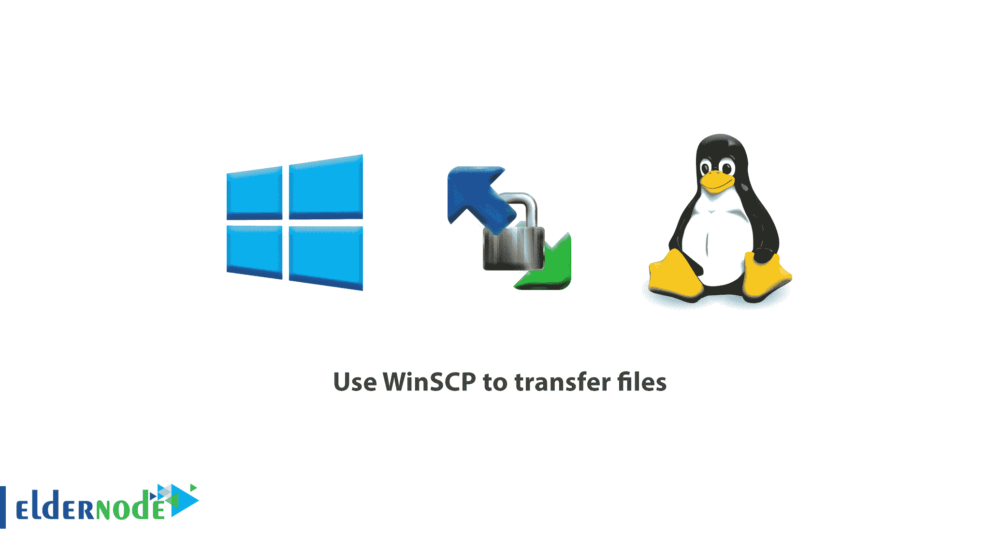
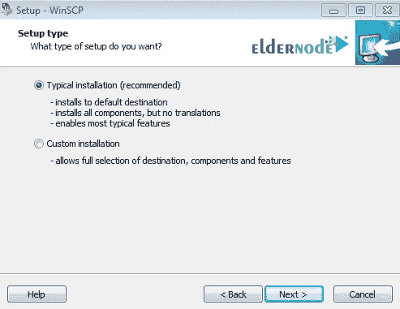
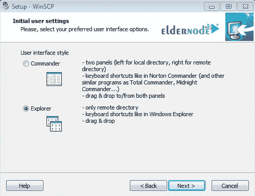
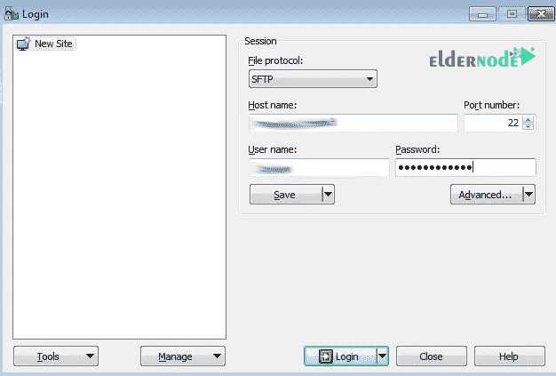
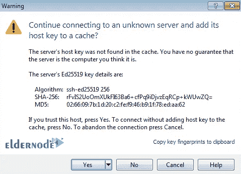
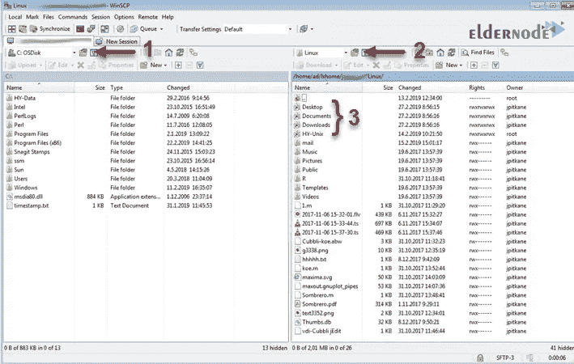
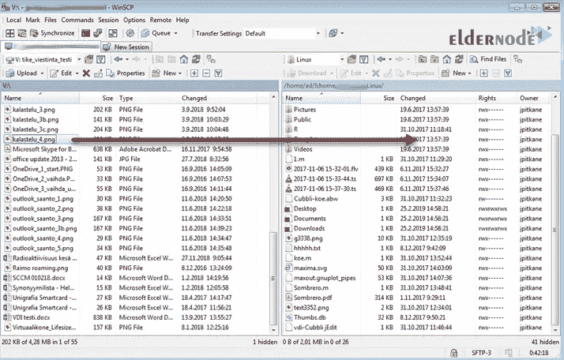
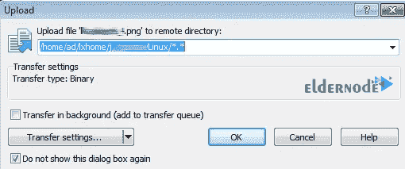
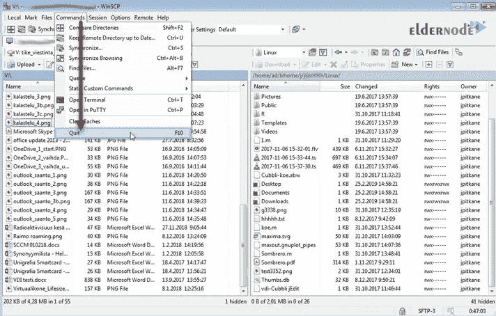

# 教程如何使用 WINSCP 传输文件- ElderNode 博客

> 原文：<https://blog.eldernode.com/use-winscp-transfer-files/>

在本文中，我们学习如何使用 **WinSCP** 来传输文件。在开始培训之前，最好先熟悉一下这个**文件传输软件**。因此，在第一步中，我们将回答问题“什么是 WINSCP ”，然后我们将解释如何一步一步地使用图像。

在[老年人节点](https://eldernode.com/)有许多[管理 RDP 服务器](https://eldernode.com/admin-rdp-server/)服务。你可以从其中一个计划中选择。

## **教程如何使用 WINSCP 传输文件**

## 什么是 WinSCP？

WinSCP 是一个免费的开源文件传输程序，它使用**文件传输协议**([FTP](https://en.wikipedia.org/wiki/File_Transfer_Protocol))**安全外壳文件传输**([SSH](https://en.wikipedia.org/wiki/Secure_Shell))**安全复制协议** ( [SCP](https://en.wikipedia.org/wiki/Secure_copy_protocol) )等协议来安全地传输文件。该程序设计用于 Windows，并支持常见的 Windows 功能，如拖放文件。

**注:** 该软件的主要功能是在本地计算机和[远程计算机](https://eldernode.com/tag/remote-desktop/)之间传输文件。

Winscp 使用**安全密码**或**公钥加密**将文件从客户端计算机传输到服务器。所以在使用 WINSCP 的教程中可以强调的重点之一就是文件传输讨论中的安全性。

安装 WinSCP 时，你可以选择两个 windows 资源管理器或诺顿指挥官界面中的一个。加入我们，了解更多关于使用 WINSCP 的信息。

### 如何安装 WinSCP？

**1。** 首先，**下载**WinSCP 安装包。

[***下载 WinSCP***](https://winscp.net/eng/download.php)

**2。** 双击像其他 Windows 程序一样启动安装文件。

**3。** 如果安装程序时需要，**设置**(典型)选项。

**4。** 在初始用户设置窗口，选择**浏览器**选项作为用户界面。这是 WINSCP 使用教程中最重要的安装设置之一。

**5。点击下一步按钮重启系统**完成安装。

### 了解如何使用 WINSCP 传输文件

如你所见，安装 WinSCP 非常简单，在安装过程中不需要任何特殊设置。

在 WINSCP 教程的这一步中，我们将通过提供每个步骤的映像来研究 Linux 系统如何与 Windows 系统通信。

#### 【Linux 和 Windows 系统之间的通信

**1。双击 WinSCP 快捷方式上的**或者从窗口开始的所有程序部分运行程序。

**2。** 将显示一个名为**登录**的窗口，要求输入主机名、用户名、和密码等信息。

**–从可用下拉列表中选择**传输协议。

**–**在**主机名**字段中，输入所需服务器的 IP 地址，输入用户名和密码后，点击登录。

首次登录时，系统会询问您是否信任主机。点击是。

**注意:** 此时，可以检查服务器指纹然后继续进行。

**3。** 会出现一个窗口，左边是你的本地 Windows 驱动，右边是 Linux 系统的内容。您可以从图中标有 1 和 2 的下拉列表中选择不同的硬盘和文件夹。

**4。** 在 WinSCP 中传输文件最简单的方法就是从窗口的左侧(你的本地 Windows 文件)拖拽文件到右侧，即 Linux 系统。您也可以将 Linux 系统文件传输到您的 Windows。

**5。** 程序会接着要求你确认文件传输操作。您也可以在出现的窗口中更改文件传输设置。

**注意**传送操作完成后，一定要从**命令**菜单中选择退出选项，或者使用 F10 快捷键**退出**程序。

### WinSCP 的优势

**——**WinSCP非常容易使用，用这个程序传输文件将在安全协议下完成。

**—** WinSCP 与**兼容【Windows 特性，可以使用拖拽&快捷图标等。在这个项目中。**

**—** 支持 SCP 和 SFTP 等良好的协议。如果你想更多地了解 SFTP，我们建议你阅读文章 [SFTP 及其与 FTP 协议的区别](https://eldernode.com/sftp-and-difference-with-ftp-protocol/)。

**—** 支持所有 web 协议。

**—** 通过 SSH 与 **Linux** 通信，不运行特定的服务。

**—** 为用户提供文件传输之外的能力，如编程和基础文件管理。

**尊敬的用户**，我们希望您能喜欢**如何使用 WinSCP 传输文件**，您可以在评论区提出关于本次培训的问题，或者解决 [Eldernode 培训](https://eldernode.com/blog/)领域的其他问题，请参考提问页面并尽快提出您的问题。腾出时间给其他用户和专家来回答你的问题。

好运。