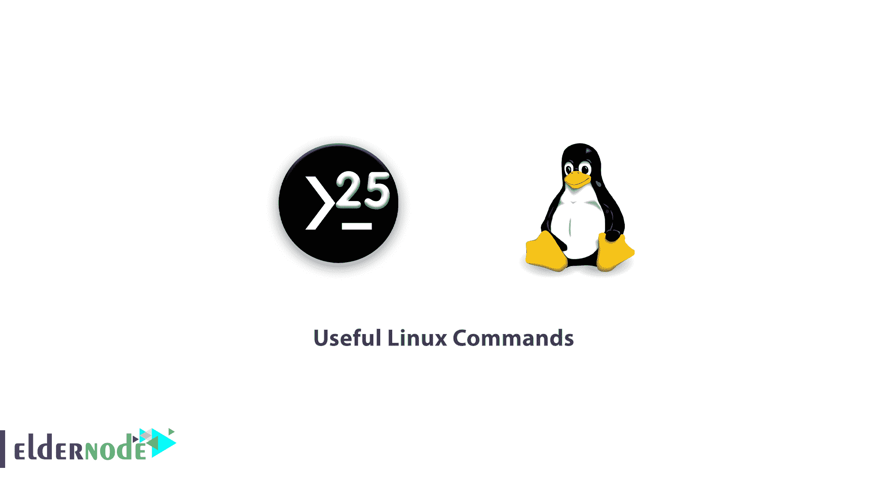

# 有用的 Linux 命令- Eldernode

> 原文：<https://blog.eldernode.com/useful-linux-commands/>



终端环境是 Linux 命令行。如果你目前在一个图形环境中，最简单的方法是使用 Ctr + Alt + T 键，这是所有发行版都支持的。还有其他方法，比如使用 Ctr + Alt + F6 键(使用 Ctrl + Alt + F7 键退出)将您带到主命令行环境。在本文中，我们将解释有用的 Linux 命令的 25 个实用命令。和我们在一起。

## 25 个有用的 Linux 命令

在本文中，我们将为 Linux 系统管理员回顾一些在日常生活中使用的有用且常用的 Linux 或 Unix 指令。这些并不是所有的命令，而是需要时可以参考的命令的完整列表。让我们从如何使用这些命令的例子开始。

### 1。正常运行时间

uptime 命令指示系统何时打开、当前登录的用户数量以及 1.5 分钟和 15 分钟的平均负载。

```
uptime  08:16:26 up 22 min, 1 user, load average: 0.00, 0.03, 0.22
```

### 2 .W

该命令指示哪些用户当前已登录。还显示用户名，TTY 名称，远程主机，登录时间，空闲时间，JCPU，PCPU，命令和进程。

**选项:**

**-h:** 不显示任何表头输入

**-s:** 无 JCPU 和 PCPU

**-f:** 删除字段

**-V:** (大写字母)-显示版本。

### 3。用户

显示当前连接到系统的用户。

```
users  tecmint
```

### 4。世卫组织

世卫组织命令只显示用户名、日期、时间和主机信息。世卫组织司令部和 w 司令部相似吗？与 w 命令不同，世卫组织命令不打印用户的工作。

```
who  tecmint pts/0 2012-09-18 07:59 (192.168.50.1)
```

### 5 号。谁啊

Whoami 命令打印当前用户名。你也可以使用“**我是谁**”命令来显示当前用户。如果你以 root 身份登录，使用 **sudo** 命令以当前用户身份打开“**whoami**”root。

如果您想知道确切的登录用户，请使用“我是谁”命令。

```
whoami  tecmint
```

### 6 .LS

LS 命令以人类可读的格式显示文件列表。

```
ls -l  total 114  dr-xr-xr-x. 2 root root 4096 Sep 18 08:46 bin  dr-xr-xr-x. 5 root root 1024 Sep 8 15:49 boot 
```

### 7\. Crontab

使用 crontab 命令和-l 选项为当前用户打印待办事项列表。

```
crontab -l  00 10 * * * /bin/ls &gt;/ls.txt
```

使用 **-e** 选项编辑您的 crontab。在下面的例子中，在 **vi** 编辑器中打开程序任务。进行必要的更改并退出编辑器，编辑器会自动保存设置。

```
crontab -e
```

### 8。减去

less 命令将文件打印显示为一页，并使用' **q** '键退出窗口。

```
less install.log  Installing setup-2.8.14-10.el6.noarch  warning: setup-2.8.14-10.el6.noarch: Header V3 RSA/SHA256 Signature, key ID c105b9de: NOKEY  Installing filesystem-2.4.30-2.1.el6.i686  Installing ca-certificates-2010.63-3.el6.noarch  Installing xml-common-0.6.3-32.el6.noarch  Installing tzdata-2010l-1.el6.noarch  Installing iso-codes-3.16-2.el6.noarch
```

### 9。更多

该命令与 less 命令的作用相同。

```
more install.log  Installing setup-2.8.14-10.el6.noarch  warning: setup-2.8.14-10.el6.noarch: Header V3 RSA/SHA256 Signature, key ID c105b9de: NOKEY  Installing filesystem-2.4.30-2.1.el6.i686  Installing ca-certificates-2010.63-3.el6.noarch  Installing xml-common-0.6.3-32.el6.noarch  Installing tzdata-2010l-1.el6.noarch  Installing iso-codes-3.16-2.el6.noarch  --More--(10%)
```

### 10。CP

用于复制文件。

```
cp -p fileA fileB
```

### 11 .MV

用于重命名文件或将文件完全移动到另一个路径。

```
mv -i fileA fileB
```

### 12。猫

该命令用于在 STDOUT 中打印文件。

```
cat fileA fileB
```

如果文件很大并且有很多页，您可以使用上面描述的 LESS 和 MORE 命令进行打印。

```
cat install.log | less  cat install.log | more
```

### 13。CD(更改目录)

使用此命令，您可以在目录之间移动。

```
cd /fileA
```

### 14 .PWD

该命令显示当前目录。

```
pwd  /root
```

### 15。排序

按升序对文本文件行进行排序。用-r 选项按降序排列。

```
sort fileA.txt  sort -r fileA.txt
```

### 16 号。我们

它是 Linux 中最流行的文本编辑器之一。

```
vi -R /etc/shadows
```

### 17。SSH(安全外壳)

SSH 命令用于登录远程主机。例如，以下命令 ssh 使用用户 narad 连接到远程主机(192.168.50.2)。

```
ssh [[email protected]](/cdn-cgi/l/email-protection)
```

### 18。FTP 和 SFTP

ftp 或 sftp 命令用于连接到 ftp 远程主机。ftp(文件传输协议)和 sftp(安全文件传输协议)。例如，以下命令连接到主机 FTP (192.168.50.2)。

```
ftp 192.168.50.2  sftp 192.168.50.2
```

使用 **mput** 命令将多个文件放在远程主机上。同样，通过输入 **mget** 命令，几个文件从远程主机**下载**。

```
ftp &gt; mput *.txt  ftp &gt; mget *.txt
```

### 19。服务

服务命令执行位于 ***/etc/init.d/*** 目录中的脚本。启动每项服务有两种方式。例如，我们用 service 命令启动 **httpd** 服务。

```
service httpd start  OR  /etc/init.d/httpd start
```

### 20。免费

显示空闲和占用的内存空间和交换空间。

```
free              total          used        free   shared     buffers     cached  Mem:      1030800        735944      294856        0       51648     547696  -/+ buffers/cache:       136600      894200  Swap:      2064376            0     2064376
```

### 21。命令

该命令用于压缩文件。

tar-CVF archive-name.tar/主页

### 22\. Grep

grep 是在文件或命令输出中搜索给定的字符串。我们可以使用-i 选项来忽略区分大小写。

```
grep tecmint /etc/passwd  tecmint:x:500:500::/home/tecmint:/bin/bash
```

### 23。找到

该命令用于搜索文件、文本和目录。

```
find / -name tecmint  /var/spool/mail/tecmint  /home/tecmint  /root/home/tecmint
```

### 第 24 课.RM

该命令用于删除文件。

```
rm filename
```

使用-i 选项允许您在删除文件之前得到确认。

```
rm -i test.txt  rm: remove regular file `test.txt'?
```

### ﹍25 .mkdir

用于构建目录。

```
mkdir directoryname 
```

## 结论

本文讲述了 25 个最有用的 Linux 命令。