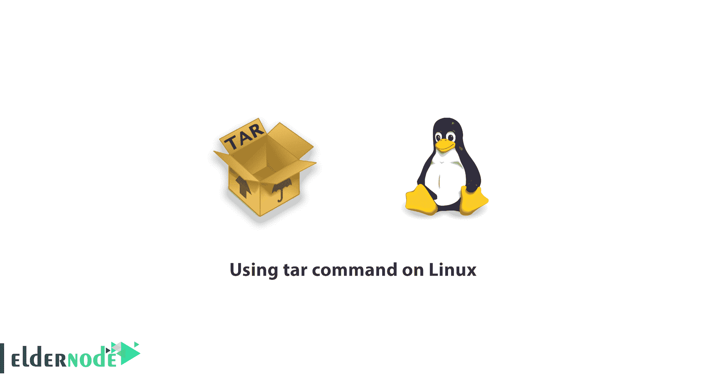

# 在 Linux 上使用 tar 命令——用 tar 提取——用 tar 压缩——GNU tar

> 原文：<https://blog.eldernode.com/using-tar-command-on-linux/>



在本文中，我们想讨论如何在 Linux 服务器上使用 tar 命令。你应该知道，Tar 命令适用于所有的 Linux 标准 Gnu 发行版，如 [CentOS](https://eldernode.com/tag/centos/) 、 [Ubuntu](https://eldernode.com/tag/ubuntu/) 、 [Debian](https://eldernode.com/tag/debian/) 和…

Tar 为在 Linux 系统上创建档案和压缩文件提供了一个标准接口。该实用程序获取大量文件，将它们一起保存在归档文件中，并压缩归档文件以节省空间。然而，tar 提供了大量的特性和选项，这些特性和选项会导致命令难以阅读，甚至会使最简单的操作变得混乱。

### 在 Linux 上使用 tar 命令

#### 用 Tar 提取存档文件

tar 的复杂性并不来自于它的基本形式，而是来自于您可以用来创建和与归档交互的选项和设置的数量。给定 tar 文件 ~/archive.tar ，可以使用下面的命令将该文件的内容提取到当前目录中。

```
tar -xf ~/archive.tar
```

这将提取 (-x) 提示符下命名的文件 (-f) 指定的档案。

#### 用 Tar 压缩并存档文件

要创建目录 ~/data 中所有文件的归档文件，请使用以下命令。

```
tar -c ~/data > data-archive.tar
```

默认情况下，tar 将归档文件的内容发送到标准输出，您可以使用它来进一步处理您创建的归档文件。您可以选择使用-f 选项绕过标准输出功能。下面的命令等同于前面的命令。

```
tar -cf data_archive.tar ~/data
```

您还可以添加一个 -v 选项来增加一些命令的详细程度。例如，以下命令将在文件添加到归档文件时输出文件列表。

```
tar -cvf data_archive.tar ~/data
```

选项的顺序有时很重要。f 选项需要是最后一个选项，因此看起来最接近它所指定的文件名。因此 -cvf 将按预期执行，而 -cfv 将失败。

现在我们向您展示一些 tar 命令示例。

###### **Tar 命令示例用于归档和压缩文件**

#### 创建档案

不使用标准输出重定向创建文件。

```
tar -cf data_archive.tar ~/data
```

#### 用 Gzip 压缩一个档案

用 tar 和 gzip 命令创建一个文件。

```
tar -czf ~/data-archive.tar.gz ~/data/
```

用 bzip 压缩创建一个 tar 文件。

```
tar -cjf ~/data-archive.tar.bz2 ~/data/
```

创建一个 tar 文件和 xzip 压缩。

```
tar -cJf ~/data-archive.tar.xz ~/data/
```

###### **Tar 命令示例用于解压缩和解压文件**

要从 tar 归档文件中提取文件，发出以下命令。

```
tar -xf ~/data-archive.tar
```

如果你想解压一个 gzip 文件，你可以使用下面的命令。

```
tar -xzvf ~/data-archive.tar.gz
```

同样，对于未压缩文件和带有 bz2 文件的提取文件，您可以使用此命令。

```
tar -xcvi ~/data-archive.tar.bz2
```

##### 结论

Tar [命令](https://eldernode.com/tag/linux-command/)是 Linux 上用于压缩、存档和提取压缩文件的最强大的命令，在这篇文章中我们用一种简单的方式向你展示如何在 Linux 上使用 Tar 命令，更多关于 tar 命令的信息请访问 [GNU tar](https://www.gnu.org/software/tar/) 。