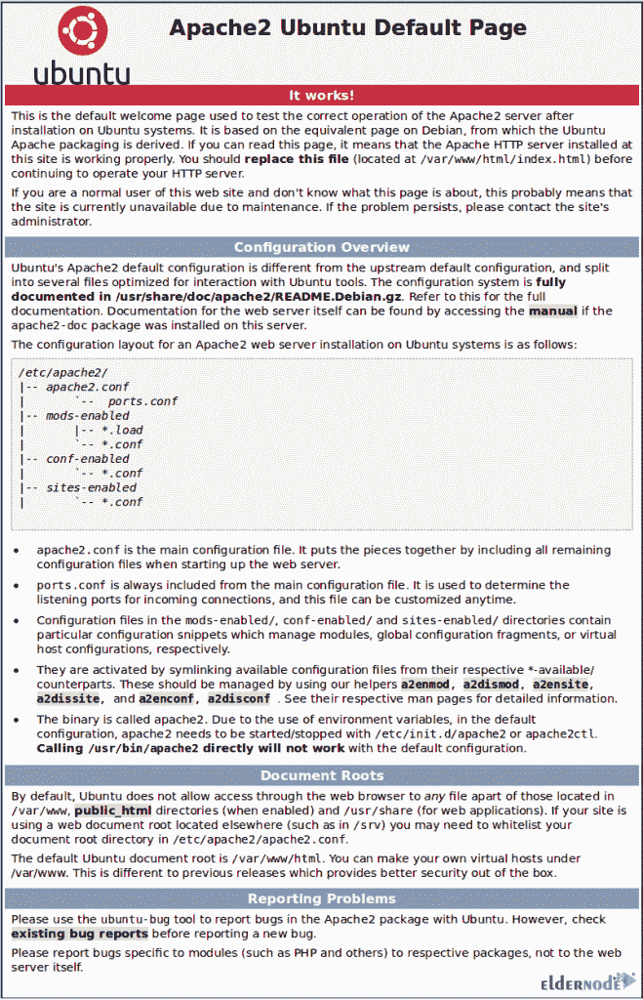

# 在 Ubuntu - Eldernode 博客上为 Apache 安装 Varnish 缓存

> 原文：<https://blog.eldernode.com/varnish-cache-for-apache-on-ubuntu/>


Varnish Cache 是一个流行且强大的开源 HTTP 引擎/反向 HTTP 代理，适用于高流量网站。Varnish 缓存，也称为 Varnish，是一个 HTTP 加速器，专为内容丰富的动态网站和 API 而设计。Varnish 被设计为 HTTP 加速器。它与 Squid 不同，Squid 最初是客户端缓存，甚至与 Apache 和 Nginx 形成对比，后者主要是源服务器。如果你正在寻找一个解决方案来加速你的 Apache 服务器，加入我们这篇文章来学习如何**在 Ubuntu 20.04** 上安装 Varnish Cache For Apache。在 [Eldernode](https://eldernode.com/) 上找到您考虑的软件包，并购买您自己的 [Ubuntu VPS](https://eldernode.com/ubuntu-vps/) ，享受我们技术团队的支持。

## **教程在 Ubuntu 20.04 上为 Apache 安装 Varnish 缓存**

之前，你已经学习了在 Ubuntu 20.04 上安装 [Apache。因此，我们假设您已经安装并运行了 Apache。接下来，我们将在非标准端口 8080 上运行 Apache，然后在端口 80 上运行 Varnish 作为反向代理。此外，我们将使用 Apache 作为后端服务器，它不能在标准的 HTTP 端口 80 下运行。和我们一起学习如何在](https://blog.eldernode.com/apache-web-server-ubuntu-20/) [Ubuntu](https://blog.eldernode.com/tag/ubuntu/) 20.04 上安装和配置 Varnish。

### **在 Ubuntu 20.04 上安装清漆缓存的先决条件**

为了让本教程更好地工作，请考虑以下先决条件:

_ Ubuntu 20.04 lt

_ 拥有 Sudo 权限的非 root 用户。

_ 要进行设置，请遵循我们在 Ubuntu 20.04 上的[初始服务器设置。](https://blog.eldernode.com/initial-server-setup-on-ubuntu-20/)

### **如何在 Ubuntu 20.04 上安装 Apache web server**

如果您重视速度、性能、可扩展性，并希望节省服务器基础设施，您会喜欢 Varnish，并发现它是您的业务所必需的。当您在任何使用 HTTP 的服务器前安装 Varnish 并将其配置为缓存内容时，Varnish 通过缓存用户经常访问的内容并将其存储在内存中来加速网站，从而保证更快地检索网页。让我们来看一下这个指南的步骤，在 Ubuntu 20.04 上安装 Varnish cache for Apache 并提高你的网站速度。

*第一步:*

首先，您需要安装 Apache 服务器。因为默认情况下它在 Ubuntu 存储库中可用。因此，使用以下命令更新 Ubuntu 存储库，然后安装 Apache:

```
apt update
```

```
apt install -y apache2
```

*第二步:*

一旦安装完成，您就可以启动 Apache 服务，并使它在系统引导时自动运行。所以，运行:

```
systemctl start apache2
```

```
systemctl enable apache2
```

*第三步:*

在这一步中，您必须允许所有人在我们的防火墙规则上访问 web 服务器、HTTP 和 HTTPS。使用以下 UFW 命令打开新的 SSH、HTTP 和 HTTPS 端口:

```
ufw allow ssh
```

```
ufw allow http
```

```
ufw allow https
```

然后，使用下面的命令启动防火墙服务，并使其在系统启动时自动启动。同样，输入 *' **y** '* 并按**回车**确认:

```
ufw enable
```

这样，HTTP、HTTPS 和 SSH 的新端口已经打开，并且可以从网络外部访问。

### **如何在 Ubuntu 20.04 上更改 Apache 默认端口**

Apache web 服务器将在端口 8080 上作为后端运行，标准的 HTTP 端口 80 将由“Varnish”使用。因此，在这一部分，您需要更改默认的 apache 端口。为此，您应该编辑 apache 配置' **ports.conf** '和“sites-available”目录下的所有虚拟主机配置。

首先，转到 Apache 配置目录并运行:

```
cd /etc/apache2
```

***注意* :** 你还需要将 Apache 配置' **ports.conf** '中的端口' 80 '替换为' 8080 '，以及“sites-available”目录下的所有虚拟主机文件。

为此，请使用下面的命令:

```
sed -i -e 's/80/8080/g' ports.conf
```

```
sed -i -e 's/80/8080/g' sites-available/*
```

现在，您可以**测试**Apache 配置。如果您没有遇到错误，您可以重新启动 Apache 服务。

```
apachectl configtest
```

```
systemctl restart apache2
```

由于 Apache 运行在 HTTP 端口' 8080 '下，您可以使用以下命令来检查它:

```
netstat -plntu
```

## **如何在 Ubuntu 20.04 上安装清漆**

在本节中，您可以使用以下命令从 Ubuntu 存储库中安装 Varnish:

```
apt install -y varnish
```

安装完成后，运行以下命令启动 Varnish 并使在系统启动时自动启动:

```
systemctl start varnish
```

```
systemctl enable varnish
```

现在，你应该已经在 Ubuntu 20.04 上安装了 Varnish，默认情况下，它运行在公共地址的端口“6081”和本地主机地址的端口“6082”下。要进行检查，请运行:

```
netstat -plntu
```

### **如何配置 Varnish HTTP Cache 监听端口 80**

因为 Varnish 将把 HTTP 请求转发到 Apache web 服务器，所以在这一步中，您将配置 Varnish 加速器监听端口 80，然后配置 Apache 监听端口 8080。

*第一步:后端配置* 

转到' varnish '配置目录，备份默认文件' ***default.vcl*** ':

```
cd /etc/varnish/
```

```
cp default.vcl default.vcl.aseli
```

这里，我们使用 [vim 编辑器](https://blog.eldernode.com/use-vi-full-text-editor/)编辑清漆配置‘default . VCL’:

```
vim default.vcl
```

在第 16 行定义“后端”配置。我们设置的后端是 Apache，它运行在端口 8080 上，保存并关闭它。

*步骤 2:在端口 80 上运行清漆*

现在，您必须更改默认端口“6081”和“6082”。另外，您需要将公共地址的端口更改为 HTTP 端口 80。

再次编辑“ **/etc/default”目录**中的清漆参数配置。

```
cd /etc/default/
```

```
vim varnish
```

然后，编辑“ **DAEMON_OPTS** ”行，将公共地址的默认端口“6081”更改为标准 HTTP 端口“80”，保存并关闭它。

现在，是时候编辑清漆服务文件' **varnish.service** '了。为此，请转到“ **/lib/systemd/system** ”目录，并使用 vim 编辑服务文件:

```
cd /lib/systemd/system/
```

```
vim varnish.service
```

接下来，在' **ExecStart** '行，更改上光启动命令如下:

```
ExecStart=/usr/sbin/varnishd -j unix,user=vcache -F -a :80 -T localhost:6082 -f /etc/varnish/default.vcl -S /etc/varnish/secret -s malloc,256m
```

完成后，保存并关闭它。要重新加载 systemd 服务配置，然后**重启** varnish，请键入:

```
systemctl daemon-reload
```

```
systemctl restart varnish
```

最后，您可以检查 varnish 并确保它在 HTTP 端口 80 上运行。所以，运行:

```
netstat -plntu
```

如果一切正常，Varnish 应该在 HTTP 端口 80 下运行，作为 Apache web 服务器的前端，它位于端口 8080 上。

### **如何在 Apache** 上测试清漆缓存

在本指南的最后一节中，您可以测试 Varnish 缓存是否已启用，以及是否与 Apache HTTP 服务器一起工作。为此，请运行以下命令:

```
curl -I http://localhost
```

最后，您将获得 Apache 内容。



以下命令允许您检查清漆日志:

```
varnishncsa
```

## 结论

在本文中，您了解了如何在 Ubuntu 20.04 **上安装 Varnish Cache for Apache。**没什么不同您是需要基本功能的用户，还是拥有专业知识、时间和资源来构建定制模块的高级用户。然而，清漆将对你有用。如果您有兴趣了解更多，请找到我们关于在 CentOS 8 上为 Apache 安装 Varnish cache】的相关文章。