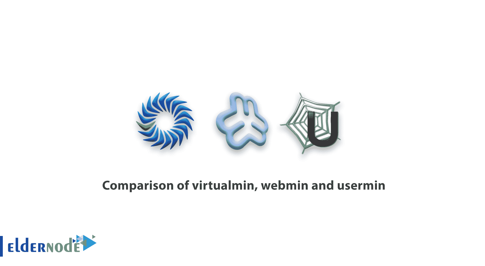

# virtualmin、webmin 和 usermin - ElderNode 博客的比较

> 原文：<https://blog.eldernode.com/virtualmin-webmin-and-usermin/>

Linux 服务器中 virtualmin、webmin 和 usermin 的比较。

在[购买 VPS](https://eldernode.com/vps/) 后，管理其账户需要一个控制面板，可以使用 CPanel 控制面板等商用控制面板，或者基于我们已经提供的，可以使用免费的 webmin 控制面板。

但 WebMin 控制面板的问题在于，panel 控制面板是用来管理服务器的，要使用它，需要有访问虚拟服务器或专用服务器 root 的权限。

#### Linux webmin 提供的特性:

*   1)文件管理
*   2)访问系统资源和工具
*   3)访问和管理安装在服务器上的各类服务，如:web 服务器、DNS 服务器、数据库等。
*   4)管理网络连接和相关设置
*   5)服务器硬件管理工具
*   6)系统资源消耗报告和统计
*   7)标准的 Nginx 网络服务器支持
*   8)安装简单方便
*   9)各种更安全的更新

#### 为什么要用 Virtualmin？

Linux Webmin 控制面板用于管理具有 root 访问权限的基于 web 的服务器。事实上，服务器管理员可以使用这个软件来查看资源和管理基于 web 的 Linux，而不是使用 SSH。

Virtualmin 软件以模块或插件的形式放在 Webmin 控制面板上，允许服务器管理员或主机定义域和主机，并将它们分开。事实上，使用 Virtualmin，在购买 VPS 服务器或专用服务器后，您将能够为不同的域创建不同的帐户，并为您的用户提供管理主机和域的能力，而不需要较低使用级别的 root 访问。

使用 Virtalmin，您可以为每个域分别定义不同的域-帐户电子邮件-DNS-FTP。

如果你安装了 virtualmin，webmin 的任何特性都不会丢失，越来越多的新特性和功能将被添加到 [VPS 服务器](https://eldernode.com/vps/)或[专用服务器](https://eldernode.com/dedicated-server/)。

#### 什么是 Usermin 软件？

Usermin 软件是安装在 Webmin 上的另一个模块，它允许 Virtualmin 用户使用 webmail。如果你不需要检查和使用电子邮件上定义的虚拟民帐户在网上，你不需要安装用户民将不会。

##### 使用 Linux Webmin 和 Virtualmin 的结论:

许多想使用免费控制面板管理服务器的人可以通过进入 [webmin](https://eldernode.com/tag/webmin/) 和 virtualmin 控制面板来实现。

起初，使用 Virtualmin 控制面板可能会有一些不同，您会遇到一些问题，但在使用它之后，您会发现这个控制面板可以让您花费与一个免费的商业系统一样多的成本，在一个 [Linux vps](https://eldernode.com/linux-vps/) 服务器或要使用的专用 Linux 服务器上托管不同的域。

我们希望从概念上解释 virtualmin、usermin 和 webmin 的区别和作用。