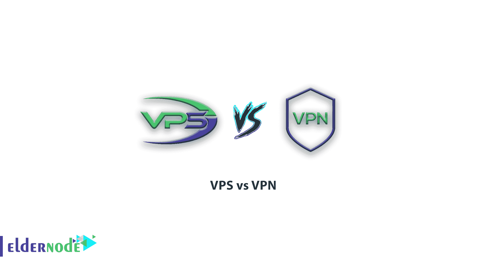
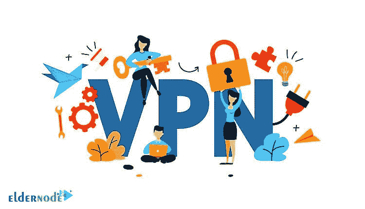
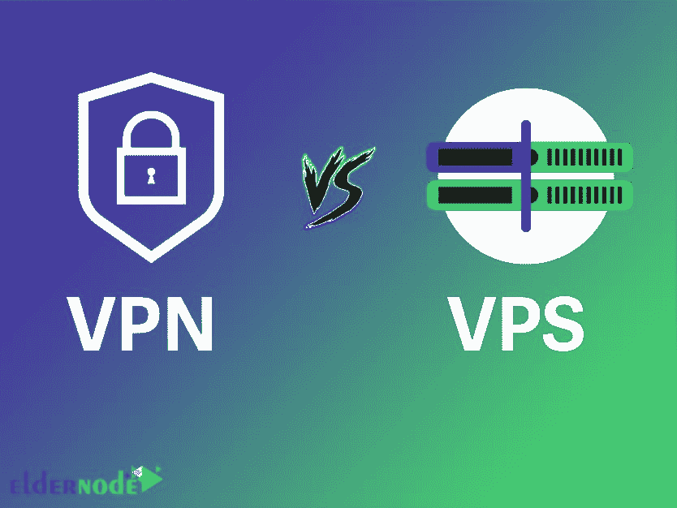

# VPS 与 VPN - Eldernode

> 原文：<https://blog.eldernode.com/vps-vs-vpn/>

虚拟专用服务器(VPS)和虚拟专用网络(VPN)虽然都为您的网站提供了更多的安全性，但这些服务实际上是非常不同的。认识到其中的主要区别对你选择适合你的企业非常有帮助。在本文中，我们将讨论 VPS 和 VPN 的区别。和我们在一起。

VPS 是一种托管服务，其中包含网站的服务器被划分为跟随专用服务器的虚拟外壳。另一方面，VPN 是一个服务器网络，用于建立私有的匿名互联网连接。这两种技术都有各自的应用，一些企业甚至决定将它们结合起来使用。

## 什么是 VPS

VPS 代表虚拟专用服务器，有时也称为 VDS，代表虚拟专用服务器。除了几个虚拟服务器位于一台物理服务器上之外，虚拟服务器的运行方式与具有相同访问级别的独立专用服务器完全相同。换句话说，使用 VMware 等虚拟化技术，使用强大而先进的硬件，将一台物理服务器划分为若干个具有不同功能的虚拟服务器(VPS)。

根据初始配置，每个虚拟服务器都会获得特定份额的服务器资源，如 CPU、主内存(Ram)、硬盘空间(HDD)和带宽。

例如，虚拟服务器可以有 1gb 的 64gb 专用服务器内存(RAM ), 40gb 的存储和 400 的月带宽。这意味着无论物理服务器上的其他虚拟服务器消耗多少，我们的虚拟服务器在任何情况下都可以访问 1gb 的服务器主内存和其他专用资源。

每个虚拟服务器完全独立运行，因此一个服务器上的 VPS 可以使用不同的操作系统和不同的版本，以及它们自己的软件。

与其他托管服务相比，虚拟服务器最重要的优势是其比专用服务器低得多的成本，以及比共享托管服务(共享托管)更高的性能独立性和访问级别。因此，在许多情况下，VPS 的成本是专用服务器的五分之一到十分之一，现在它们拥有所有的功能。虚拟服务器也可以有专用数量的有效 IP。一般来说，从最终用户的角度来看，虚拟服务器就像一个专用服务器，用户不会看到任何性能和服务质量的差异。

### VPS 是如何工作的？

VPS 是一台计算机服务器，用于托管您的网站、文件和网站所需的数据库。每当一个访问者想要访问你的网站，他的浏览器就会向你的服务器发出请求，必要的数据就会通过互联网传输给他。VPS 主机为您提供了一个模拟物理服务器的虚拟服务器。但实际上，这个服务器是由几个用户共享的。

使用虚拟化技术，您的主机提供商在服务器操作系统上安装一个虚拟层。这一层将服务器分成不同的分区，并允许每个用户在每个分区上安装他们的操作系统和软件。

事实上，虚拟服务器是公共和私有主机的结合。这项服务是为那些需要专用服务器的功能和特性，同时又没有提供专用服务器的成本的人准备的。在虚拟服务器中，使用虚拟虚拟机管理程序技术，私有服务器被分成几个彼此独立运行的分区。注意，尽管是独立的，它们仍然使用服务器的资源。

上面描述的一个简单的例子，比如你的电脑系统或者笔记本电脑，它被分成不同的驱动器，但是它们都在一台电脑上。

在虚拟服务器中，用户可以独立地管理自己的服务器，轻松地配置他们想要的和需要的，同时支付比私有服务器更少的费用。

## 什么是 VPN

虚拟专用网络(VPN)是一种通过公共网络(如互联网)传输信息的网络，但同时，使用加密算法和身份验证，这种连接仍然是私有的。

VPN 创建一个加密连接，从你连接到互联网的地方发送到另一个地区，通常是另一个国家，然后插入到公共互联网。此过程将改变您的 IP 地址，您的互联网连接的实际位置将不再为人所知。服务器访问新的 IP 地址，但不提供原始 IP 地址。因此，在使用敏感网站时，我们不会向您提供您的真实信息。

一些在线服务根据你的居住地提供不同的价格。比如美国的一些服务比欧洲便宜，用户可以通过更换 IP 以更低的价格访问。

### VPN 是如何工作的？

市场上有几种 VPN 服务。购买这些服务之一后，不同国家的列表将呈现在您面前。根据供应商的不同，VPN 以应用程序和程序的形式提供给用户，或者需要手动设置。运行 VPN 时，您必须选择 VPN 服务器所在的国家/地区，以便以加密形式连接到它。这时，你所有的信息都被放在一个加密的隧道里，然后进入公共互联网。

当信息通过隧道进入公共互联网时，IP 地址会改变，您的原始 IP 不再发送到 web 服务器。如果你使用 VPN，你仍然需要一个路由器或互联网服务提供商。但是，您的所有信息都是加密的，在到达 VPN 服务器之前不会更改。因此，公司将无法访问您的信息。当您使用公共和免费的互联网时，VPN 会对您的信息进行加密，因此您的信息以加密的形式提供给人们，并且不可能使用它。

VPN 位于您的手机或计算机上，通过连接到它们的服务器，为您提供带有可信链接的加密连接。您可以正常使用 VPN，但这次没有任何顾虑或限制。通过连接到 VPN，您的信息和浏览历史将被 VPN 制造商访问，而不是被您的 ISP 跟踪。所以，你不要完全相信他们，认为自己在网络上是 100%匿名的。

**比如**，当你去谷歌、脸书或需要登录的网站时，你的信息被存储为 cookie，下一次，即使你用 VPN 登录，你仍然会看到你的信息被保存。在这种情况下，如果有人使用相同的设备，他们将访问您的信息。所以不要以为激活 VPN 你就完全匿名了。

另一方面，有许多政府和执法机构可以通过强制 VPN 服务器在互联网上监控你来禁用它。这个问题的实现会涉及到 VPN 中使用的服务器，VPN 服务器等东西。

使用 VPN 会降低你的下载和上传速度。这是因为使用它们，而不是直接连接到互联网，您将使用与 VPN 相同的接口，因此数据传输的速度将会降低。当然，这也取决于你的 VPN 和它连接的服务器的质量。

## VPN 和 VPS 有什么区别？

在本节中，我们将解释 VPS 和 VPN 之间的区别。然后我们会说每一个对什么样的工作有用。

使用正确的工具将提高您的效率和安全性。然而，要知道使用哪种服务来支持一个网站有点困难。**例如**，VPS 可以提供增加网站流量所需的速度。这种类型的虚拟主机服务可以提高您的性能，而不会增加专用服务器的成本。

VPS 的工作原理是将一台物理服务器分成几个虚拟部分。这允许多个网站在同一服务器上运行，而不必共享资源。

另一方面， **VPN** 是一个私有且安全的网络，会增加你的公共网络流量。这可以保护您的敏感信息免受黑客攻击。这项服务对于拥有大量重要信息(如银行信息和机密电子邮件)的企业非常有用。

VPN 对您的数据进行加密，并隐藏通过您的网络发送的数据的实际位置，而不是从您的实际位置发送。

VPS 对许多企业来说是一个强有力的解决方案。它以合理的价格为你的网站提供更快的速度，这是一个“可扩展”的解决方案。这意味着随着工作的进展，您将能够提高流量并增加您的资源需求。

此外，VPS 比 VPN 对您的服务器环境提供更多的控制。所以它给你访问主服务器的权限，你可以选择你的操作系统。所有这些都使得 VPS 成为拥有卓越方法和工具的企业的宝贵工具。

Recommended Article: [VPS vs VPN](https://blog.eldernode.com/vps-vs-vpn/)

然而，VPS 并不一定对每份工作都有用。因为:T3

**–**比 VPN 贵。

**–**虽然它为我们增加了访问权限，但并不能让你完全控制专用服务器。

就 VPN 而言，该服务会考虑您的企业是否拥有重要信息。加密您的私人数据，保护它免受黑客攻击。这种方法对于保护支付信息和维护客户机密非常有效。

此外，VPN 甚至可以通过公共 Wi-Fi 保护您的数据，这可能会降低您数据的安全性。所有个人信息，比如你在 VPN 上的 IP，都是匿名的。

然而，像 VPS 这样的 VPN 可能不适合您的业务。如下:

**–**降低您的互联网连接速度。

**–**有很多方法可以获得 VPN，这可能会降低您信息的安全性。

**–**有些 VPN 销售网站不确定，所以从哪个中心购买要慎重。

因此，VPSs 和 VPN 是非常不同的技术。两者都提供了选项，您决定使用哪一个取决于您的业务需求。

## 结论

比较 VPS 和 VPN 有点像比较苹果和橘子。在商业世界中，每种服务都有自己的应用程序，许多在线公司决定使用其中一种或两种服务。

对于需要快速扩展和维护高流量网站的企业来说，VPS 是一流的托管选择。对于那些远程工作或经常出差的人来说，VPN 也是一个有用的解决方案。事实上，这两种技术都可以成为你在线工具箱中有价值的附加组件。