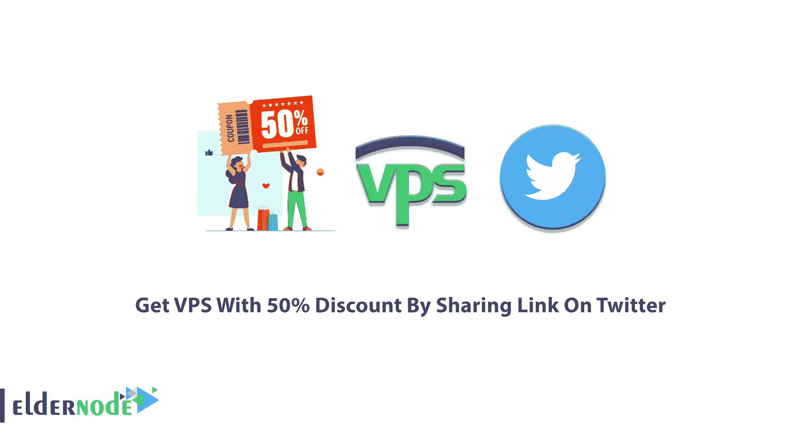
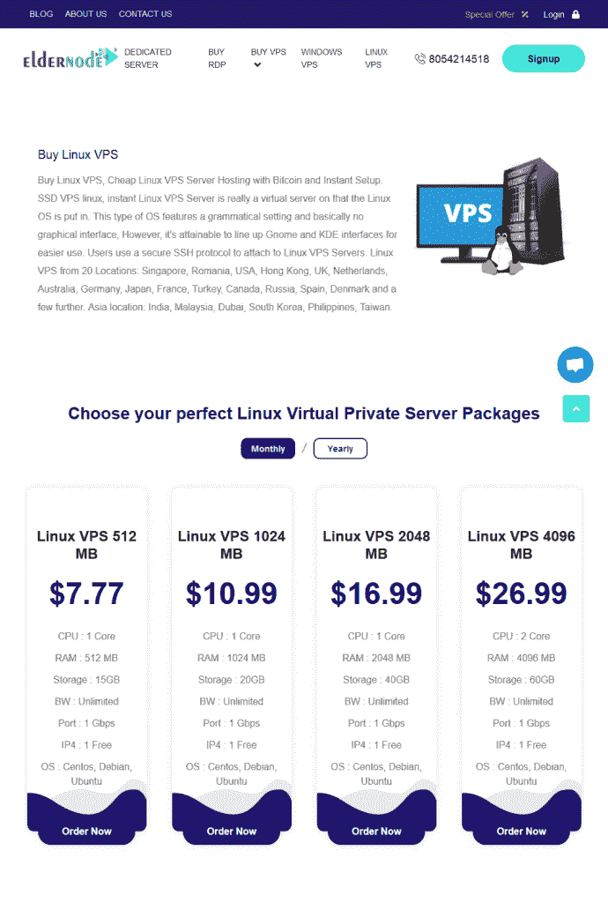
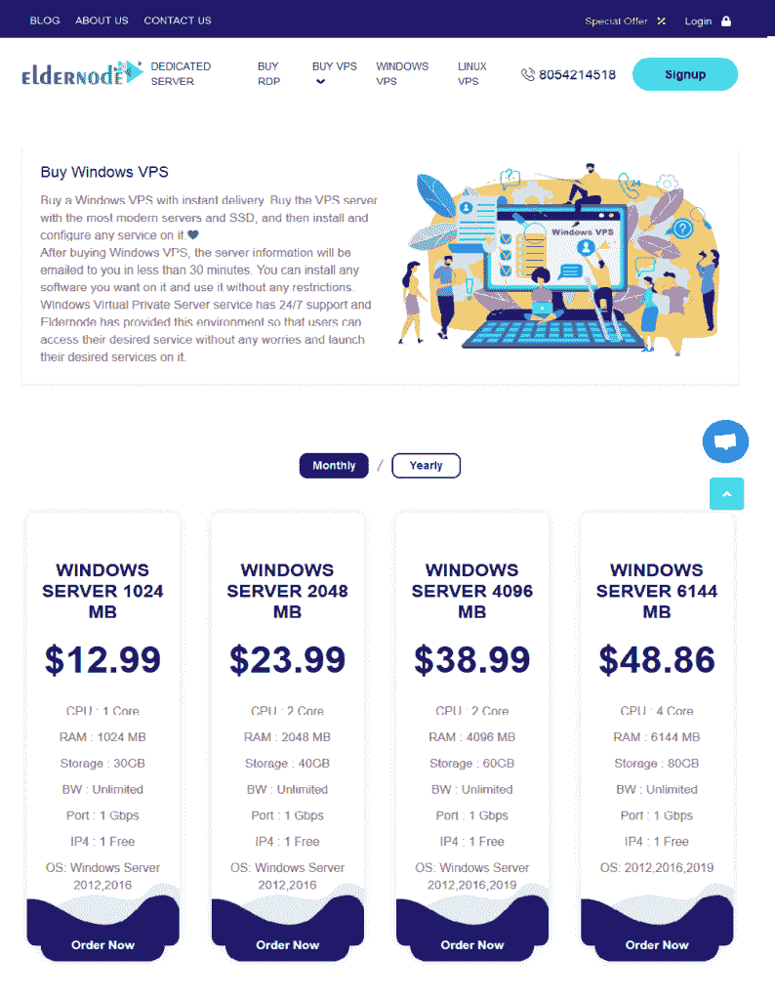
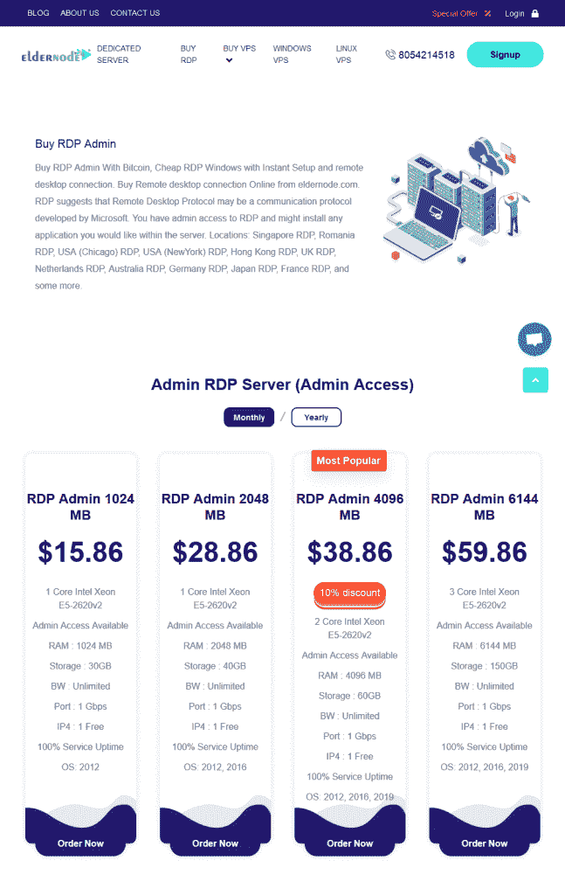
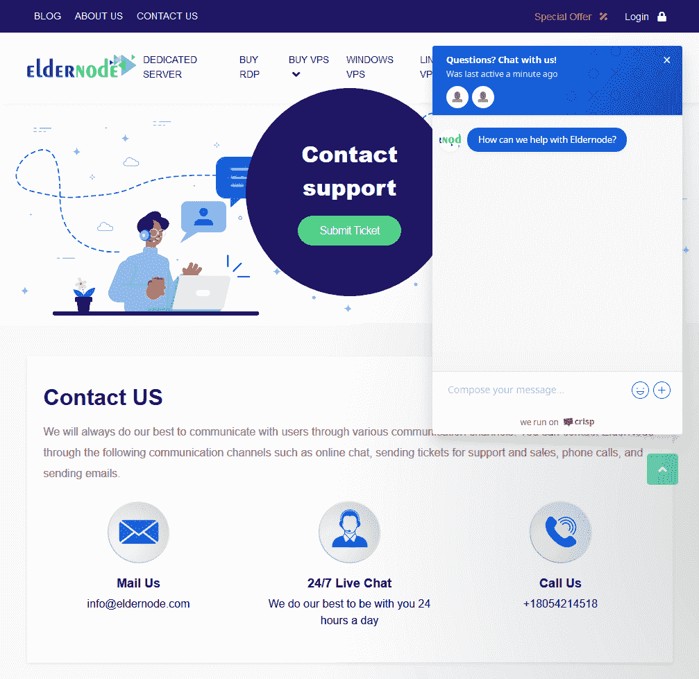

# 通过在 Twitter - Eldernode 博客上分享链接，获得 50%折扣的 VPS

> 原文：<https://blog.eldernode.com/vps-with-50-discount/>

现在是白天还是晚上，是购物时间还是休息时间，这里有一个诱人的建议给你。值得和 [Eldernode](https://eldernode.com/) 一起检验和玩这个双赢的游戏。在 Twitter 上创建“eldernode”帐户并收到客户延长我们的“[特别优惠](https://eldernode.com/coupons/)的请求之际，我们正准备为我们的宝贵用户计划新的折扣。在这篇文章中，你将看到如何通过在 Twitter 上分享链接**以 50%的折扣获得 VPS。**

## **所有关于 elder node**

好朋友的故事总是很吸引人，值得一读。2018 年，IT 专业人士汤姆和亚历山大决定经营一家新企业，庆祝十年的友谊。于是，作为一个虚拟主机服务商，Eldernode 诞生了。Eldernode 开始提供广泛的服务，如 [Windows VPS](https://eldernode.com/windows-vps/) 、 [Linux VPS](https://eldernode.com/linux-vps/) 、[托管 VPS](https://eldernode.com/vps/) 、[专用服务器](https://eldernode.com/dedicated-server/)和 [SSD 服务器](https://eldernode.com/ssd-vps/)。

正如他们所预测的，两年多后，来自世界各地的客户都在使用老年人节点服务。忠诚的客户报告他们的意见、建议和满意度。很快，他们决定建立一个名为 [Eldernode blog](https://blog.eldernode.com/) 的培训部门，以创建一个完美的、记录在案的参考资料。博客为客户提供更好的服务，帮助他们成为不同 IT 主题的专家。分为初级和高级两个部分，用户可以很容易地学习安装他们所考虑的服务、优化工具和操作系统。通过简单的搜索，用户可以解决在安装、配置、运行等过程中出现的问题。，或者进行故障排除，最后发送他们的具体问题，以便在一天中的任何时候都能得到快速回答。

### **elder node Linux VPS**

所有 Linux 发行版和 Linux 服务器的多种配置都可以在 Eldernode 中获得。你可以很容易地选择你认为合适的 [Linux 虚拟私有服务器](https://eldernode.com/linux-vps/)包。软件包是为不同种类的 CPU、Ram、存储和操作系统设计的，以帮助您选择您喜欢的一种。也可以买包月套餐，然后改成包年。

一旦您开始订购，成为 Eldernode 用户的好处将会为您所用。您将享受 24/7 支持、即时激活、在线支付和无限带宽。VIP 但便宜不再仅仅是一种说法，因为你在 Eldernode.com 购物。

### 

### Eldernode Windows VPS

Eldernode 还为 Windows VPS 提供即时交付，让你在上面安装和配置任何服务。比半个足球还快，你会在你的电子邮件上收到服务器信息。然后，您就可以安装您考虑的软件了，Eldernode 团队也准备好了 27/7/365 支持。我们的月度和年度包适用于不同种类的 CPU、Ram、存储和操作系统，如 Windows 2010、2012、2016 和 2019。一旦您购买了自己的 Windows VPS，您将拥有专用资源、完全访问权限和云基础架构。

#### 

### 埃尔德诺德·RDP

您可能希望拥有对 [RDP 管理](https://eldernode.com/buy-rdp/)的管理权限，并安装您想要的应用程序。由于其特性，远程桌面协议非常流行。然而，Eldernode 为您提供了无限的带宽、强大的 CPU 和即时激活。检查 RDP 管理包找到你合适的。

### 

### 如何从 Eldernode 获得折扣

除了 Eldernode.com 上的可用优惠，还有一个针对新老客户的有趣的折扣计划。如果你拥有 3.3 亿 Twitter 账户中的一个，并准备购买自己的 VPS，我们的新服务可能适合你。

### 谁可以使用折扣

要使用我们的新优惠计划，你只需要有一个至少拥有 **1K** (真实)粉丝的 **Twitter 账户**。这似乎不是一个不公平的条件，如果你的追随者较少，这是一个很好的动机，以 50%的折扣购买自己的 VPS。

### 如何发送您的请求

要开始这一合作的快速流程，请向我们发送主题为“ **Twitter 折扣**的[消息](https://eldernode.com/contact-us/)，以获得在您的 Twitter 帐户上分享的链接。更多细节将在我们的回答信息中解释。

就是这样！如果您在 2021 年没有收到任何折扣，让我们成为第一个。你怎么知道的？可能是持续互动的开始。

## 结论

在本文中，您了解了如何使用我们的新折扣计划，并了解了我们在 Eldernode 上的各种服务。如果你在 Twitter 上有账户，并且你有兴趣购买自己的 VPS，现在就试试吧！为什么不呢？