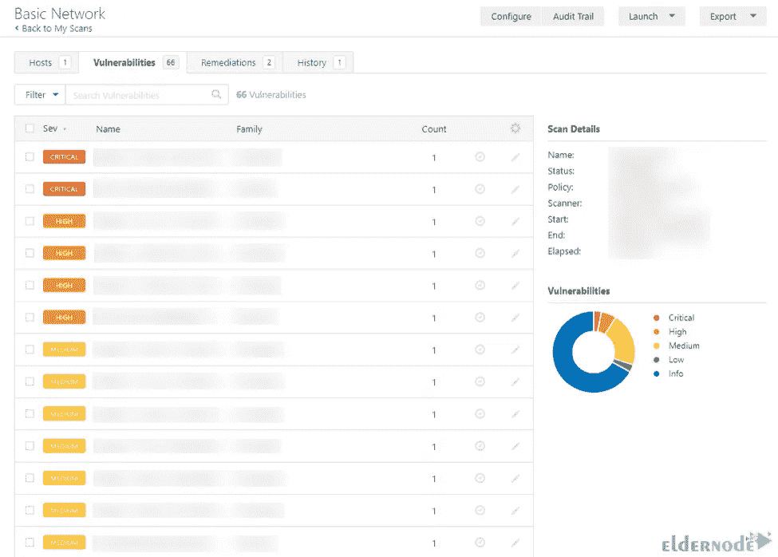

# 使用 Nessus 运行漏洞扫描的 5 个步骤

> 原文：<https://blog.eldernode.com/vulnerability-scan-using-nessus/>


说到网络安全，大多数安全测试工具都非常复杂。Nessus 是一个漏洞扫描器，它简化了这个过程。它非常易于使用，工作速度快，只需点击一个按钮，就可以快速为您提供网络安全报告。本文将向您介绍使用 Nessus 运行漏洞扫描的 5 个步骤。如果你打算购买自己的 [VPS](https://eldernode.com/vps/) 服务器，你可以查看 [Eldernode](https://eldernode.com/) 网站上提供的软件包。

## **如何使用 Nessus** 运行漏洞扫描

Nessus 是一款开源的专有网络漏洞扫描器，由 Tenable 开发，采用 NASL。这种语言描述了单独的威胁和潜在的攻击。它测试计算机上的每个端口，确定它正在运行什么服务，并测试该服务以确保其中没有漏洞。该扫描器使用通用漏洞和暴露体系结构，便于兼容的[安全](https://blog.eldernode.com/tag/security/)工具之间的交叉链接。

### **第一步:安装 Nessus 并创建扫描**

第一步，进入 [Nessus](https://www.tenable.com/downloads/nessus?loginAttempted=true) 官方页面，选择想要的版本和平台。然后点击**下载**:


要在 Windows 操作系统上安装 Nessus，您可以使用如何在 Windows post 上安装和配置 Nessus。

但是如果你想在 [Linux](https://blog.eldernode.com/tag/linux/) 操作系统上安装 Nessus，只需运行下面针对你的操作系统的命令。

**红帽:**

```
rpm -ivh Nessus-<version number>-es6.x86_64.rpm
```

Debian:

```
dpkg -i Nessus-<version number>-debian6_amd64.deb
```

**FreeBSD:**

```
pkg add Nessus-<version number>-fbsd10-amd64.txz
```

现在使用以下命令启动 Nessus 守护进程。

红帽，CentOS，甲骨文 Linux，Fedora，SUSE，FreeBSD:

```
service nessusd start
```

Debian、Kali 和 Ubuntu:

```
systemctl start nessusd
```

现在是创建扫描并开始扫描的时候了。为此，您应该转到**扫描> >我的扫描> >新扫描**路径:


### **第二步:选择扫描模式**

现在选择你想要的扫描模板。扫描模板定义了可配置的设置，并解释了如何设置它们。

扫描策略是一组与执行扫描相关的预定义配置选项。创建策略后，在创建扫描时，可以在用户定义的选项卡中选择扫描策略作为模板。

### **步骤三:配置扫描设置**

首先，您需要为您选择的模板配置可用的设置，从而准备您的扫描。

现在，转到**基本设置**部分并配置设置。基本设置如下:

–>**名称:**将显示在 [Nessus](https://blog.eldernode.com/install-and-configure-nessus-on-debian/) 界面中的扫描或策略的名称。

–>**描述:**描述扫描或策略(可选)。

–>**文件夹:**扫描保存后出现的文件夹。

–>**目标:**指定要扫描的目标。


您可以将其余设置保留为预配置的默认模式，但最好检查发现、评估、报告和高级设置。

“配置凭据”步骤也是可选的，它允许运行验证扫描。该选项可以提供更完整的结果，并对您环境中的漏洞进行更准确的评估。

最后，您可以通过点击**保存**按钮启动扫描。要立即运行扫描，点击保存旁边的**向下**按钮，并选择**启动**。扫描可能需要一些时间来运行，请等待完成。

### **第四步:检查您的扫描结果**

要了解组织的安全状态和漏洞，请检查扫描结果。借助颜色编码指示器和可定制的查看选项，您可以定制查看扫描数据的方式。

检查扫描结果的视图选项如下:

–>**主机:**显示所有扫描的目标

–>**历史:**显示扫描列表，包括开始时间、结束时间和扫描状态

–>**漏洞:**已识别的漏洞列表

–>**注意:**显示有关扫描和扫描结果的附加信息

–>**修正:**显示所有修正的详细信息，按漏洞数量排序

基于漏洞的扫描结果示例:



此外，您可以通过转到顶部导航栏中的**扫描**部分并选择想要查看结果的扫描来检查漏洞。

此外，要查看所有漏洞，请单击**漏洞**选项卡，要查看在该主机上发现的漏洞，请单击特定主机。

一般来说，要打开漏洞详情页面，只需点击**漏洞**行即可。打开后，将显示主机上每个实例的插件信息和输出。


### **步骤五:上报扫描结果**

您可以以多种文件格式导出扫描结果。有些报告格式是为导入 Tenable 等程序或产品而设计的，而有些报告格式是可定制的。最后，您应该导出扫描报告。为此，请转到扫描结果页面，点击**导出**。然后选择想要导出扫描结果的格式，再次点击**导出**下载报告:


## 结论

Nessus 用于漏洞评估和渗透测试。在本文中，我们解释了使用 Nessus 运行漏洞扫描的 5 个步骤。我希望这篇教程能帮助你用 Nessus 运行漏洞扫描。如果你有任何问题或建议，可以在评论区联系我们。