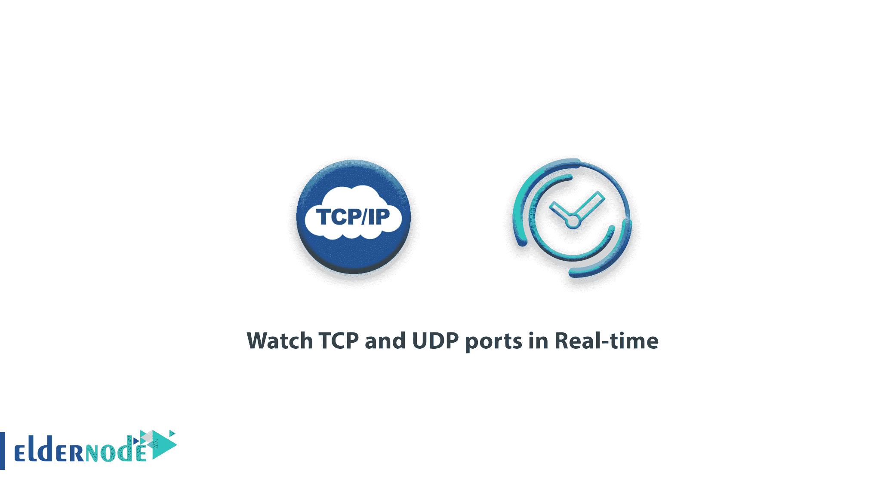
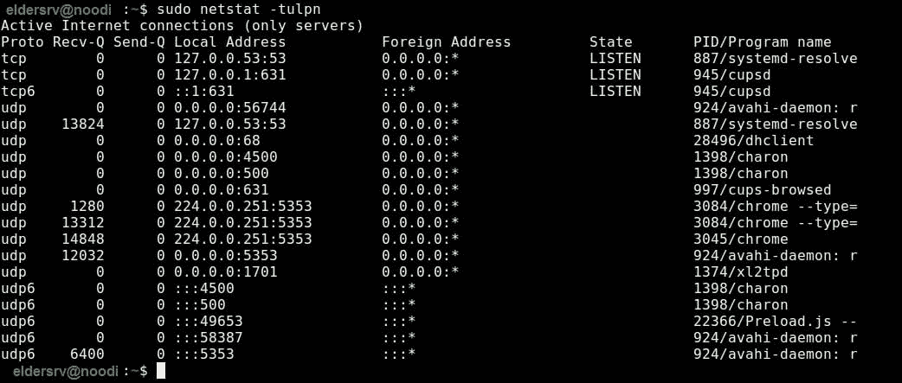
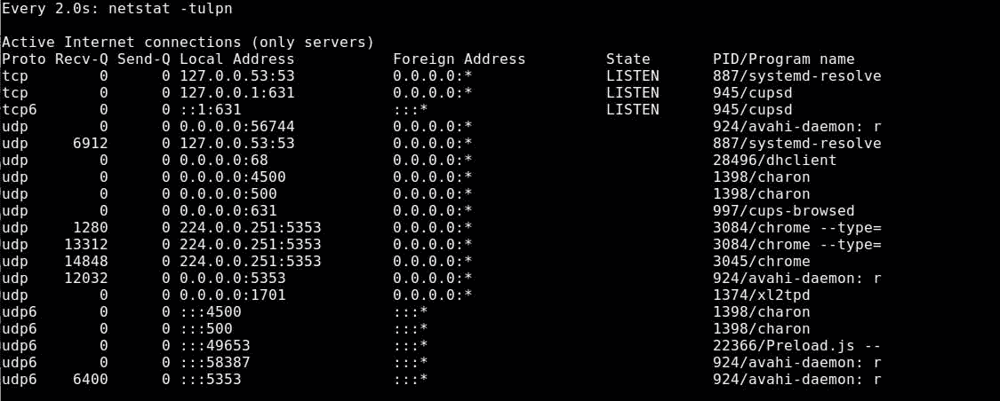

# 教程观察实时 Linux 中的 TCP 和 UDP 端口

> 原文：<https://blog.eldernode.com/watch-tcp-udp-ports/>



一个 Linux 系统管理员需要知道一些 Linux 技巧。在本文中，我们将介绍**教程实时观察 TCP 和 UDP 端口**。端口是一种逻辑结构，用于标识特定的进程/应用程序或网络服务类型，Linux 系统上运行的每个网络服务都使用特定的协议。 **TCP** ( **传输控制协议**)和 **UDP** ( **用户数据报协议**)。

## 教程实时观察 TCP 和 UDP 端口

加入我们，看看如何在 Linux 系统上通过套接字摘要实时列出、监控或观察正在运行的 **TCP** 和 **UDP** 端口。

### 列出 Linux 中所有开放的端口

您可以使用 [**netstat 命令**](https://en.wikipedia.org/wiki/Netstat) 或 **ss 实用程序**，列出 Linux 系统上所有开放的端口。此外，netstat 命令已被弃用，取而代之的是 ss 命令，它可以显示更详细的网络统计信息。

```
sudo netstat -tulpn  sudo ss -tulpn
```



输出将通过**状态**栏显示端口是否处于监听状态(**监听**)。

而在上面的**命令**中，flag:

-t–启用 TCP 端口列表。

-u–启用 UDP 端口列表。

-l–仅打印监听插座。

-n–显示端口号。

-p–显示工艺/程序名称。

[购买 Linux 虚拟主机](https://eldernode.com/linux-hosting/)

### 实时观察 TCP 和 UDP 开放端口

你可以用 watch 实用程序运行 **netstat** 或 **ss 工具**来实时观察 **TCP** 和 **UDP** 端口。

```
sudo watch netstat -tulpn  sudo watch ss -tulpn
```



都搞定了。可以按 CTLR+C 退出。

亲爱的用户，我们希望你能喜欢本教程实时观看 TCP 和 UDP 端口，你可以在评论区提出关于本次培训的问题，或者解决 [Eldernode 培训](https://eldernode.com/blog/)领域的其他问题，请参考[提问页面](https://eldernode.com/ask)部分并在其中提出你的问题。

**同样，参见**

[Linux 服务器监控命令](https://eldernode.com/linux-server-monitoring-commands/)

[Linux 安全提示和窍门](https://eldernode.com/linux-security-tips-and-tricks/)

[Linux Server Monitoring Commands](https://eldernode.com/linux-server-monitoring-commands/)

[Linux security tips and tricks](https://eldernode.com/linux-security-tips-and-tricks/)