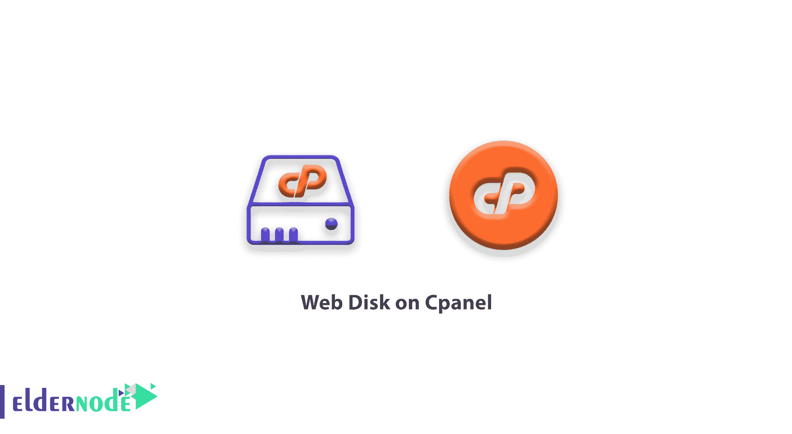
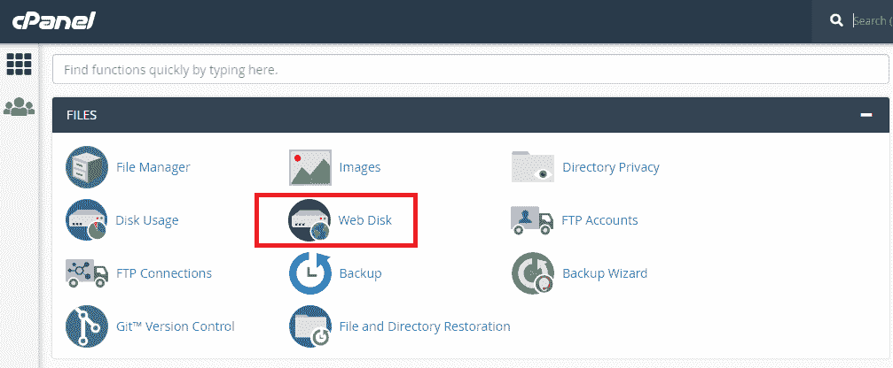
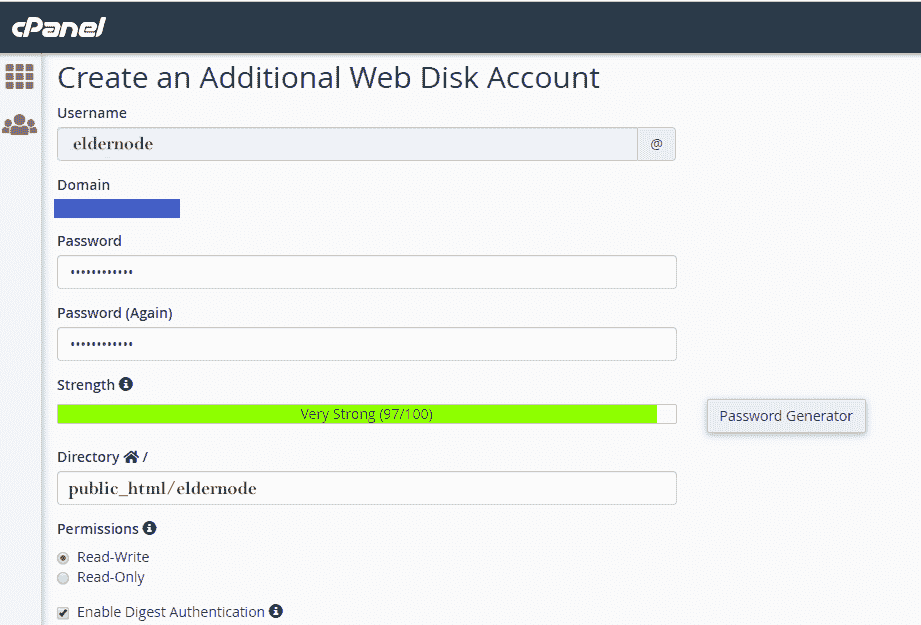
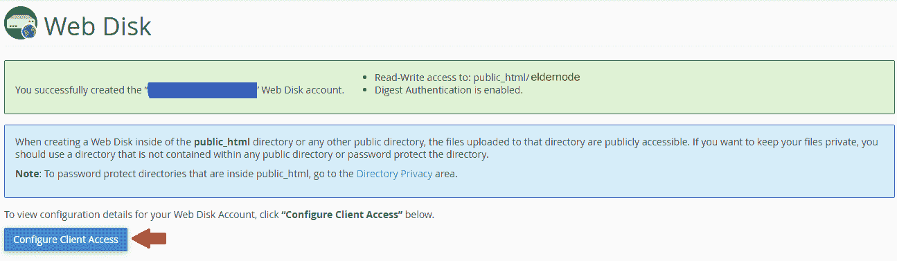
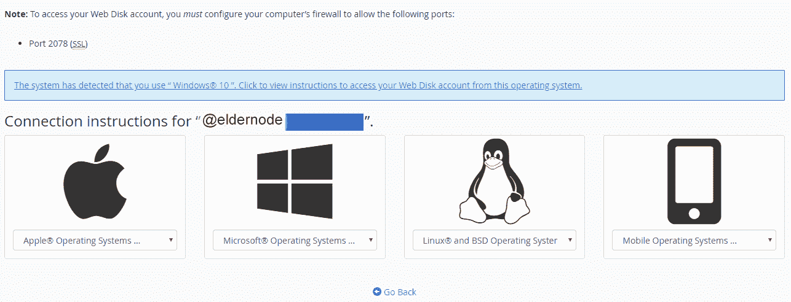
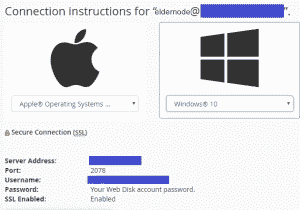

# Cpanel 上的 Web 磁盘- cpanel 服务器| cpanel vps 许可证

> 原文：<https://blog.eldernode.com/web-disk-on-cpanel/>

[Cpanel 上的网盘](http://eldernode.com/category/tutorial/)；网盘是在 [Cpanel](https://www.cpanel.net/) 的控制面板中可以看到的好功能之一。Cpanel 的控制面板非常受欢迎，提供了良好的用户界面。

使用 Web Disk，您可以轻松地在本地和主机环境之间传输信息，而不必登录到控制面板环境。通过 Web Disk，您可以添加、删除或编辑新文件，而不必登录到控制面板并保存更改。

请继续关注我们，教你如何使用网络磁盘。

首先，进入控制面板主机，点击网络磁盘选项。

然后创建一个可以用于登录的用户名和密码。接下来，您可以指定用户的权限或访问级别，这允许用户通过点击**读写**来编辑和查看文件。即使您使用**只读**选项，您也不会给用户访问变更信息的权限。

然后点击**启用摘要式认证**。但是，如果在您的服务器上启用了 **SSL** ，则不需要启用该选项。

最后，点击**创建**。

创建后，在出现的屏幕上，点击“**访问 web 磁盘**选项。

在下一页，您应该指定操作系统的**类型**和**版本**。

然后点击“**下载快速入门脚本**”选项。下载脚本后，您将收到以下消息:“**正在连接您的网络磁盘，这可能需要一分钟**”。您将收到一个页面，要求您输入与您创建的用户名和密码相同的用户名和密码。

导入信息后，您可以登录并上传、删除和编辑新文件。

祝您好运