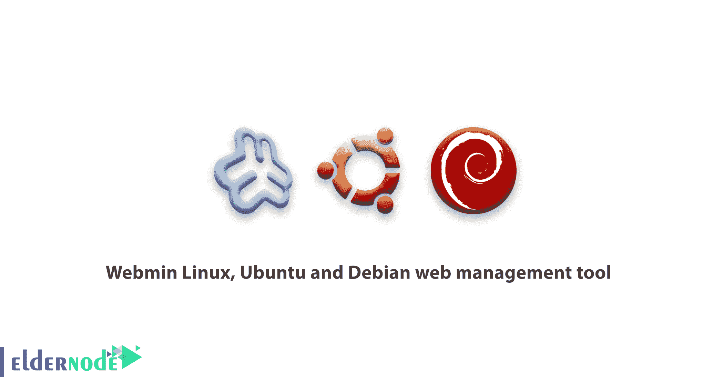

# Webmin Linux、Ubuntu 和 Debian web 管理工具| Eldernode

> 原文：<https://blog.eldernode.com/webmin-linux-ubuntu-and-debian/>



webmin 是一个用于管理 Linux 操作系统的 web 界面。使用远程网络浏览器，你可以管理像 CentOS 及其服务这样的 Linux 发行版。

当 [Linux 发行版](https://eldernode.com/tag/linux-distribution/)被安装在一个没有图形并且只能以文本形式访问的系统上时，管理它的一种方法是通过 [SSH](https://eldernode.com/tag/connect-to-ssh-with-putty/) 连接到它，另一种方法是使用像 webmin 这样的程序。

该程序包括用户、组的创建，系统配置文件的更改，以及 dhcp、dns 等服务的配置。

鉴于 CentOS Linux 是 RHEL 和 rpm 支持发行版之一，在 CentOS 上安装 Webmin 的最佳方式是使用 RPM WebMin 安装包。

### 教程 Webmin Linux，Ubuntu 和 Debian web 管理工具

**CentOS 上的 Webmin 安装教程:**

1)第一步是安装 rm 包下载:

```
wget http://prdownloads.sourceforge.net/webadmin/webmin-1.670-1.noarch.rpm    rpm -U webmin-1.670-1.noarch.rpm 
```

2)在 CentOS 上完成 web 安装步骤后，首先禁用 Iptables 防火墙或打开服务器上的 10000 端口(下面的命令):

```
service iptables stop 
```

3)现在使用此地址输入您的用户控制面板(输入您的 Ip 地址，然后输入端口，而不是下面的地址):

```
https://server-ip:10000 
```

**Ubuntu 和 Debian 上的 Webmin 安装教程:**

如果你使用的是 Debian 衍生的 Linux 服务器发行版，比如 Debian [Linux vps](https://eldernode.com/linux-vps/) 本身或者 Ubuntu 发行版 Linux，那么在服务器上安装 webmin 最好也是最简单的方法。使用 **deb** 安装包。

1)在支持的服务器上安装 webmin。黛比，请遵循以下说明:

```
wget http://prdownloads.sourceforge.net/webadmin/webmin_1.670_all.deb dpkg –install webmin_1.670_all.deb 
```

Webmin 没有重要的主机功能，为了方便使用虚拟主机功能，您必须首先在 Webmin 上安装 Virtualmin 主机控制面板。实际上，Virtualmin 是一个 web 挖掘模块，为 webmin 增加了托管功能。

不带 Virtualmin 托管模块的 Webmin 适合精通 Linux 的专业人士。在这种情况下，您将能够以 web 库的形式完整地管理和配置您的 Linux 服务器。

我希望你喜欢关于 [Linux](https://eldernode.com/linux-vps/) 、 [Ubuntu](https://eldernode.com/ubuntu-vps/) 和 [CentOS](https://eldernode.com/centos-vps/) 的 Webmin 教程。