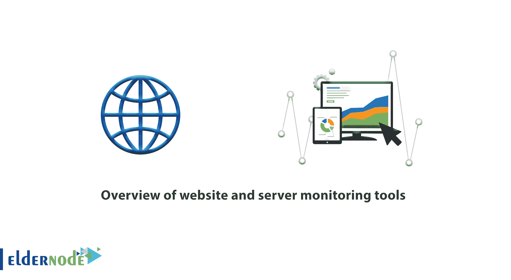
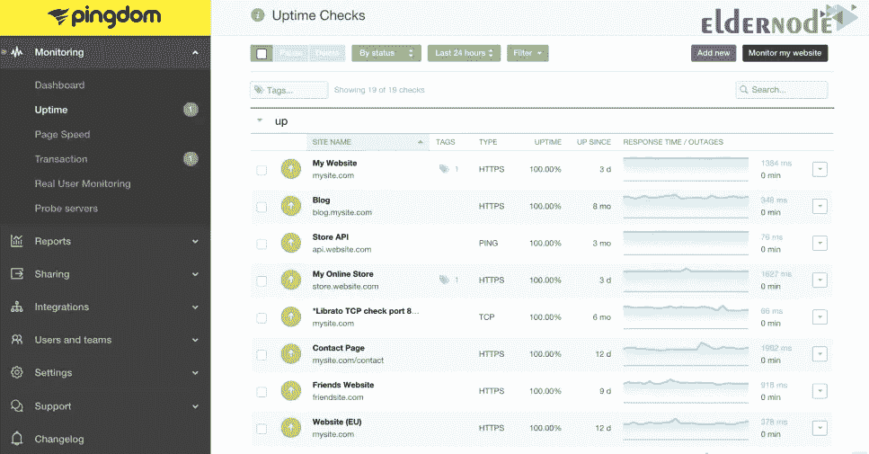
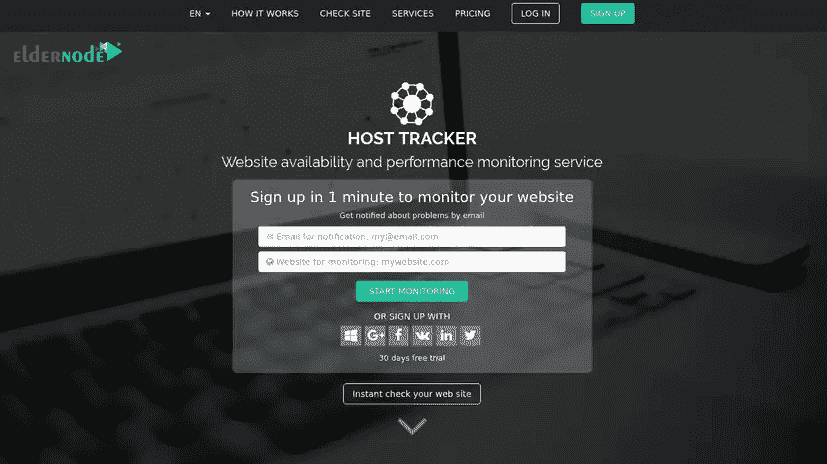
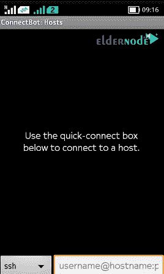
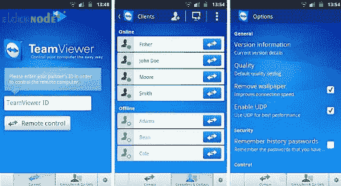
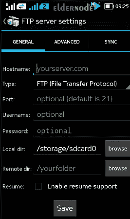
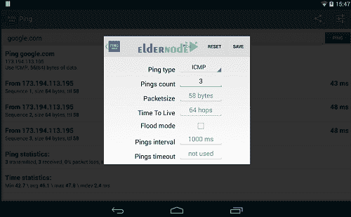

# 网站和服务器监控工具概述- ElderNode 博客

> 原文：<https://blog.eldernode.com/website-and-server-monitoring-tools/>

网站和**服务器监控工具**概述。网站和服务器的一致性和持续可用性一直是服务器管理员关心的主要问题。一个解决方案是网站和服务器监控工具。

一个好主机最主要也是最敏感的优势之一，无论是在共享主机服务还是服务器方面，是服务器的稳定性或高 T2 运行时间。这是一些著名的主持人总是感到自豪，这是他们的主要广告因素之一。

最没有根据的后端服务器广告之一可以是 100%的稳定性！ 100%的正常运行时间基本上与**共享**和**专用托管**服务的逻辑不一致，如果一台服务器声称 100%的正常运行时间，那么它的服务质量和服务器的完整性就会成为一个大问号。与此同时，提供托管服务的最大和最有信誉的组织总是坚持接近 100%的正常运行时间。

在本文中，我们将看看服务器和网站监控工具。和我们在一起。

[***在 Eldernode***](https://eldernode.com/windows-vps/) 选择您的完美 Windows 虚拟专用服务器包

### 为什么稳定性和正常运行时间很重要？

为了解释正常运行时间的重要性，我们举几个例子就够了:

**1—**想象你的网站是一个网店。一家 24 小时为你赚钱的商店。现在想象一下，你的网站因为任何原因一天有几分钟是不可用的。事实上，在此期间，你的收益已经被打乱，而这种打乱，除了物质损失，还会引起你的网站用户的不满，并导致他们迁移到类似的网站。

**2—**想象你的网站是一个在线服务网站，在搜索引擎、资源、成本、人员 / **花费**小时，你的网站不断显示在谷歌搜索引擎 Be 的第一页。然而，由于硬件故障，你的网站总有一天会关闭。鉴于谷歌索引 引擎最重要的要求之一是网站的可用性，因为有一天你的网站会显示在谷歌的第二页，这将减少你的流量。

**3—**想象你的公司总是与其他公司对应并且通过一个邮件服务器发送和接收这些公司的 **付款信息**。但是，由于任何原因，您的邮件服务器将在几个小时内无法访问，发送到该邮件服务器的所有**电子邮件**将被退回，与这些电子邮件相关的金融交易将不会执行。

上面的例子只是托管服务的正常运行时间和可持续性重要性的几个例子。

### 选择一个监控服务

在选择站点监控服务之前，请记住最可靠的服务器监控和网站监控工具是您的托管公司为您的站点和服务器提供的工具。因为在监控一个网站或服务器的过程中，托管服务器和监控服务器、路由和互联网路由等几个因素都是有影响的。

**注意:** 一个好的监控工具应该在离服务器最近的地方，但是要在不同的子网和不同的服务器上。

显然，通过与你的网站相同的[网络服务器](https://eldernode.com/category/web-server/)在你的网站上安装一个传感器是完全无用和不合理的。

### 领先的监控工具

#### 1-【Pingdom.com】

[Pingdom.com](https://www.pingdom.com/)服务器监控软件可以被认为是目前最强大、最专业的监控服务。

监控服务除了这项服务，网站一般还提供其他业务，比如托管销售。但是 pingdom 服务是为数不多的专门监控服务之一，它没有提到这项服务中的任何其他活动，也没有以任何方式鼓励用户使用辅助服务。

知名组织如微软、戴尔、苹果在其部分服务器上使用这项服务。在免费使用该服务时，可以添加一个**服务器** / **站点**，您可以为其定义 **Http** 和 **HTTPS** 网络传感器以及所需的端口。该工具通过发送电子邮件、发送短信和在用户中创建提醒来通知您服务状态的变化。该工具的另一个应用服务是提供真实用户监控插件( *真实用户监控* )！

Pingdom 声称最精确的监控工具也有它们的**bug**和**弱点**。这项服务通过指定一个真正的用户来检查你的网站，掩盖了它可能存在的弱点！

**注:** 目前， pingdom 服务专注于欧洲和北美的服务器和站点。如果你的网站或服务器在这些国家之一，pingdom 可能是一个不错的选择。

#### 2-【UptimeRobot.com】

免费的upime robot工具对服务器更有用。

在这个完全免费的工具中，可以添加 **50 个传感器**用于回应请求或 ping ，检查端口开放度以及检查网站的可用性。

使 uptime robot 区别于其他工具的一个工具是能够为页面上的特定关键字创建搜索传感器。通过创建这种传感器，您可以在不同的时间间隔内意识到特定页面上某个关键字的存在或不存在，这除了在 [SEO](https://en.wikipedia.org/wiki/Search_engine_optimization) 讨论中广泛使用之外，还可以防止用户在内容可变的网站上滥用。

**注:** 该工具使用电子邮件通知传感器的变化。

#### 3-【Host-tracker.com】

如果你想专业地监控你的网站或数据库， host-tracker 是你的正确选择。

除了通常的监控服务工具之外，该服务还允许您为数据库创建一个查询传感器。通过输入您的数据库信息和一个查询，该查询将在您的数据库上以指定的时间间隔执行，并通过电子邮件将结果发送给您。

举个例子；如果你想知道你的网站上每天的确切帖子数量，这项服务会做到这一点。然后它会把结果发送给你。

#### 4- ConnectBot 软件

基于 Unix 的站点和服务器通常通过 SSH 连接进行管理。

此外，大多数 web 服务的运行依赖于特定端口的开放，这通常由 Telnet 服务来检查。

在 [ConnectBot](https://connectbot.org/) 软件中，你将同时拥有上述两种功能。这个软件允许你在一个基于 SSH 协议的安全平台上进行通信。

类似于 **iOS** 中 ConnectBot 的软件是 [iSSH 软件](https://apps.apple.com/us/app/issh-2/id1254742822)，它将为你提供几乎所有的上述功能。

#### 5- TeamViewer 软件

在小屏幕的手机上通过[远程桌面](http://eldernode.com/tag/remote-desktop)协议远程访问服务器的可能性似乎有点不合逻辑。如果您使用的是平板电脑，通过该设备远程连接到服务器的能力会很有用。

TeamViewer 的开发者在他们的免费软件版本中实现了这一点。在这个软件中，你将能够远程连接到基于 Windows 和 Mac 的服务器。该软件通过放置组合键的快捷方式，解决了遥控器中 [UI](https://en.wikipedia.org/wiki/User_interface) 通过触摸设备的问题。有时会感觉到键盘和鼠标的**空虚。该软件的**手机版**并不能完全取代桌面。**

#### 6- AndFTP 软件

将文件上传到互联网空间的能力是许多移动应用程序提供的功能。有时候服务器管理员需要通过 **FTP** 与服务器通信，恰好很多软件都是做这个的。在这些软件中，从 ***Google Play*** 用户的角度来看最完整的软件是和软件。并且 FTP 软件包含了一个 FTP 桌面软件的所有预期功能。

**注:****iOS**中没有比 Go 软件上的 [FTP 更完整的选择。](https://apps.apple.com/us/app/ftp-on-the-go-pro/id704834976)

#### 7- Ping 工具软件

Ping 、 Traceroute 、端口扫描器等工具对服务器管理员的重要性和效率是相当清楚的。 Ping Tools 软件以简单而**的用户友好界面**的形式提供这些工具。

**尊敬的用户**，我们希望您能喜欢这个[教程](https://eldernode.com/category/tutorial/)，您可以在评论区提出关于本次培训的问题，或者解决[老年人节点培训](https://eldernode.com/blog/)领域的其他问题，请参考[提问页面](https://eldernode.com/ask)部分，并尽快提出您的问题。腾出时间给其他用户和专家来回答你的问题。

好运。