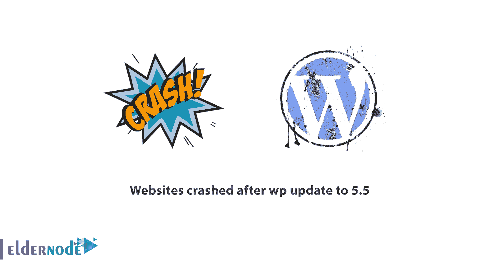

# wp 更新到 5.5 后网站崩溃 wordpress 5.5 网站崩溃

> 原文：<https://blog.eldernode.com/websites-crashed-after-wp-5/>

wp 升级到 5.5 后网站崩溃是大多数 WordPress 用户这些天面临的事实。在这篇文章中，我们将首先检查 WordPress 版本网站崩溃的原因。然后我们教你如何解决 **jQuery 迁移**和**分页 Bug 错误**。VPS 主机帮助你快速利用所有令人惊奇的 WordPress 功能，并避免 WordPress 网站频繁受到攻击。 ***留在我们身边。***

## WP 更新到 5.5 后网站崩溃

数以千计的 WordPress 网站在将他们的 WordPress 升级到 **WordPress 5.5** 后遇到了问题。WordPress 5.5 出现问题的原因之一是该版本的 jQuery Migrate 缺乏**支持**，导致数万多个网站中断。

这个版本的 WordPress 与一些 WordPress 主题的**分页**的设置方式不兼容，导致网站表现不如以前。在这篇“wp 更新到 5.5 后网站崩溃”的文章中，我们尝试考察 WP 5.5 中的这两个问题。然后，我们将向您介绍 WordPress 5.5 **故障排除**解决方案。

### 由于 jQuery 迁移错误，wp 升级到 5.5 后网站崩溃

WordPress 5.5 不使用 jQuery Migrate JavaScript 库。 **jQuery Migrate** 是一个像桥梁一样在 WordPress 上运行旧代码的库。如果你在你的网站上使用旧插件和皮肤(尤其是那些不再更新的)，你很可能会遇到 WordPress 5.5 的问题。

当然，请记住这并不是新版 WordPress 的错，而是旧插件和皮肤的使用导致了网站的 T2 中断。

#### 如何修复 jQuery 迁移错误？

检查你的 WordPress 插件的**最新更新**日期。如果最后一次更新是在一年多以前，你可能想寻找一个替代插件。

**注:** 别忘了用老插件增加安全风险，所以就算你没有 WordPress 5.5 的问题，还是考虑用新插件比较好。

如果由于任何原因你不能使用新的主题和插件或者你在 Chrome 控制台上遇到 JavaScript 错误，那么“启用 jQuery 迁移助手”**插件**可以帮助你解决这个问题。这个插件的活跃安装数都在数万以上，说明这个问题在发行商中普遍存在。您可以借助下面的链接下载这个插件:

**[启用 jQuery 迁移助手](https://wordpress.org/plugins/enable-jquery-migrate-helper)**

### wp 升级到 5.5 后网站崩溃，因为分页错误

WordPress 分页是网站导航结构的一部分。将 WordPress 升级到**版本 5.5** 导致了糟糕的网站分页性能。据一些网站发布者称，在更新 WordPress 后，页面参数被从网站 URL 中删除，重定向链接变成 301 。这个问题的原因是 WordPress 在其分页中使用了" **page** "变量，但是大多数 WordPress 主题在其他应用中使用" page "变量。

在 **WordPress 5.5** 中，页面变量只能接收数值，而在查询和外壳代码中，该变量还可以接收非数值字符串和字符。

#### 如何修复 WordPress 上的分页错误？

在 WordPress 中，“ **page** 变量只被定义为接收数值。例如，在查询中使用这个词作为“ page=offers & id=xxx？”遇到一个错误。

**为了解决这个问题** ，你可以在你的查询中使用另一个词，比如“ mypage ，而不是使用单词“ page ”。

**另一种解决方法** 是禁用该查询样式的“ redirect_canonical() ”函数。

**注意:** 在这样做之前，一定要咨询你的站点 SEO 专家，考虑这样做对你的站点 SEO 的后果。

## 结论

总的来说， WordPress 5.5 有着良好的效益，被认为是一次成功的更新。与此同时，有一些问题给许多网络出版商带来了麻烦。诸如分页或大部分 JavaScript 代码执行不力等问题影响了许多 WordPress 网站的性能。这些问题看似复杂，但一旦你找到了每个问题的根源，你就能轻松解决。

**尊敬的用户**，我们希望您喜欢“**网站在 wp 更新到 5.5** 后崩溃”，您可以在评论区询问关于本次培训的问题，或者解决 [Eldernode 培训](https://eldernode.com/blog/)领域的其他问题，请参考提问页面，并尽快提出您的问题。腾出时间给其他用户和专家来回答你的问题。

好运。