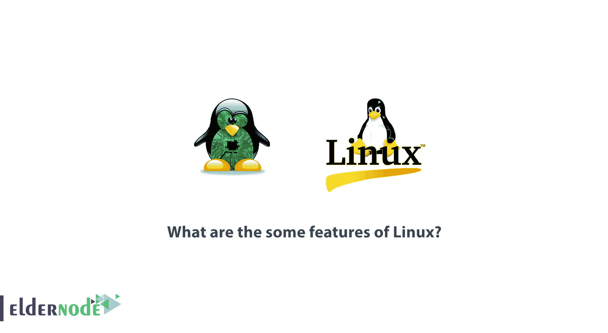

# Linux 的一些特性是什么？-埃尔德诺德

> 原文：<https://blog.eldernode.com/what-are-the-some-features-of-linux/>

你对 Linux 操作系统了解多少？你知道操作系统内核是操作系统最重要的部分。内核实际上是一套软件，有任务管理和硬件管理任务。当操作系统启动时，内核位于缓存中。在本文中，我们将研究 Linux 操作系统的一些特性。你可以在 [Eldernode](https://eldernode.com/) 中选择你最完美的 [Linux VPS](https://eldernode.com/linux-vps/) 服务器包。

## Linux 有哪些特性？

根据最近的研究，我们发现 Linux 有大约 3000 万行代码，其中大约 10%专用于内核。Linux 最初非常有限，但随着时间的推移，它的所有硬件现在都在市场上得到支持。

Linux 操作系统于 1991 年 9 月首次发布。几个月后，这种语言的另一个版本出现在互联网上。成千上万的程序员在 Linux 上工作，并做了一系列的修复。Linux 的传播使得黑客们对这个操作系统特别感兴趣。

任何到达用户手中的软件都必须在特定的许可下发布。有几种权限。GPL 是软件领域中使用最广泛的许可证之一。

### Linux 操作系统上的安全性

与 Windows 和其他操作系统不同，Linux 操作系统有一套非常严格的规则，使得访问文件非常困难。Linux 操作系统在内部是安全的。这个操作系统最初是为多用户系统设计的。很明显，这样的情况表明了 Linux 操作系统的最优性。多个访问级别，以及 Linux 操作系统中的定制，可以防止恶意程序访问它们，并且只攻击系统的一部分。

Linux 操作系统中的安全问题很容易被检测到并快速修复。如果您定期更新您的 Linux 操作系统，您肯定不会遇到任何特殊的问题。Linux 操作系统上的访问分为三个级别:

**1。**阅读权限

**2。**写权限

**3。**执行权限

如果一个站点位于 Linux 服务器上，并且您看到了它，那么您实际上拥有读取权限，如果您被拒绝读取权限，那么您将无法再查看该站点。

### Linux 操作系统权限

Linux 操作系统中的读取权限用于读取和列出目录的内容。

写权限也称为更改授权，允许对文件内容进行必要的更改。此外，在适当的时候删除所需的文件或删除特定的文件。该权限也用于创建新文件。

执行权限使文件运行更加准确。比如一个人在一个目录下只有运行权限，没有读取权限，只能运行目录下的程序，不能查看。

如果用户创建了一个文件，他可以拒绝访问该文件，并将权限分配给另一个人。

Linux 中有一个重要的部分叫做 ROOT，它提供了所有的访问权限，在这个部分中，您可以轻松地更改权限、查看文件或删除不必要的部分。

### Linux 操作系统与其他设备的兼容性

Linux 操作系统无处不在。这种操作系统用于手表、手机、路由器板、游戏控制台、保护和导航系统，以及摄像机等。如果你关注厨房电器的智能化，你会看到 Linux 在其中有非常大的作用。

Linux 操作系统中有一个高可伸缩性的特性，这使得这个操作系统越来越受欢迎。

Linux 操作系统发行版另一个需要考虑的重要问题是 Linux 是开源的和可扩展的。您可以将 Linux 用作个人设备，或者将 Linux 视为 web 服务器。Linux 发行版对公众开放，有些发行版只面向特定的群体。

### Linux 操作系统服务器

Linux 服务器非常强大。这些服务器支持大量的语言。Linux 操作系统对于强大的数据库有非常高的效率。这些服务器比 Windows 服务器便宜得多。这种便宜在硬件行也能看出来。事实上，你不需要为操作系统本身付费。

Linux 系统不需要一般的更换，也可以假设操作系统不需要关机重装就可以使用。

## 【Linux 优于 Windows 的 10 大理由

在这一节中，我们将探讨 Linux 优于 Windows 的十个原因:

### 1-开源 Linux

假设你打算买一辆你看不到引擎盖下是什么的车作为汽车发动机？你能相信它吗？Windows 就像那辆车，你不知道里面发生了什么。相比之下，Linux 是一个完全开源的项目。你可以看看你的 Linux 操作系统的源代码。当然，大多数人并不关心 Linux 的开放性，但这是 GNU / Linux 最重要的特点。

### 2-Linux 的高安全性

Windows 操作系统容易受到各种类型的攻击(或黑客攻击)。但是 Linux 更安全。
在 Windows 中，你需要安装或购买杀毒软件来保护你的电脑免受黑客和恶意软件的攻击。但是在 Linux 中没有必要使用这样的反病毒程序。

### 3-Linux 不需要强大的硬件

如果想在电脑上安装 Windows 10 操作系统，需要有一台硬件相对较好的电脑。如果 Linux 可以在旧得多的计算机上运行，那么运行 Linux 需要的内存和 CPU 就更少。这就是为什么大多数网站都是用开源编程语言设计的，比如托管在 Linux 服务器上的 PHP。

### 4- Linux 服务器，程序员的理想选择

Linux 几乎支持所有主流编程语言，如 Python、C / C ++、Java、Perl、Ruby 和 PHP。

对于开发人员来说，Linux 终端比使用窗口命令行更好。bash 脚本特性也是许多程序员更喜欢使用 Linux 操作系统的重要原因之一。

同样，在使用 SSH 的 Linux 中，服务器可以很容易、很快地被管理。例如，使用 apt-get 这样的命令，您可以轻松地管理服务器包，如果这在 Windows 中非常耗时的话。

### 5-定制 Linux 桌面的能力

使用 Linux 而不是 Windows 的主要好处之一是定制。如果你想访问更多可定制的设置，比如安装主题，漂亮的图标主题，定制你的操作系统环境，Linux 有这些特性。

### 6-分布的多样性

针对不同的需求有不同类型的 Linux。例如，有针对黑客的 Linux 发行版，有针对程序员的 Linux 发行版，有针对非常旧的计算机的 Linux 发行版。Linux 适合所有人。

### 7-免费使用

Linux 对公众是免费的。

### 8-Linux 的高稳定性

我们都经历过，Windows 在你的电脑上安装的时间越长，你重新安装 Windows 的速度就越慢。但是 Linux 帮助你经历一个更长的时期。

Linux 可靠的另一个重要证据是 web 服务器。你可以看到许多互联网巨头如谷歌和脸书都运行在 Linux 上。甚至几乎所有的超级计算机都运行在 Linux 上。这是因为从长远来看，Linux 比 Windows 操作系统稳定得多。

### 9-需要在 Windows 中大量重启

**–**有时候你只需要重启就可以安装软件了！

**–**如果您最近安装了该软件，您将需要重新启动！

**–**如果刚刚安装了 Windows 更新，需要重启！

**–**如果您发现系统速度变慢，您需要重启！

但是在 Linux 的情况下，你不需要重新启动，你可以很容易地继续工作，Linux 不会打扰你。

### 10-隐私

微软收集数据的方式，应该收集什么和不应该收集什么受到了很多批评。如果你曾经使用过 Windows 10，你只需进入隐私设置，就可以知道默认情况下一切都是启用的。即使您不决定向 Microsoft 发送有关您的数据的信息，也不能确定是否会发送？！！
相比之下，Linux 是一个完整的隐私解决方案。首先，Linux 发行版不收集太多(或者根本不收集)信息。此外，您不需要额外的工具来保护您的隐私。

## 结论

操作系统在 Linux 内核中并不普及，特别是对于普通用户。大部分都是想学习编程/管理或者有足够的计算机管理知识，通过方便的终端工作，服务器操作等等的人选择的。然而，在本教程中，我们试图向您解释 Linux 操作系统的一些特性。还提到了 Linux 相对于 Windows 的优势。