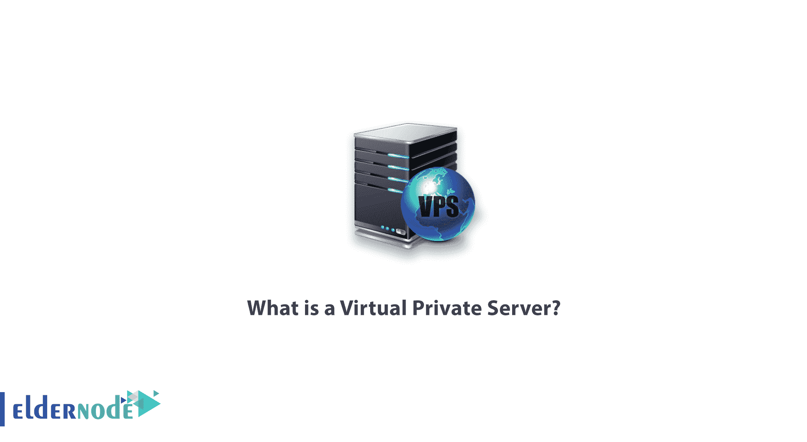
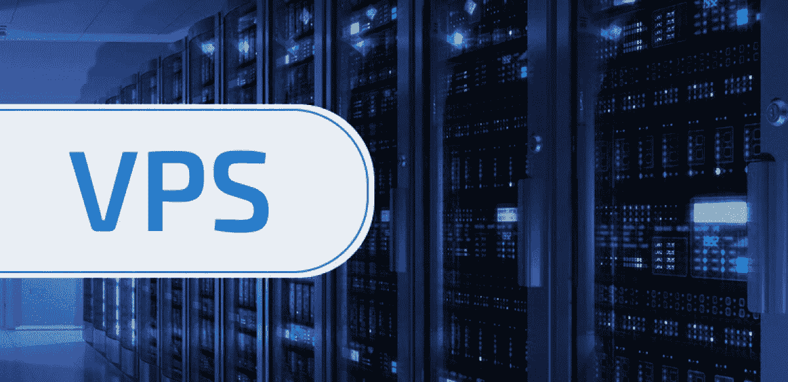
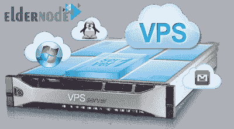

# 什么是虚拟专用服务器-如何购买 VPS | ElderNode 博客

> 原文：<https://blog.eldernode.com/what-is-a-virtual-private-server/>

虚拟专用服务器([**)VPS**](https://eldernode.com/vps/))是完整的专用服务器的一部分。这是通过虚拟化实现的。一台服务器分为几个部分，可用于不同的目的。

鉴于一台完整服务器的资源被分成若干段，购买虚拟服务器的成本往往低于专用服务器。

在本文中，我们将讨论 VPS 并解释其应用。请继续。

### **什么是虚拟专用服务器应用？**

VPS 有很多应用，可以多次使用。以下是其中的一些:

*   **a)** 托管一个相对过度使用的网站或一些中型网站
*   **b)** 使用 VPS 进行邮件服务器、数据库服务器等 Web 服务。
*   **c)** 使用 VPS 来控制或改善系统性能
*   **d)** 使用 VPS 作为二级通信和数据加密代理
*   **e)** 做需要高速上网流量的事情。

### **描述了准备一个 VPS 的过程:**

根据虚拟化的技术和结构，VPS 通常由一台或多台专用服务器组成。

通常，从专用服务器检索几个虚拟专用服务器。为此，虚拟化需要一个代理(虚拟化软件)。

虚拟化系统可以免费或付费用于各种平台，具体取决于它们的类型和功能。服务器还需要支持虚拟化技术。

创建本地或公共 VPS 有许多具体的解决方案。对于 web 上的每个 VPS，至少应该有一个 IP 可以登录到网络。

虚拟化系统还可以基于允许的 CPU 核心数量、允许的 RAM 数量、硬盘空间数量等，针对每个 VPS 进行单独或集体配置。

专用或共享资源意味着每台服务器都可以完全访问资源，或者能够整体使用共享资源。

通常，在共享模式下，质量和性能是无法预期的。

以下是一些受支持的虚拟化技术和操作系统。

### **VPS 类型:**

虚拟专用服务器通常由操作系统根据虚拟化模型和技术进行分类。

以下是 VPS 类别的类型:

1.  [***Linux 虚拟私有服务器***](https://eldernode.com/linux-vps/) (可安装各种 Linux 发行版操作系统)
2.  [***Windows 虚拟专用服务器***](https://eldernode.com/windows-vps/) (具备安装大部分 Windows Server 操作系统的能力)
3.  **专用虚拟私有服务器**(有 CPU、RAM 等专用资源。)
4.  **共享虚拟专用服务器**(共享硬件资源)
5.  **云虚拟私有服务器**(采用不同的结构来增强性能、稳定性、安全性等。)

### **向长辈节点购买 VPS 服务器:**

Eldernode complex 还积极提供 VPS 服务器，并拥有数百个活跃的客户端。单击下面的链接注册并从 [Eldernode](https://eldernode.com/) 购买 VPS。

[**买 VPS**](https://eldernode.com/vps/)

祝您好运