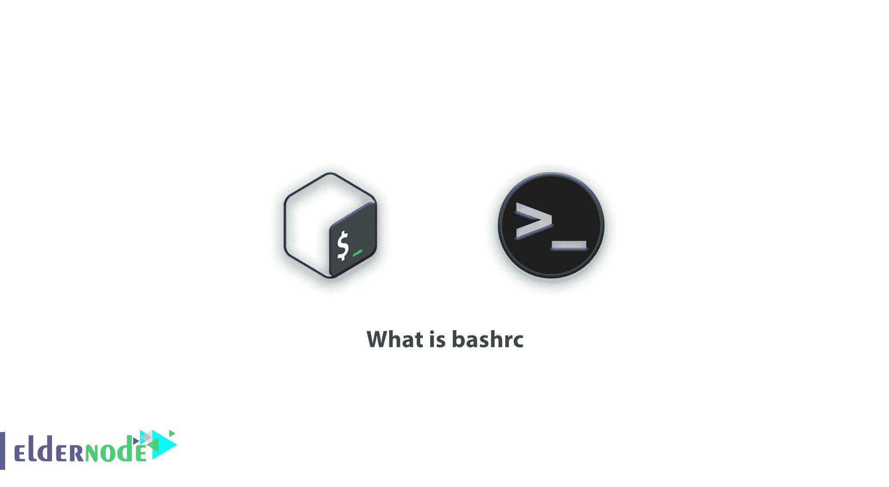

# 什么是 bashrc - Eldernode

> 原文：<https://blog.eldernode.com/what-is-bashrc/>



Bash 脚本可以用于很多事情，包括执行 Shell 命令、一起运行多个命令、定制管理任务、自动执行任务等等。这就是基本的 Bash 编程知识对于任何 Linux 操作系统用户都很重要的原因。每个 Linux 皮肤都有一组称为启动文件的文件。因为在加载并引导 Linux 之后以及启动 Linux 并登录到系统时，这些文件被读取。每个用户的引导文件位于其主目录下。本文向您简要介绍了 bashrc。

## bashrc 简介

在 Linux 发行版中，用户的主目录中有三个文件，这三个文件都是隐藏的。这些文件分别叫做 **bashrc** 、 **bash_profile** 和 **bash_history** 。以下命令显示了主目录下所有隐藏文件的列表，这些文件的名称以 bash 字符串开头。下图显示了该命令的输出。当然，Linux 发行版还有另一个名为 etc /profile/的文件，它是 Bash shell 驱动程序文件的一部分。当然，在下面的输出中，有一个名为 bash_history 的文件，它不是引导文件。所以下面的四个文件(以及 etc /profile/)是一些 bash shell 驱动程序文件。

ls -ld $HOME/。狂欢*

$HOME/。bashrc

$HOME/.bash_profile

$HOME/。bash_logout

etc/配置文件

***注:*****$ HOME**变量是 Linux 安装后默认创建的环境变量之一，保存当前登录用户的主目录路径。

这篇文章是关于 **bashrc** 文件的，因此只解释这个文件。bashrc 文件通常用于标识一些应用程序(如 Java、用 Java 编写的应用程序和 Oracle)使用的环境变量。

比如一些用 Java 写的程序，需要从一个名为 **$JAVA_HOME** 的变量中读取 Java 安装路径。在下面的链接中，我们还展示了如何准备 Oracle 安装环境，包括构建和识别一些变量。

这个文件还指定了交互式 shell 的行为，这就是为什么有些人建议我们在另一个文件 **$HOME/中编写自己的自定义变量。bash_profile** 。

**bashrc** 文件包含 shell 脚本代码，首先阅读并理解它有助于您更加熟悉 shell 脚本，也有助于您更好地理解 bash shell。

## 什么是 bashrc

bash 解释您在终端程序中输入的内容，并根据您的输入运行命令。它允许使用脚本进行某种程度的定制，这就是 bashrc 的用武之地。

为了加载您的首选项，bash 会在每次启动时运行 bashrc 文件的内容。这个 shell 脚本可以在每个用户的主目录中找到。它用于保存和加载您的终端首选项和环境变量。

终端偏好设置可以包含许多不同的内容。最常见的是，bashrc 文件包含用户总是希望可用的别名。别名允许用户用更短或替代的名字来引用命令，对于那些经常在终端工作的人来说，别名可以节省大量的时间。

### 为什么要编辑 bashrc？

有几个有用的技巧可以让你的终端体验更加高效和用户友好。

***1)功能***

```
# FUNCTIONS #  #######  md() { mkdir -p $1 cd $1 }
```

除了简化命令名之外，还可以使用 bash 函数将多个命令组合成一个操作。它们可能非常复杂，但通常遵循以下语法:

```
function_name () {  command_1  command_2  }
```

下面的命令结合了 **mkdir** 和 **cd** 。键入 md **folder_name** 会在你的工作目录中创建一个名为“ **folder_name** 的目录，并立即导航到其中。

```
md () {  mkdir -p $1  cd $1  }
```

***注意:*** 你在函数中看到的$1 代表第一个参数，就是你在函数名后面紧接着输入的文本。

***2)别名***

别名还允许您使用简写代码来访问喜欢的命令形式。

让我们以命令 ls 为例。默认情况下，ls 显示目录的内容。这很有用，但是更多地了解目录，或者知道目录的隐藏内容通常更有用。因此，一个常见的别名是 ll，它被设置为运行 ls -lha 或类似的东西。这将显示关于文件的最详细信息，揭示隐藏的文件，并以“人类可读”的单位而不是块来显示文件大小。

您需要像这样格式化您的别名:

```
alias ll="ls -lha"
```

在左边键入要替换的文本，在右边键入用引号括起来的命令。您可以使用它来创建命令的较短版本，防止常见的拼写错误，或者强制命令总是使用您喜欢的标志运行。您还可以用自己喜欢的简写方式来避开令人讨厌或容易忘记的语法。

***3)迎头痛击提示***

bash 提示符允许您设置终端的样式，并在运行命令时显示提示符。定制的 bash 提示符确实可以使您在终端上的工作更加高效。

### 如何编辑 bashrc

您可以在任何终端文本编辑器中编辑 bashrc。我们将在下面的例子中使用 nano。要使用 nano 编辑 bashrc，请在终端中调用以下命令:

```
nano ~/.bashrc
```

如果您以前从未编辑过 bashrc 文件，您可能会发现它是空的。如果没有，你可以随意在任何一行添加内容。您对 bashrc 所做的任何更改都将在下次启动终端时应用。

如果您想立即应用它们，请运行以下命令:

```
source ~/.bashrc
```

您可以在任何您喜欢的地方添加 bashrc，但是可以随意使用 command(以#开头)来组织您的代码。

***注意:***bashrc 中的编辑必须遵循 bash 的脚本格式。

## 结论

**。bashrc** 文件是一个很好的地方，因此可以在每次打开 shell 时运行您想要运行的命令。**。bashrc** files 基本上是一个每当你打开一个新的 shell 时都会运行的文件。的。bashrc 文件是一个非常强大的工具，也是定制 Linux shell 的好方法。如果使用得当，你的生产力会提高十倍。
在本教程中，我们向您介绍了 bashrc 文件以及如何编辑它。