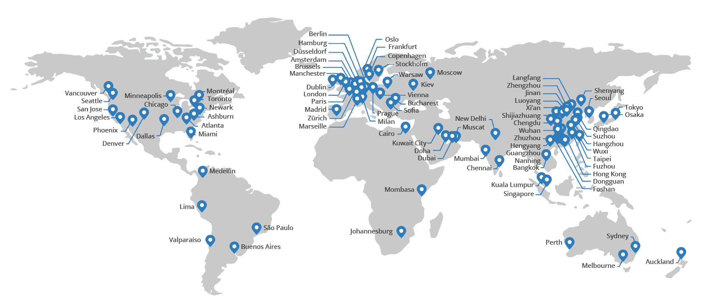

# 什么是 CDN(内容交付网络)-什么是 CDN 功能

> 原文：<https://blog.eldernode.com/what-is-cdn-content-delivery-network/>

互联网用户的一个重要问题是互联网内容的快速传送。因此，请加入我们这篇关于什么是 CDN(内容交付网络)的文章。一个**内容传送网络**或**内容分发网络**包括[代理服务器](https://en.wikipedia.org/wiki/Proxy_server "Proxy server")及其数据中心，通过一个地理上分布的网络。

## 什么是 CDN(内容分发网络)

CDN 是一个大型内容分发网络，就像代理服务器一样，位于不同的数据中心。 **CDN 或内容交付网络**的目的是以最高的效率和速度为网站的访问者提供服务。CDN 操作系统是您的服务器上可下载内容的一种形式，如 **CSS** 、 **JavaScript 代码**、**多媒体文件**，以及不同地理位置的每台服务器上的每台服务器的副本。从最近的服务器发送给用户。

主要的互联网公司，如谷歌、微软、雅虎，使用世界各地的服务器来存储和传递信息，以控制网站流量和更好的互联网服务。世界各地的不同用户在使用它时在接收期望的服务方面不会感觉到任何差异，并且他们都以最高可能的速度从最近的服务器接收他们的服务。今天，一些公司提供公共的 **CDN** 服务，这样一个小网站就可以利用这个优势。目前，大型服务公司已经以两种形式提供这项服务，**免费和商业**，包括免费服务给 [CloudFlare](https://www.cloudflare.com/) 和 Coral CDN，在商业系统中给[亚马逊 Cloudfront](https://aws.amazon.com/cloudfront/) 、 [Cach Fly](https://www.cachefly.com/) 、 [MaxCDN](https://www.stackpath.com/maxcdn/) 和 **Windows Azure** 。

除了 CDN 支持，微软 **Windows Azure** 是一个完整的云托管。

最后，我们看看一个 **CDN** 或[内容分发网络](https://eldernode.com/windows-vps/)的一些特征。

### 什么是 CDN 功能

**1**——由于与主机
**2** 间接通信，增加了网站的安全性——以有利的方式增加了带宽
**3**—简单快速的安装
**4**—提高了加载速度，并在访客系统中显示网页
**5**—在搜索引擎中对网站进行排名的积极结果

现在你已经熟悉 CDN 了，请**不要**错过我们未来的相关文章，多学习。

亲爱的用户，我们希望本教程什么是 CDN(内容交付网络)对你有所帮助，如果你有任何问题或想查看我们的用户关于本文的对话，请访问[提问页面](https://eldernode.com/ask)。也为了提高你的知识，这里有很多关于[老年节点训练](https://eldernode.com/blog/)的有用教程。