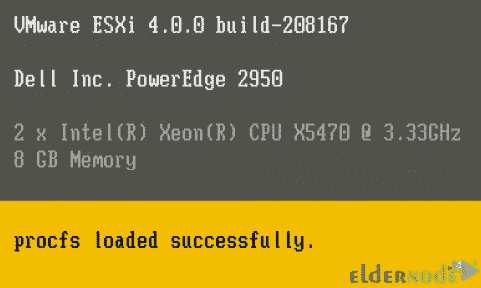
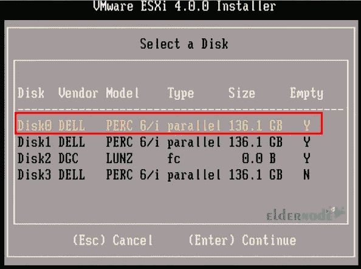
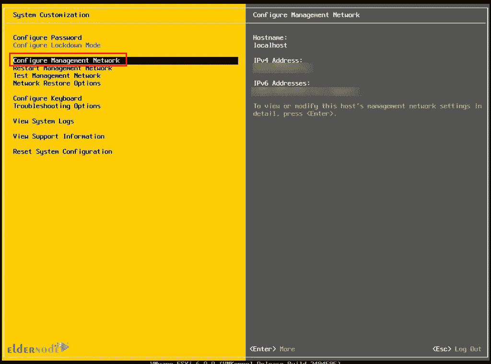

# 什么是 ESXi？它是做什么的？如何安装 ESXi

> 原文：<https://blog.eldernode.com/what-is-esxi-install-esxi-on-your-computer/>

在服务器虚拟化技术中，可以在单个硬件上实现多个操作系统，并且可以同时使用所有这些操作系统。如果您需要为您需要的每项服务准备一个单独的硬件系统，正确的解决方案是使用虚拟化技术。可以安装在计算机或服务器上以执行服务器虚拟化的操作系统类型之一是 ESXi。本文将向您解释什么是 ESX，它有什么作用，以及如何在您的计算机上安装和配置 ESXi。如果你想购买一个 [Windows VPS](https://eldernode.com/windows-vps/) ，你可以查看 [Eldernode](https://eldernode.com/) 网站上提供的套装。

## **教程安装和配置 ESXi**

### **什么是 ESXi？它是做什么的？**

[VMware ESXi](https://blog.eldernode.com/create-a-virtual-machine-in-vmware-esxi-6-5/) 是 VMware 虚拟机管理程序软件系列的商业虚拟化产品。这种虚拟化是一种裸机虚拟机管理程序，这意味着它直接安装在硬件上，而不需要像其他程序一样安装在操作系统上。ESXi 是第 1 类虚拟机管理程序或金属虚拟机管理程序，是 VMware 基础架构软件套件的核心组件之一。虚拟机管理程序有助于在一台物理服务器上高效运行多个虚拟机。

当 VMkernel 收到资源请求时，内核会将请求转发给主机的物理硬件。ESXi 直接安装在主机的本地磁盘上。

### **如何在电脑上下载 ESXi 服务器**

**首先，选择 ESXi 服务器的各种下载选项，并从 VMware ESXi 下载页面下载 ESXi 服务器:**

****

**下载完成后，进入安装过程。**

## ****如何在电脑上安装 ESXi****

**在本节中，您将学习如何在您的计算机上安装 [ESXi 服务器](https://blog.eldernode.com/setup-vmware-esxi-on-dedicated-server/)。首先，请插入 ESXi CD 并重新启动服务器。**

**您将看到一个引导菜单，其中包含从本地磁盘启动 **ESXi 安装程序**和**引导程序**的选项。选择 ESXi 安装程序:**

****

**当安装程序加载所有必需的模块时，您将会看到服务器配置信息:**

****

**在以下屏幕中，选择**安装**:**

****

**现在按下 **F11** 接受 EULA:**

****

**您将看到 VMware ESXi 4.0.0 安装程序显示的所有可用磁盘组。您应该选择要安装 ESXi 的磁盘。我们将选择磁盘 0:**

****

**在此步骤中，通过按下 **F11** 确认 ESXi 安装:**

****

**等待几分钟，让安装过程完成:**

****

**安装完成后，您将看到以下屏幕:**

****

### ****如何在电脑上配置 ESXi****

**安装完成后，重新启动服务器。然后，您将看到以下屏幕:**

****

**按下 **F2** 将 IP 地址分配给服务器，并输入用户名、密码和根凭证。然后选择**配置管理网络**，按**进入**:**

****

**现在选择 **IPv4 配置**并再次按**回车**:**

****

**您可以将 IP 地址设置为 DHCP，也可以设置为静态 IP 地址。我们将选择一个静态 IP 地址并提供您的 IP 地址。然后会要求您重启管理网络，单击**是**:**

****

**最后，选择 **DNS 配置**并输入您想要设置给服务器的主机名。按下 **ESC** 键可以退出配置页面；**

****

**就是这样！**

**结论**

## **ESXi 是 vSphere 虚拟机管理程序产品套件的核心。在本文中，我们解释了什么是 ESXi，它有什么作用，以及如何在您的计算机上安装和配置 ESXi。我希望您喜欢这篇文章，并帮助您在计算机上安装 ESXi。如果你有任何问题和建议，请在评论区联系我们。**

**ESXi is the core of the vSphere Hypervisor product suite. In this article, we explained What Is ESXi, What Does It Do, and How To Install And Configure ESXi On Your Computer. I hope you enjoyed this article and helps you to install ESXi on your computer. If you have any questions and suggestions, contact us in the Comments section.**