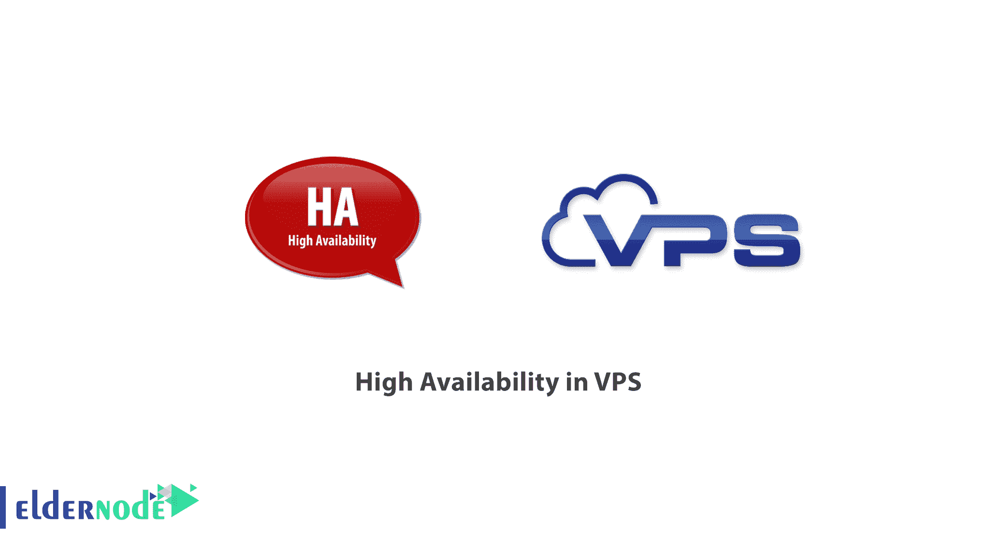

# VPS 中的高可用性是什么？VPS 中的教程 HA

> 原文：<https://blog.eldernode.com/what-is-high-availability-in-vps/>

什么是 [VPS](https://eldernode.com/vps/) 中的高可用性？在回答什么是**高可用性** ( HA )的问题时，必须指出，多年来托管虚拟专用服务器( VPS )一直是一个吸引人的点。**共享托管**的性价比和**专用硬件服务器**的高运行功率之间的一个点。

随着云结构的引入，这一概念得到了更广泛的理解和扩展。最近，主机 VPS 增加了新的功能，让你享受云服务的好处，而不增加成本。

我们将在下面回顾这些新功能。

[***从 Eldernode***](https://eldernode.com/admin-rdp-server/) 在线购买 Admin RDP 服务器

### 什么是高可用性？

服务器的结构由虚拟环境中的集群网络配置。所有这些集群都包含具有冗余属性的硬件。

基本上，由于高可用性的优势，它在瞬间为您提供了**冗余特性**。换句话说，高可用性的定义是，无论何时系统组件出现问题，您的服务器都应该继续运行而不会出现问题。

### 简单的服务器控制

除了高可用性特性之外，[购买的新 VP](https://eldernode.com/vps/)还有其他特性，使其更易于控制。这些设施包括:

**1。** 以图形化方式监控资源消耗

**2。** 分别查看 RAM、CPU、带宽和磁盘空间消耗

**3。** 修改服务器密码

**4。** 查看服务器的技术规格和详细信息

**5。** 监控服务器的当前状态

### 什么是快照？

为了响应什么是[快照](https://en.wikipedia.org/wiki/Snapshot_(computer_storage))，您可以使用快照返回到服务器稳定的点。

许多企业主发现，随着他们的数据和信息的增长，备份过程也在增长。因为备份性能高度依赖于在线需求和最新应用。

**快照功能**允许您制作数据和信息的副本。您还可以备份您的服务器，而不会损害或中断系统。换句话说，高可用性服务必须能够在任何需要的时候将您的所有数据返回到特定的时间点。

下面是一些你可能觉得需要一张**快照**的场景:

#### 升级应用程序(非常常见)

例如，考虑将你的网站升级到最新版本的[。在这种情况下，使用快照，你可以很容易地回到 WordPress 升级之前的时间，让你的服务器进入**稳定状态**。](https://wordpress.org/download/)

#### 安全项目

考虑这样一种情况，你的网站被黑客攻击或者被感染的代码被注入你的 [CMS](https://en.wikipedia.org/wiki/Content_management_system) 。如果您已经基于特定框架拍摄了服务器的快照，您可以返回到该点并修复安全漏洞**。**

#### **编程缺陷**

**如果你是一个操作环境中的程序员，你想在你的应用和网站上运行新代码，那么快照是必不可少的。因为在应用更改后，如果出现任何问题，您可以返回到应用程序的前一版本。**

****

****亦作，见:****

**[VPS 的优缺点](https://eldernode.com/advantages-and-disadvantages-of-vps/)**

**[对专用服务器的误解](https://eldernode.com/misconceptions-about-dedicated-server/)**

****尊敬的用户**，我们希望您能喜欢这个[教程](https://eldernode.com/category/tutorial/)，您可以在评论区提出关于本次培训的问题，或者解决[老年人节点培训](https://eldernode.com/blog/)领域的其他问题，请参考[提问页面](https://eldernode.com/ask)部分，并尽快提出您的问题。腾出时间给其他用户和专家来回答你的问题。**

**好运。**