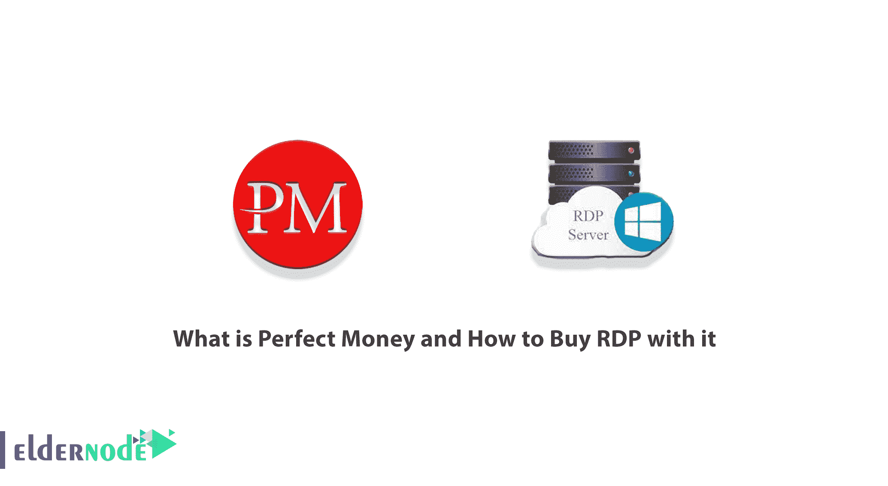
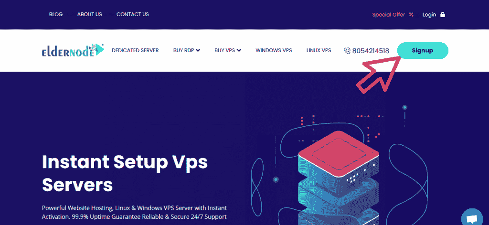
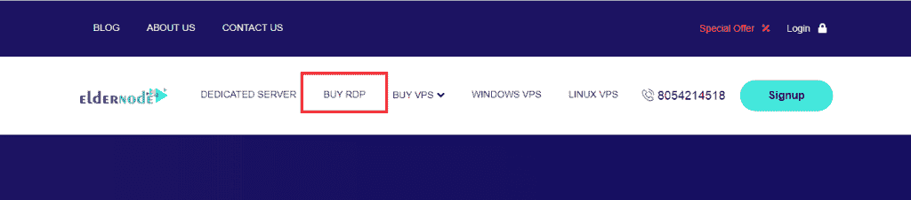
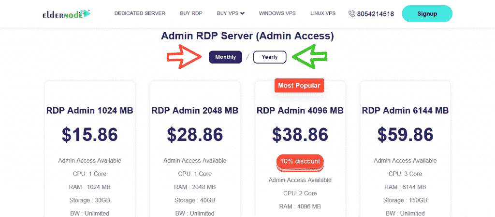
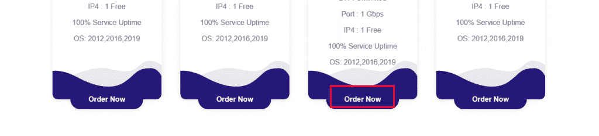
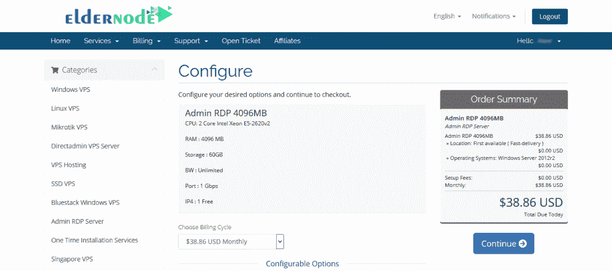
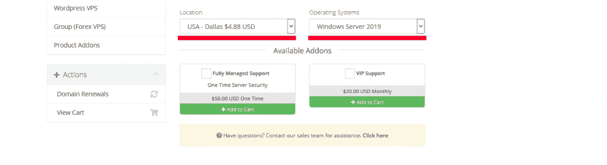
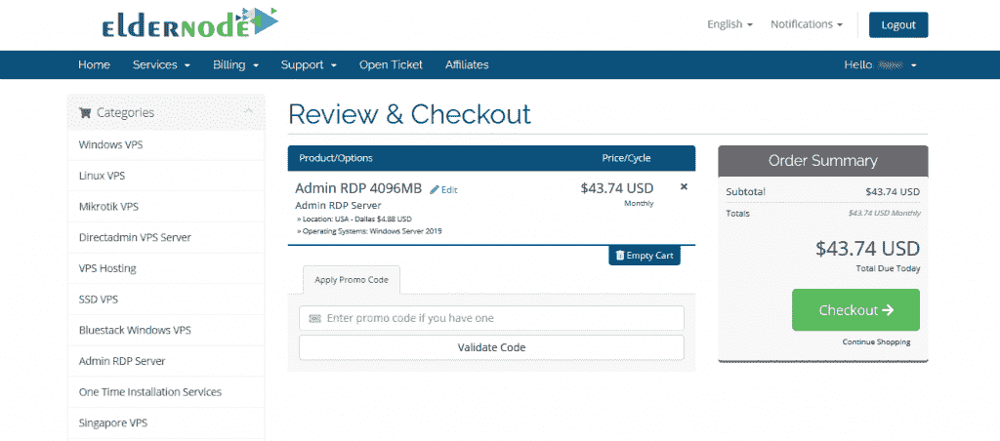
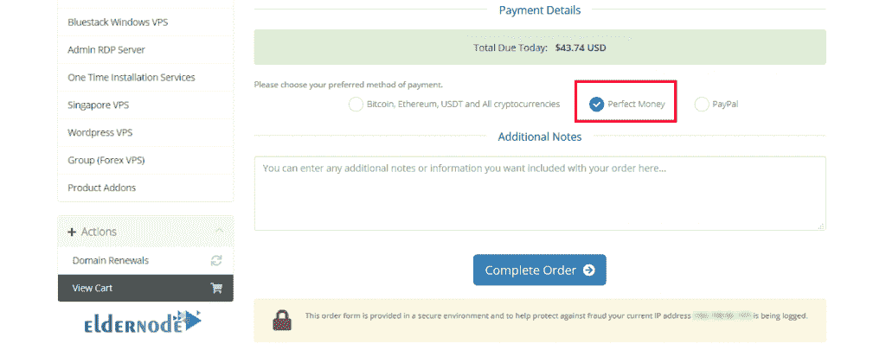

# 什么是完美货币以及如何用它购买 RDP

> 原文：<https://blog.eldernode.com/what-is-perfect-money/>

完美货币是一个类似 PayPal 等支付平台的平台。它是世界上最有信誉的支付服务公司之一，拥有来自世界各地的数千万活跃用户。这项服务还可以用来在电子账户上存储货币，或者购买比特币等其他资产。在本教程中，我们将教你**什么是完美货币，以及如何用它在[elder node](https://eldernode.com/)购买 RDP。**

## **介绍到完美的金钱**

Perfect Money 是一家总部位于巴拿马的全球支付系统公司。该公司为世界各地的用户和企业提供通过互联网发送、接收和支付款项的服务。2007 年宣布推出完美货币，一些人认为该系统可以在这个日期之前推出。

如果我们想在标题和摘要中列出完美货币的功能，它们将是:

–在线货币转账

–接收美元、欧元和…

–从互联网网站和企业购买商品或服务

–将钱安全存入电子账户，每月收取利息

–购买比特币等等。

perfect Money payment 系统有许多应用程序，可以为用户提供良好的功能，使在线交易尽可能简单，这些应用程序包括:

1.使用这个支付系统(Perfect Money)，您将能够在线转移、接收和存储各种货币。

2.用户将能够从使用完美货币系统接受这种货币的网站上购买各种商品。

3.一个好的和实用的能力是将完美的货币转换成其他金融系统的货币的可能性。

4.通过 PayPal 系统购买完美货币是可能的。

5.完美货币是使用在线支付系统在各种领域，如炒作，一些网上商店，传销等。

6.有可能买到数字货币，用完美货币兑换成其他货币。

7.完美钱钱包有三种模式:网站、IOS、安卓手机应用。

### **什么是 RDP 管理？**

RDP (Remote Desktop Protocol)是微软开发的工具。该工具通过互联网或局域网在远程的 [Windows 服务器](https://blog.eldernode.com/tag/windows/)之间使用图形界面连接。需要注意的是，该服务器使用的是 Windows 操作系统。

此连接允许用户管理员访问安装在服务器上的工具和软件。请注意，可以安装 Windows 10、Windows Server 2012 R2、Windows Server 2016、2019 或任何其他 Windows Server 操作系统。如果你正在寻找购买 RDP 服务器，我们建议你遵循这篇文章。

无论您的企业规模如何，我们都可以帮助您使用 Windows RDP 定制您的需求。在这篇文章的后续部分，在介绍了 RDP 管理服务器在 Eldernode 的位置之后，如何用最合适的钱购买 RDP 管理服务器将会一步步被教授。

## **RDP 管理位置在**的长辈节点上

有趣的是，由于 Eldernode 提供的服务范围，您可以根据使用类型和客户选择您想要的地方。你还应该考虑重要的一点，你的服务使用的地理区域最多，或者你使用的是什么服务。在接下来的几节中，我们将向您介绍位于 Eldernode 的 **RDP 管理位置**。但是，如果您想要的位置不在选项中，请通过实时聊天或免费门票联系我们的顾问和我们的向导。

### **RDP 管理地点:**

美国、加拿大、法国、荷兰、英国、俄罗斯、德国、新加坡、香港、土耳其、日本、印度和…

## **如何用完美的钱买到 RDP Admin**

在这一节，我们将一步一步地教你如何在 Eldernode 用完美的钱购买 RDP Admin。应该注意的是，购买 RDP 服务器的第一步是找到一个真正提供最佳价格、24/7 支持、各种主机包和各种主机选项的供应商。Eldernode 公司声称为其尊贵的客户提供灵活的服务、全面的监控和支持，以及快速简便的起步。

第一步，需要访问 [Eldernode 网站](https://eldernode.com/)。然后你必须点击 [**注册**](https://my.eldernode.com/register.php) ，如下图所示，在网站上**注册**:

在网站上完成注册过程后，您必须返回到第一页。在主菜单第一页，点击 [**购买 RDP**](https://eldernode.com/buy-rdp/) 。

在“购买 RDP”页面上，您可以看到不同的包装。根据您的需求，在审核完这些套餐后，您可以点击**立即订购**选择其中一个套餐。

***注:*** 通过点击滑块按钮，可以选择您想要的套餐是**包月**还是**包年**。

在配置步骤中，您可以看到所选软件包的规格。您必须在此页面上指定**位置**和**操作系统**选项。还可以选择**全托管支持**和 **VIP 支持**。

完成这些步骤后，右键点击**继续**。

下一步是**审核&结账**。在这里，您可以将折扣代码放入**应用促销代码**部分，并点击**验证码**进行应用。然后点击右栏的**结账**。

现在是确定付款方式的时候了。在**付款明细**部分，您必须选择**完美货币**。然后点击**完成订单**。

在下一步中，您可以看到您的付款和订单的详细信息。然后你需要选择**完美货币账户**并点击**进行支付**。

最后在下一页，完成相关字段后，点击**预览付款**即可完成订单。

## 结论

在本文的开始，我们试图向您介绍完美货币。然后，我们提供了一个 RDP 管理服务的简短描述，为您进一步熟悉。最后，在介绍了 RDP 管理服务器在 Eldernode 的位置后，我们一步一步地教你如何在 Eldernode 用完美的钱购买 RDP。

[yasr _ visitor _ votes size = " medium "]