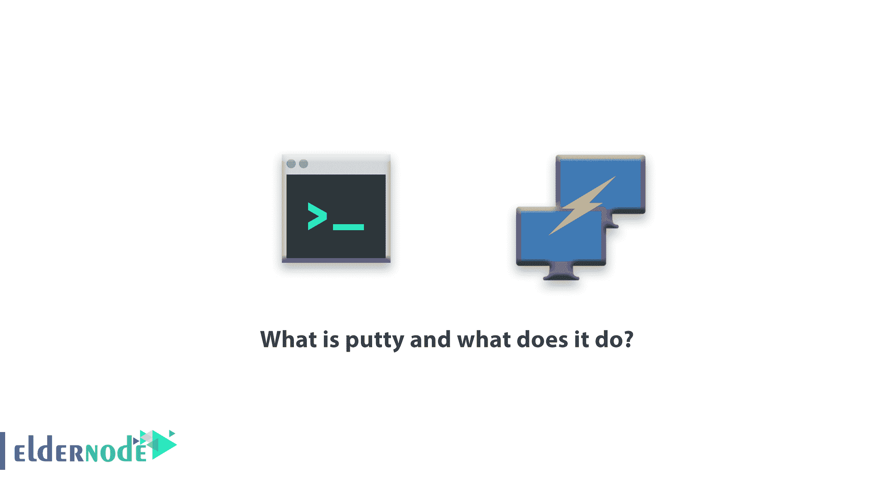

# 什么是 putty，它有什么作用-教程| Eldernode

> 原文：<https://blog.eldernode.com/what-is-putty-and-what-does-it-do/>

**Putty** 是一个连接到 [Linux 服务器](https://eldernode.com/tag/linux-server/)的软件，用这个软件你可以访问你的 Linux 服务器。该软件还支持 Telnet 和 Rlogin 协议。你需要[下载](https://www.putty.org/)并安装这个软件来连接你的 Linux 服务器。使用 PuTTY 代替默认的 Linux 系统。

使用理由:

*   1)熟悉度:用户在使用 Windows 时更习惯使用他们熟悉的 SSH 客户端。
*   2)调试模式:将原始套接字连接到 PuTTY 更加人性化。
*   3)便利性:有一个图形用户界面(GUI ),使它更容易使用，特别是 SSH 或新手。

PuTTY 使用大多数 [Linux 发行版](https://eldernode.com/tag/linux-distribution/)中可用的默认官方数据库进行安装。例如，您可以在 Ubuntu 上安装 PuTTY，在 universal database 上安装它的相关发行版。

这个程序的主要目标是创建一个可以在大多数操作系统上运行的多平台程序。

并且它可以在大多数目的地用作 xterm 终端。大多数功能，如端口传输和公钥，都可以通过命令行选项访问。

PuTTY 程序有一些特殊的好处，尤其是在远程工作时。配置起来更容易，也更耐用。为了远程连接，它会在短暂停顿后连接。

了解如何使用 Putty 软件连接到 Linux 服务器:

*   1)首先，打开。
*   2)然后在下图指定的字段中输入所需服务器的 IP 或域名。
*   3)进入 Linux 终端环境后，它会返回给你。
*   4)首先输入您的用户名。

注意，Linux 用户名一般是 root。

*   5)输入用户名后，输入密码。
*   6)登录后，您可以通过 Linux 命令使用您的服务器。

我们希望您发现腻子文章有用。