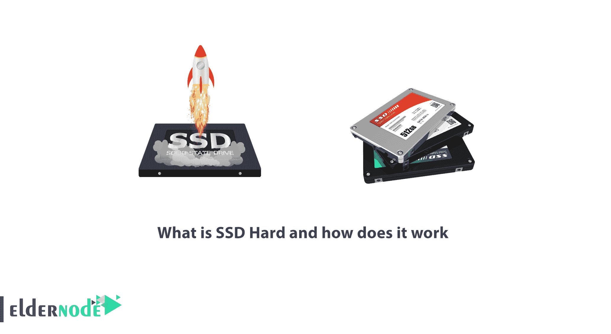
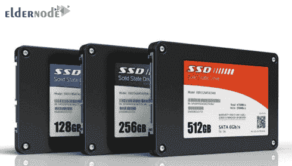
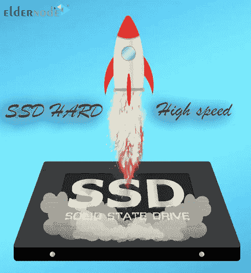
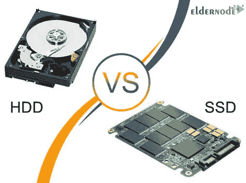
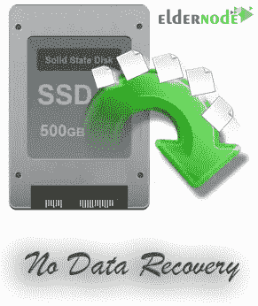
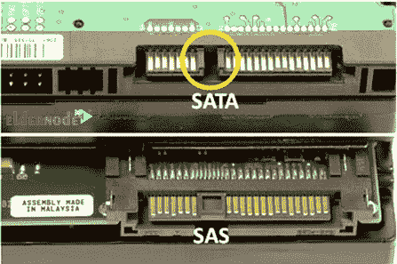

# 什么是固态硬盘及其工作原理- ElderNode 博客

> 原文：<https://blog.eldernode.com/what-is-ssd-hard/>

什么是 SSD 硬盘，它是如何工作的？如今，被称为 SSD 的新一代硬盘已经被引入数据存储市场。亲爱的朋友们，在这篇文章中，我们想把它介绍给你们。下面，我们将考察 SSD 和 HDD 硬盘之间的**差异**。**最后**，我们将讨论 SAS 硬盘的一小部分，并解释它与 SSD 的**区别。 *和我们一起呆着* 。**

[***从 Eldernode***](https://eldernode.com/admin-rdp-server/) 在线购买 Admin RDP 服务器

### 什么是固态硬盘或 SSD 硬盘？

SSD ，或[固态硬盘](https://en.wikipedia.org/wiki/Solid-state_drive)，如上所述，是用于数据存储的新一代硬盘，已经上市数年。

SSD s 实现的**结构**是这样的，它不包括任何移动部件，甚至不包括旋转的磁盘。事实上，这是它们与其他数据存储硬盘的主要区别。

这些是集成电路，像不同类型的存储器一样，非常快速地读取信息**和**存储信息**，而不需要使用诸如电之类的力量。**

****

### **SSD 的优势是什么？**

**固态硬盘有很多优点，这也是它们现在如此受欢迎的原因。以下是一些最重要的好处:**

****1。** **高速** :固态硬盘比硬盘快很多。**

****2。 抗冲击性** :由于这类硬盘的实现结构中没有旋转和移动的磁盘，所以它们的抗冲击性很高。此外，它们的主人将不再担心由于被击中而丢失重要信息。**

****3。 与存储市场上其他常见类型相比，延迟极低，性能完全静音** 。**

****

### **SSD 和 HDD 有什么区别？**

**为了考察 **SSD** 和 **HDD** 的区别，应该说传统硬盘 (HDD)有旋转盘在上面存储信息。因此，每当计算机试图访问信息时，一个针头就会到达信息的位置，读取信息，并最终将相关信息提供给计算机。**

**在整篇文章中，我们将进一步考察 SSD 和 HDD 的区别。**

****

**关于 SSD 和 HDD 的区别，应该说在传统硬盘上写数据和 SSD 有一个非常相似的过程。**

****在固态硬盘**中，没有运动，甚至没有旋转，而数据存储在专用块中。每当计算机需要特殊信息时，固态硬盘能够快速找到并提供这些数据。**

****一款新的固态硬盘**能够以多种方式加速您的计算机。在这些方式中，我们可以提及以下方式:**

****1。** 减少时间引导意味着显著地引导计算机，运行以及立即加载不同类型的软件，包括 HDD 和 SSD 的区别。**

****2。** 毫不浪费时间地启动或打开不同类型的文档和文件是 HDD 和 SSD 最重要的区别之一。**

****3。** **高速复制不同类型**的文件可以认为是考察 HDD 和 SSD 区别的重要因素。**

**既然我们已经检查了 SSD 和 HDD 的区别，我们将在整篇文章中检查 SSD 硬盘的弱点。**

### **固态硬盘有哪些弱点？**

**以下是这些流行硬盘的三个弱点:**

****1。 无数据恢复:**SSDs 的主要**弱点**之一就是无法恢复数据。当硬盘崩溃时，专家通常能够恢复至少一些数据。当然，这也取决于导致故障的因素以及磁盘的物理状况，而这在 SSD 硬盘中是不存在的。**

****2。 写入频率:** 其次**SSDs 的缺点**是它们的使用寿命，这根据写入周期来看，写入次数相对于 HDD s 来说相对较短。**

****3。 容量:** 目前， SSD 硬盘，考虑到容量，还无法与 HDD 抗衡，但这样的限制肯定是暂时的，在不太远的将来会被解除。**

****

### **什么是 SAS 硬盘？**

**SAS 硬盘实际上是 SATA 硬盘的扩展版本。 **SAS** 代表串行连接 SCSI 。这类硬盘的**传输速度**约为 768 MB ，比 SATA 硬盘快很多。**

**SAS 硬盘屏幕每分钟的旋转是决定其速度的主要因素之一。**

****

**为了**比较** SSD 和 SAS 硬盘，不如考察一下 SSD 和 SAS 硬盘的**区别。为此，我们将在这里比较速度。****

**SATA 和 SAS 硬盘与 SSD 硬盘的区别点在于存储屏幕上有一个旋转的部分。您在这些页面上旋转的越快，**读取**和**写入数据**的速度就越快。**

**市面上的各种类型的硬盘都有 900 转或者 7.2 转的速度。目前，鉴于世界对高速的需求日益增长，各种其他类型的非常高转速的 10，000 rpm 或 15，000 rpm 也被使用。随着磁盘旋转速度的提高，数据访问的速度也随之提高。**

**设备的功耗，由此产生的噪音和振动会增加。此外，系统的维护成本也会增加。**

****另请参见:****

**[使用硬盘的 PowerShell 命令](https://eldernode.com/powershell-commands-for-hard-disk/)**

****尊敬的用户**，我们希望您能喜欢这个[教程](https://eldernode.com/category/tutorial/)，您可以在评论区提出关于本次培训的问题，或者解决[老年人节点培训](https://eldernode.com/blog/)领域的其他问题，请参考[提问页面](https://eldernode.com/ask)部分，并尽快提出您的问题。腾出时间给其他用户和专家来回答你的问题。**

**好运。**

**Goodluck.**