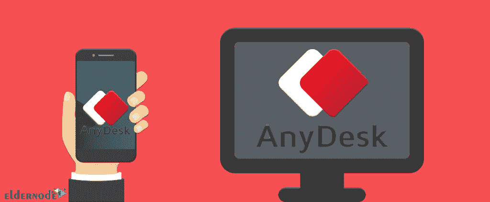

# AnyDesk 和 RDP 服务器- Eldernode 博客有什么区别

> 原文：<https://blog.eldernode.com/what-is-the-difference-between-anydesk-vs-rdp/>

RDP 和 AnyDesk 都通过网络远程访问设备。RDP 是远程使用计算机的协议或标准。您还可以通过 Anydesk 应用程序远程连接到电脑。在本文中，我们将解释 Anydesk 和 [RDP 服务器](https://eldernode.com/buy-rdp/)的区别，并逐一介绍。

## 简介

### **什么是 AnyDesk？**

AnyDesk 是一个用于 Windows、Mac、Linux 和移动系统的远程桌面应用程序，你不需要创建一个帐户来使用它。该应用程序声称可以创建一个安全的连接，并已开发出确保无缝数据传输。AnyDesk 是为那些需要从电脑或手机远程访问另一台设备的人设计的。这个应用程序在用户之间建立了一个桥梁，允许他们控制另一个设备。AnyDesk 免费供个人使用，并提供关键功能，包括记录和连接到附近的设备。这个[软件](https://anydesk.com/)有三个不同的版本。在 Lite 模式下，您可以拥有一个用户和控制器，每月 10.99 美元。在专业模式下，你可以访问无限的设备和更多的功能，如地址簿和安装定制每月 20.99 美元。在 AnyDesk 的最高级版本中，用户每月支付 52.99 美元就可以获得无限数量的同时会话。

### 远程桌面协议

[RDP](https://eldernode.com/buy-rdp/) 代表远程桌面协议，是微软开发的专有协议，提供图形用户界面，通过网络连接到另一台计算机。RDP 允许客户端电脑查看远程电脑屏幕并与其建立远程连接。默认情况下，RDP 协议使用 TCP 协议端口号 3389 进行通信。用户应该有 RDP 或远程桌面连接软件来使用远程桌面协议，而主机应该运行 RDP 服务器软件。RDP 客户端软件可用于大多数版本的 Windows 和其他操作系统，包括 Linux、Unix、macOS、iOS 和 Android。

## **AnyDesk vs RDP 服务器特点:**

### **AnyDesk**

*   能够随时随地从任何桌面远程访问和控制任何桌面
*   免费供个人使用
*   为企业用户提供各种定价选项
*   轻量级，能够使用录制在线会议的选项
*   能够以快速的性能完全掌控网络的所有权和控制权

### **远程桌面**

*   使用单独的应用程序键访问传统的键盘快捷键和键盘修饰键
*   能够完全访问远程计算机上存储的文件
*   使打印和共享文档变得容易
*   停止服务器设备进入睡眠状态以允许远程连接
*   从电脑管理员处远程访问资源，如基于会话的桌面、虚拟桌面和其他 RemoteApp 程序

## **any desk vs RDP**的区别 

### **操作系统**

RDP 和 AnyDesk 都兼容多种操作系统 AnyDesk 覆盖多达 32 种设备，支持 Windows，macOS，Android，iOS，Linux，FreeBSD，Chrome OS 和 Raspberry Pi。但 RDP 与 Windows、macOS、Android 和 iOS 的更高版本兼容，可以开箱安装，但缺乏官方的 Linux 支持。

### **界面**

RDP 和 AnyDesk 都提供了一个用户友好的界面，两者的图像都很清晰。此外，它们都可以传输文件和支持音频。

### **行政**

可以使用 AnyDesk 中内置的地址簿来跟踪联系人和连接。AnyDesk 可以选择用个性化的用户名和徽标替换您的默认 ID，以定制品牌。此外，您可以使用 MSI 软件包在多台计算机上自动安装 AnyDesk。但 RDP 会保存最近的联系人以便快速访问，而且没有专门的通讯录。

### **协作工具**

您可以使用 RDP 和 AnyDesk 实时协作处理文档和演示文稿。当然，需要注意的是，AnyDesk 还有一些额外的功能。AnyDesk 支持文本聊天、语音和视频会议，以及远程桌面会话的自动记录。此外，它还有一个绘图工具白板，允许你在屏幕上绘图来分享想法。

### **如何使用 RDP 或 AnyDesk:**

在远程桌面连接登录屏幕中，您需要输入远程计算机名称和用户名进行连接，用户应该使用 Microsoft 远程桌面助手配置应用程序，但 AnyDesk 不需要用户。

AnyDesk 有一个干净的用户界面，所有附加选项都隐藏在菜单下。在 AnyDesk 中，您可以通过单击 connect 输入远程桌面地址进行连接，也可以使用桌面访问地址。

如果您在 AnyDesk 中通过移动连接到桌面，您可以将移动屏幕用作触摸板，截图，请求提升权限，开始会话记录，上传和下载文件，以及使用 VPN。

### **定价**

AnyDesk 有专业版和免费版。该软件的免费版本适用于非商业用途，高级版本有三种计划，包括 Lite、Professional 和 Power。RDP 是一个免费的远程桌面协议，不需要任何共享。

### **哪个比较好？**

RDP 和 AnyDesk 都通过网络远程访问设备。AnyDesk 易于使用，功能广泛。AnyDesk 计划对个人用户来说是负担得起的。

RDP 的功能有限，只提供必要的工具。RDP 提供了一个实用的界面、安全的环境和几个自定义功能，您可以免费将其用于个人和商业用途。

## 结论

本文对 RDP 和 AnyDesk 进行了比较，说明了两者的区别。希望你能在这篇文章的帮助下选择合适的远程桌面。如果您有任何问题，可以通过评论联系我们。